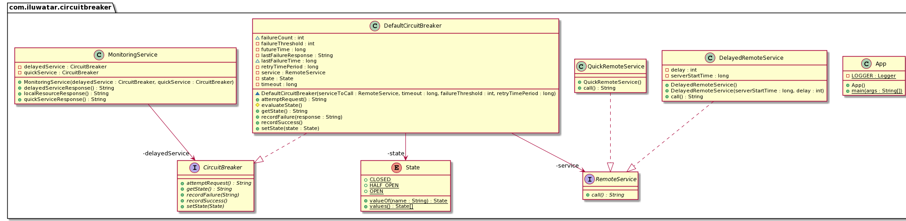

## 意圖

以這樣一種方式處理昂貴的遠端服務呼叫，即單個服務/元件的故障不會導致整個應用程式宕機，我們可以儘快重新連線到服務。

## 解釋

真實世界例子

> 想象一個 Web 應用程式，它同時具有用於獲取資料的本地檔案/影象和遠端服務。 這些遠端服務有時可能健康且響應迅速，或者由於各種原因可能在某 個時間點變得緩慢和無響應。因此，如果其中一個遠端服務緩慢或未成功響應，我們的應用程式將嘗試使用多個執行緒/程序從遠端服務獲取響應，很快它們都會掛起（也稱為 [執行緒飢餓][thread starvation](https://en.wikipedia.org/wiki/Starvation_(computer_science)))導致我們的整個 Web 應用程式崩潰。我們應該能夠檢測到這種情況並向使用者顯示適當的訊息，以便他/她可以探索不受遠端服務故障影響的應用程式的其他部分。 同時，其他正常工作的服務應保持正常執行，不受此故障的影響。
>

通俗地說

> 斷路器允許優雅地處理失敗的遠端服務。當我們應用程式的所有部分彼此高度解耦時，它特別有用，一個元件的故障並不意味著其他部分將停止工作。

維基百科說

> 斷路器是現代軟體開發中使用的一種設計模式。 它用於檢測故障並封裝防止故障不斷重複發生、維護期間、臨時外部系統故障或意外系統困難的邏輯。

## 程式示例

So, how does this all come together? With the above example in mind we will imitate the 
functionality in a simple example. A monitoring service mimics the web app and makes both local and 
remote calls.

那麼，這一切是如何結合在一起的呢？ 記住上面的例子，我們將在一個簡單的例子中模仿這個功能。 監控服務模仿 Web 應用程式並進行本地和遠端呼叫。

服務架構如下：


在程式碼方面，終端使用者應用程式是：

```java
@Slf4j
public class App {

  private static final Logger LOGGER = LoggerFactory.getLogger(App.class);

  /**
   * Program entry point.
   *
   * @param args command line args
   */
  public static void main(String[] args) {

    var serverStartTime = System.nanoTime();

    var delayedService = new DelayedRemoteService(serverStartTime, 5);
    var delayedServiceCircuitBreaker = new DefaultCircuitBreaker(delayedService, 3000, 2,
        2000 * 1000 * 1000);

    var quickService = new QuickRemoteService();
    var quickServiceCircuitBreaker = new DefaultCircuitBreaker(quickService, 3000, 2,
        2000 * 1000 * 1000);

    // 建立一個可以進行本地和遠端呼叫的監控服務物件
    var monitoringService = new MonitoringService(delayedServiceCircuitBreaker,
        quickServiceCircuitBreaker);

    // 獲取本地資源
    LOGGER.info(monitoringService.localResourceResponse());

    // 從延遲服務中獲取響應 2 次，以滿足失敗閾值
    LOGGER.info(monitoringService.delayedServiceResponse());
    LOGGER.info(monitoringService.delayedServiceResponse());

    // 在超過故障閾值限制後獲取延遲服務斷路器的當前狀態
    // 現在是開啟狀態
    LOGGER.info(delayedServiceCircuitBreaker.getState());

     // 同時，延遲服務宕機，從健康快速服務獲取響應
    LOGGER.info(monitoringService.quickServiceResponse());
    LOGGER.info(quickServiceCircuitBreaker.getState());

    // 等待延遲的服務響應
    try {
      LOGGER.info("Waiting for delayed service to become responsive");
      Thread.sleep(5000);
    } catch (InterruptedException e) {
      e.printStackTrace();
    }
    // 檢查延時斷路器的狀態，應該是HALF_OPEN
    LOGGER.info(delayedServiceCircuitBreaker.getState());

    // 從延遲服務中獲取響應，現在應該是健康的
    LOGGER.info(monitoringService.delayedServiceResponse());
    // 獲取成功響應後，它的狀態應該是關閉。
    LOGGER.info(delayedServiceCircuitBreaker.getState());
  }
}
```

監控服務類:

```java
public class MonitoringService {

  private final CircuitBreaker delayedService;

  private final CircuitBreaker quickService;

  public MonitoringService(CircuitBreaker delayedService, CircuitBreaker quickService) {
    this.delayedService = delayedService;
    this.quickService = quickService;
  }

  // 假設：本地服務不會失敗，無需將其包裝在斷路器邏輯中
  public String localResourceResponse() {
    return "Local Service is working";
  }

  /**
   * Fetch response from the delayed service (with some simulated startup time).
   *
   * @return response string
   */
  public String delayedServiceResponse() {
    try {
      return this.delayedService.attemptRequest();
    } catch (RemoteServiceException e) {
      return e.getMessage();
    }
  }

  /**
   * Fetches response from a healthy service without any failure.
   *
   * @return response string
   */
  public String quickServiceResponse() {
    try {
      return this.quickService.attemptRequest();
    } catch (RemoteServiceException e) {
      return e.getMessage();
    }
  }
}
```
可以看出，它直接呼叫獲取本地資源，但它將對遠端（昂貴）服務的呼叫包裝在斷路器物件中，防止故障如下：

```java
public class DefaultCircuitBreaker implements CircuitBreaker {

    private final long timeout;
    private final long retryTimePeriod;
    private final RemoteService service;
    long lastFailureTime;
    private String lastFailureResponse;
    int failureCount;
    private final int failureThreshold;
    private State state;
    private final long futureTime = 1000 * 1000 * 1000 * 1000;

    /**
     * Constructor to create an instance of Circuit Breaker.
     *
     * @param timeout          Timeout for the API request. Not necessary for this simple example
     * @param failureThreshold Number of failures we receive from the depended service before changing
     *                         state to 'OPEN'
     * @param retryTimePeriod  Time period after which a new request is made to remote service for
     *                         status check.
     */
    DefaultCircuitBreaker(RemoteService serviceToCall, long timeout, int failureThreshold,
                          long retryTimePeriod) {
        this.service = serviceToCall;
        //  我們從關閉狀態開始希望一切都是正常的
        this.state = State.CLOSED;
        this.failureThreshold = failureThreshold;
        // API的超時時間.
        // 用於在超過限制時中斷對遠端資源的呼叫
        this.timeout = timeout;
        this.retryTimePeriod = retryTimePeriod;
        //An absurd amount of time in future which basically indicates the last failure never happened
        this.lastFailureTime = System.nanoTime() + futureTime;
        this.failureCount = 0;
    }

    // 重置所有
    @Override
    public void recordSuccess() {
        this.failureCount = 0;
        this.lastFailureTime = System.nanoTime() + futureTime;
        this.state = State.CLOSED;
    }

    @Override
    public void recordFailure(String response) {
        failureCount = failureCount + 1;
        this.lastFailureTime = System.nanoTime();
        // Cache the failure response for returning on open state
        this.lastFailureResponse = response;
    }

    // 根據 failureThreshold、failureCount 和 lastFailureTime 評估當前狀態。
    protected void evaluateState() {
        if (failureCount >= failureThreshold) { //Then something is wrong with remote service
            if ((System.nanoTime() - lastFailureTime) > retryTimePeriod) {
                // 我們已經等得夠久了，應該嘗試檢查服務是否已啟動
                state = State.HALF_OPEN;
            } else {
                // 服務可能仍會出現故障
                state = State.OPEN;
            }
        } else {
            // 一切正常
            state = State.CLOSED;
        }
    }

    @Override
    public String getState() {
        evaluateState();
        return state.name();
    }

    /**
     * Break the circuit beforehand if it is known service is down Or connect the circuit manually if
     * service comes online before expected.
     *
     * @param state State at which circuit is in
     */
    @Override
    public void setState(State state) {
        this.state = state;
        switch (state) {
            case OPEN -> {
                this.failureCount = failureThreshold;
                this.lastFailureTime = System.nanoTime();
            }
            case HALF_OPEN -> {
                this.failureCount = failureThreshold;
                this.lastFailureTime = System.nanoTime() - retryTimePeriod;
            }
            default -> this.failureCount = 0;
        }
    }

    /**
     * Executes service call.
     *
     * @return Value from the remote resource, stale response or a custom exception
     */
    @Override
    public String attemptRequest() throws RemoteServiceException {
        evaluateState();
        if (state == State.OPEN) {
            // 如果電路處於開啟狀態，則返回快取的響應
            return this.lastFailureResponse;
        } else {
            // 如果電路未開啟，則發出 API 請求
            try {
                //在實際應用程式中，這將線上程中執行，並且將利用斷路器的超時引數來了解服務
                // 是否正在工作。 在這裡，我們根據伺服器響應本身模擬
                var response = service.call();
                // api 響應正常，重置所有。
                recordSuccess();
                return response;
            } catch (RemoteServiceException ex) {
                recordFailure(ex.getMessage());
                throw ex;
            }
        }
    }
}
```

上述模式如何防止失敗？ 讓我們透過它實現的這個有限狀態機來理解。


- 我們使用某些引數初始化斷路器物件：`timeout`、`failureThreshold` 和 `retryTimePeriod`，這有助於確定 API 的彈性。
- 最初，我們處於“關閉”狀態，沒有發生對 API 的遠端呼叫。
- 每次呼叫成功時，我們都會將狀態重置為開始時的狀態。
- 如果失敗次數超過某個閾值，我們將進入“open”狀態，這就像開路一樣，阻止遠端服務呼叫，從而節省資源。  （這裡，我們從 API 返回名為 ```stale response``` 的響應）
- 一旦超過重試超時時間，我們就會進入“半開”狀態並再次呼叫遠端服務以檢查服務是否正常工作，以便我們可以提供新鮮內容。 失敗將其設定回“開啟”狀態，並在重試超時時間後進行另一次嘗試，而成功將其設定為“關閉”狀態，以便一切重新開始正常工作。

## 類圖



## 適用性

在以下情況下使用斷路器模式

- 構建一個容錯應用程式，其中某些服務的故障不應導致整個應用程式宕機。
- 構建一個持續執行（永遠線上）的應用程式，這樣它的元件就可以在不完全關閉的情況下升級。

## 相關模式

- [Retry Pattern](https://github.com/iluwatar/java-design-patterns/tree/master/retry)

## 真實世界例子

* [Spring Circuit Breaker module](https://spring.io/guides/gs/circuit-breaker)
* [Netflix Hystrix API](https://github.com/Netflix/Hystrix)

## 鳴謝

* [Understanding Circuit Breaker Pattern](https://itnext.io/understand-circuitbreaker-design-pattern-with-simple-practical-example-92a752615b42)
* [Martin Fowler on Circuit Breaker](https://martinfowler.com/bliki/CircuitBreaker.html)
* [Fault tolerance in a high volume, distributed system](https://medium.com/netflix-techblog/fault-tolerance-in-a-high-volume-distributed-system-91ab4faae74a)
* [Circuit Breaker pattern](https://docs.microsoft.com/en-us/azure/architecture/patterns/circuit-breaker)
