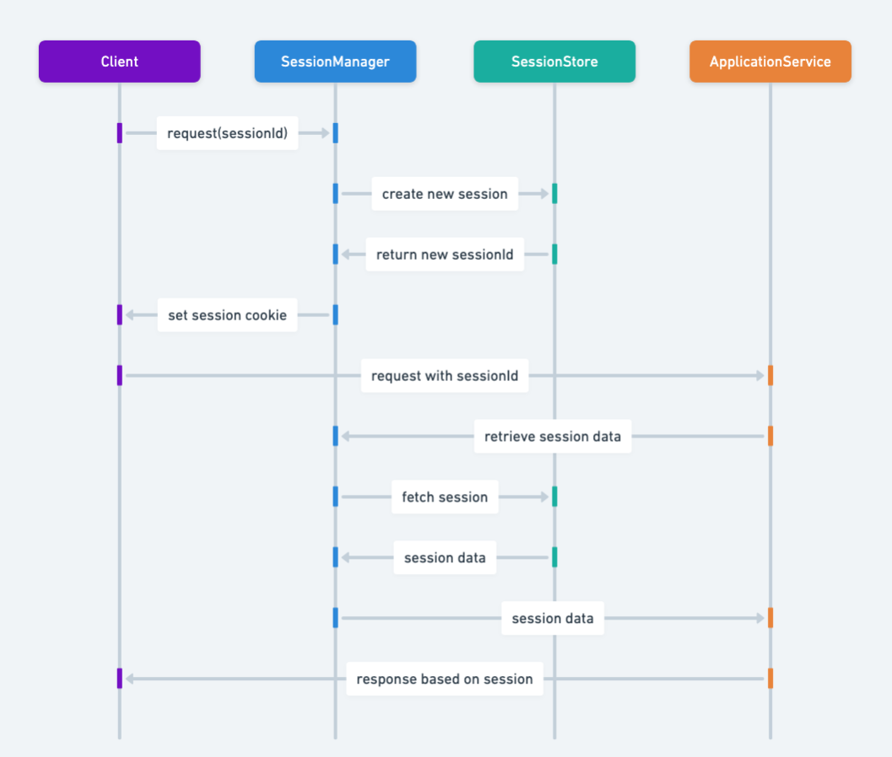

## 又稱為

* 使用者工作階段

## 用戶端工作階段設計模式的目的

用戶端工作階段模式適合涉及用戶端與伺服器互動的 Web 開發。它在 Web 應用程式的多個請求之間維持使用者狀態與資料，確保連續且個人化的使用體驗。

## 用戶端工作階段模式的詳細說明與真實世界範例

真實世界範例

> 圖書館會員系統就是一個例子。會員登入後，系統建立工作階段追蹤借閱活動，其中包含會員 ID、目前借閱的書籍、到期日與罰款。會員瀏覽目錄、借書或還書時，工作階段持續維護這些狀態，直到會員登出或工作階段逾時。

簡單來說

> 用戶端工作階段模式在多個 Web 請求之間管理使用者專屬資料，維持連續性與個人化。

維基百科指出，用戶端與伺服器模型中，用戶端請求中央伺服器提供服務與資源；Web 應用程式利用工作階段管理多個請求中的使用者資料，例如維持網路銀行互動的登入資訊與狀態。

序列圖



## Java 用戶端工作階段模式的程式範例

以下有 `Server` 與 `Session` 類別。`Server` 代表處理請求並替用戶端建立工作階段的伺服器，`Session` 代表分配給用戶端的工作階段。

```java
// Server 類別代表處理請求並替用戶端建立工作階段的伺服器。
public class Server {
  private String host;
  private int port;

  public Server(String host, int port) {
    this.host = host;
    this.port = port;
  }

  public Session getSession(String name) {
    return new Session(name, "ClientName");
  }

  public void process(Request request) {
    // 處理請求...
  }
}

// Session 類別代表分配給用戶端的工作階段。
public class Session {
  private String id;
  private String clientName;

  public Session(String id, String clientName) {
    this.id = id;
    this.clientName = clientName;
  }
}
```

在 `main` 中建立伺服器與兩個用戶端工作階段，再把工作階段與資料放入請求傳給伺服器。伺服器便能根據工作階段辨識用戶端。

```java
public class App {
  public static void main(String[] args) {
    var server = new Server("localhost", 8080);
    var session1 = server.getSession("Session1");
    var session2 = server.getSession("Session2");
    var request1 = new Request("Data1", session1);
    var request2 = new Request("Data2", session2);
    server.process(request1);
    server.process(request2);
  }
}
```

程式輸出：

```
19:28:49.152 [main] INFO com.iluwatar.client.session.Server -- Processing Request with client: Session1 data: Data1
19:28:49.154 [main] INFO com.iluwatar.client.session.Server -- Processing Request with client: Session2 data: Data2
```

## 何時在 Java 中使用用戶端工作階段模式

* 需要使用者驗證與授權的 Web 應用程式。
* 需要在多個請求或造訪期間追蹤使用者活動與偏好的應用程式。
* 需要將狀態管理卸載到用戶端以最佳化伺服器資源的系統。

## 用戶端工作階段模式的實際應用

* 電子商務網站跨工作階段追蹤購物車內容。
* 依照使用者偏好與歷史紀錄提供個人化內容的線上平台。
* 需要登入才能使用個人化或受保護內容的 Web 應用程式。

## 用戶端工作階段模式的優點與取捨

優點：

* 減少伺服器儲存使用者狀態的需求，提高伺服器效能。
* 透過個人化內容與一致導覽提升使用者體驗。
* 可使用 Cookie、Web Storage API 等多種用戶端儲存機制管理工作階段。

取捨：

* 敏感資訊若未妥善加密與驗證，儲存在用戶端工作階段可能產生安全風險。
* 依賴不同瀏覽器與使用者設定的 Cookie 政策等用戶端能力。
* 工作階段逾時、更新，以及多裝置或多分頁同步會增加管理複雜度。

## 相關模式

* 伺服器工作階段：常與用戶端工作階段搭配，平衡用戶端效率與伺服器控制。
* [單例](https://java-design-patterns.com/patterns/singleton/)：確保應用程式中使用者工作階段只有一個實例。
* [狀態](https://java-design-patterns.com/patterns/state/)：管理工作階段的狀態轉換，例如已驗證、訪客或已逾時。

## 參考資料與致謝

* [Professional Java for Web Applications](https://amzn.to/4aazY59)
* [Securing Web Applications with Spring Security](https://amzn.to/3PCCEA1)
* [Client Session State Design Pattern: Explained Simply](https://www.youtube.com/watch?v=ycOSj9g41pc)