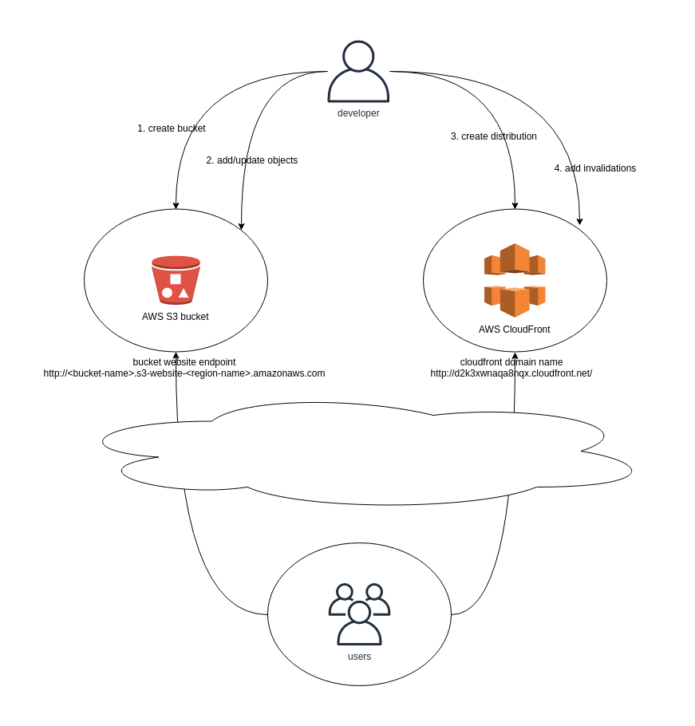

## 意圖

將靜態內容部署到基於雲的儲存服務，該服務可以將它們直接交付給客戶端。 這可以減少對昂貴計算例項的需求。

## 解釋

真實世界例子

> 全球性的營銷網站（靜態內容）需要快速的部署以開始吸引潛在的客戶。為了將託管費用和維護成本降至最低，使用雲託管儲存服務和內容交付網路。

通俗地說

> 靜態內容託管模式利用雲原生儲存服務來儲存內容和全球內容交付網路，將其快取在世界各地的多個資料中心。 在靜態網站上，單個網頁包含靜態內容。 它們還可能包含客戶端指令碼，例如 Javascript。相比之下，動態網站依賴於伺服器端處理，包括伺服器端指令碼，如 PHP、JSP 或 ASP.NET。

維基百科說

> 與由 Web 應用程式生成的動態網頁相反，靜態網頁（有時稱為平面網頁或固定網頁）是完全按照儲存的方式傳送到使用者的網頁瀏覽器的網頁。靜態網頁適用於從不或很少需要更新的內容，儘管現代
> Web 模板系統正在改變這一點。可以將大量靜態頁面作為檔案進行維護，沒有自動化工具（例如靜態站點生成器）是不切實際的。

**示例**



在這個例子中我們使用AWS S3建立一個靜態網站，並利用 AWS Cloudfront 在全球範圍內分發內容。

1. 首先你需要一個AWS賬戶，你可以在這個建立一個免費的：[AWS Free Tier](https://aws.amazon.com/free/free-tier/)

2. 登陸 [AWS控制檯](https://console.aws.amazon.com/console/home?nc2=h_ct&src=header-signin)

3. 進入身份和接入管理服務 (IAM) .

4. 建立一個僅具有此應用程式必要許可權的IAM使用者。

   * 點選 `使用者`
   * 點選 `新增使用者`. 選擇你想要的 `使用者名稱`， `接入型別`應該是 `程式設計式接入`. 點選 `下一步: 許可權`.
   * 選擇 `直接附加已存在的策略`. 選擇 `AmazonS3FullAccess` 和 `CloudFrontFullAccess`. Click `下一步: 標籤`.
   * 沒有需要的標籤, 所以直接點選 `下一步: 回顧`.
   * 檢查呈現的資訊，沒問題的話點選`建立使用者`
   * 完成這個示例所需要的`訪問秘鑰Id`和`訪問秘鑰密碼`將會呈現在你面前，請妥善保管。
   * 點選 `關閉`.

5. [安裝AWS 命令列工具 (AWS CLI)](https://docs.aws.amazon.com/cli/latest/userguide/install-cliv1.html) 來獲得程式設計式訪問AWS雲。

6. 使用`aws configure`命令來配置AWS CLI [說明書](https://docs.aws.amazon.com/cli/latest/userguide/cli-configure-quickstart.html#cli-configure-quickstart-config)

7. 為web站點建立AWS S3 bucket。 注意S3 bucket名字必須要在全球範圍內唯一。


   *  語法是 `aws s3 mb <bucket name>`  [說明書](https://docs.aws.amazon.com/cli/latest/userguide/cli-services-s3-commands.html#using-s3-commands-managing-buckets-creating)
   * 比如 `aws s3 mb s3://my-static-website-jh34jsjmg`
   * 使用列出現有儲存桶的命令`aws s3 ls`驗證儲存桶是否已成功建立

8. 使用命令`aws s3 website`來配置bucket作為web站點。  [說明書](https://docs.aws.amazon.com/cli/latest/reference/s3/website.html).

   * 比如`aws s3 website s3://my-static-website-jh34jsjmg --index-document index.html --error-document error.html`

9. 上傳內容到bucket中。
   * 首先建立內容，至少包含`index.html`和`error.html`文件。
   * 上傳內容到你的bucket中。 [說明書](https://docs.aws.amazon.com/cli/latest/userguide/cli-services-s3-commands.html#using-s3-commands-managing-objects-copy)
   * 比如`aws s3 cp index.html s3://my-static-website-jh34jsjmg` and `aws s3 cp error.html s3://my-static-website-jh34jsjmg`

10. 然後我們需要設定bucket的策略以允許讀取訪問。

    * 使用以下內容建立`policy.json`（注意需要將bucket名稱替換為自己的）。

    ```json
    {
        "Version": "2012-10-17",
        "Statement": [
            {
                "Sid": "PublicReadGetObject",
                "Effect": "Allow",
                "Principal": "*",
                "Action": "s3:GetObject",
                "Resource": "arn:aws:s3:::my-static-website-jh34jsjmg/*"
            }
        ]
    }
    ```

    * 根據這些設定桶策略[說明書](https://docs.aws.amazon.com/cli/latest/reference/s3api/put-bucket-policy.html)
    * 比如 `aws s3api put-bucket-policy --bucket my-static-website-jh34jsjmg --policy file://policy.json`

11. 使用瀏覽器測試web站點。

    * web站點的URL格式是 `http://<bucket-name>.s3-website-<region-name>.amazonaws.com`
    * 比如 這個站點建立在 `eu-west-1` 區域 ,名字是 `my-static-website-jh34jsjmg` 所以它可以透過 `http://my-static-website-jh34jsjmg.s3-website-eu-west-1.amazonaws.com`來訪問。

12. 為web站點建立CloudFormation 分發。

    * 語法文件在這裡 [this reference](https://docs.aws.amazon.com/cli/latest/reference/cloudfront/create-distribution.html)
    * 比如，最簡單的方式是使用命令l `aws cloudfront create-distribution --origin-domain-name my-static-website-jh34jsjmg.s3.amazonaws.com --default-root-object index.html`
    * 也支援JSON格式的配置 比如使用 `--distribution-config file://dist-config.json` 來傳遞分發的配置檔案引數
    * 命令的舒勇將顯示準確的分配配置項，包括包括可用於測試的生成的 CloudFront 域名，例如 `d2k3xwnaqa8nqx.cloudfront.net`
    * CloudFormation 分發部署需要一些時間，但一旦完成，您的網站就會從全球各地的資料中心提供服務！

13. 就是這樣！ 您已經實現了一個靜態網站，其內容分發網路以閃電般的速度在世界各地提供服務。

    * 要更新網站，您需要更新 S3 儲存桶中的物件並使 CloudFront 分配中的物件無效
    * 要從 AWS CLI 執行此操作，請參閱 [this reference](https://docs.aws.amazon.com/cli/latest/reference/cloudfront/create-invalidation.html)
    * 您可能想要做的進一步開發是透過 https 提供內容併為您的站點新增域名

## 適用性

當您想要執行以下操作時，請使用靜態內容託管模式：

* 最小化包含一些靜態資源的網站和應用程式的託管成本。
* 使用靜態內容構建全球可用的網站
* 監控網站流量、頻寬使用、成本等。

## 典型用例

* 具有全球影響力的網站
* 靜態網站生成器生成的內容
* 沒有動態內容要求的網站

## 真實世界例子

* [Java Design Patterns web site](https://java-design-patterns.com)

## 鳴謝

* [Static Content Hosting pattern](https://docs.microsoft.com/en-us/azure/architecture/patterns/static-content-hosting)
