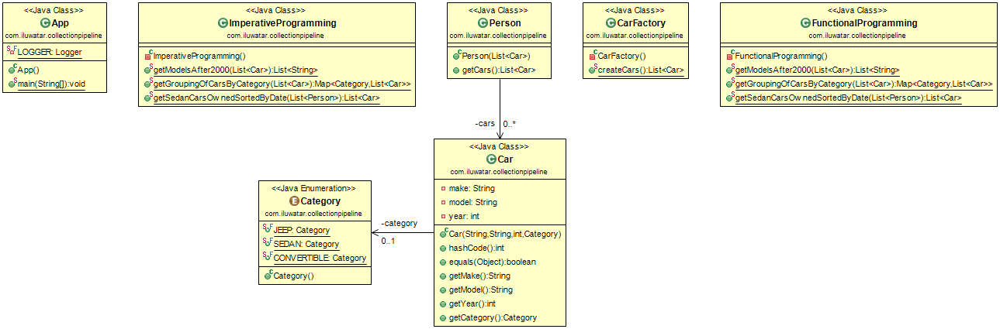

## 釋義
**集合管道（Collection Pipeline）**包含**函式組合（Function Composition）**和**集合管道（Collection Pipeline）**兩組合概念，這是兩種函數語言程式設計模式，你可以在程式碼中結合這兩種模式來進行集合迭代。
在函數語言程式設計中，可以透過一系列較小的模組化函式或操作來編排複雜的操作。這一系列函式被稱為函式組合。當一個資料集合流經一個函式組合時，它就成為一個集合管道。函式組合和集合管道是函數語言程式設計中經常使用的兩種設計模式。

## 類圖

## 適用場景
在以下場景適用集合管道模式：

* 當你想執行一組連續的運算元操作，其中一個運算元收集的輸出需要被輸入到下一個運算元中
* 當你在程式碼中需要使用大量的中間狀態語句時
* 當你在程式碼中使用大量的迴圈語句時

## 引用

* [Function composition and the Collection Pipeline pattern](https://www.ibm.com/developerworks/library/j-java8idioms2/index.html)
* [Martin Fowler](https://martinfowler.com/articles/collection-pipeline/)
* [Java8 Streams](https://docs.oracle.com/javase/8/docs/api/java/util/stream/package-summary.html)