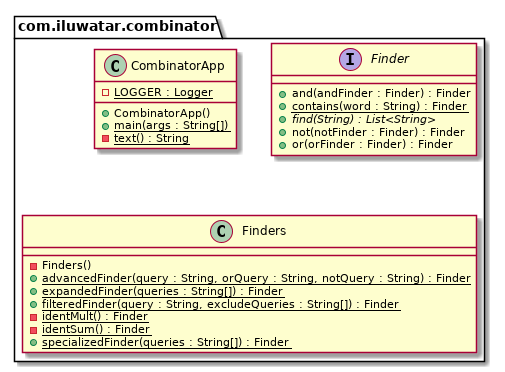

## 或稱

構圖模式

## 目的

功能模式代表了一種以組合功能為中心的圖書館組織風格。
簡單地說，有一些型別 T，一些用於構造型別 T 的“原始”值的函式，以及一些可以以各種方式組合型別 T 的值以構建更復雜的型別 T 值的“組合器”。

## 解釋

真實世界例子

> 在電腦科學中，組合邏輯被用作計算的簡化模型，用於可計算性理論和證明理論。 儘管組合邏輯很簡單，但它捕獲了計算的許多基本特徵。
> 

通俗的說
> 組合器允許從先前定義的“事物”建立新的“事物”。
> 

維基百科說

> 組合器是一個高階函式，僅使用函式應用程式和之前定義的組合器來定義其引數的結果。
> 

**程式示例**

翻譯上面的組合器示例。 首先，我們有一個由幾個方法`contains`, `not`, `or`, `and`組成的介面。

```java
// 用於查詢文字中的行的功能介面。
public interface Finder {

	// 在文字中查詢行的函式。
	List<String> find(String text);

	// 函式{@link #find(String)}的簡單實現。
	static Finder contains(String word) {
    		return txt -> Stream.of(txt.split("\n"))
        		.filter(line -> line.toLowerCase().contains(word.toLowerCase()))
        		.collect(Collectors.toList());
  	}

	// 組合器：not。
	default Finder not(Finder notFinder) {
    		return txt -> {
      			List<String> res = this.find(txt);
      			res.removeAll(notFinder.find(txt));
      			return res;
    			};
  	}

	// 組合器：or。
	default Finder or(Finder orFinder) {
    		return txt -> {
      			List<String> res = this.find(txt);
      			res.addAll(orFinder.find(txt));
      			return res;
    			};
	}

	// 組合器：and。
	default Finder and(Finder andFinder) {
    		return
        	txt -> this
            		.find(txt)
            		.stream()
            		.flatMap(line -> andFinder.find(line).stream())
            		.collect(Collectors.toList());
  	}
	...
}
```

然後我們還有另一個組合器用於一些複雜的查詢器`advancedFinder`, `filteredFinder`, `specializedFinder`和`expandedFinder`。

```java
// 由簡單取景器組成的複雜取景器。
public class Finders {

	private Finders() {
  	}

	// Finder 用於查詢複雜的查詢。
	public static Finder advancedFinder(String query, String orQuery, String notQuery) {
    		return
        		Finder.contains(query)
            			.or(Finder.contains(orQuery))
            			.not(Finder.contains(notQuery));
	}

	// 過濾查詢器也會查詢包含排除查詢的查詢。
	public static Finder filteredFinder(String query, String... excludeQueries) {
		var finder = Finder.contains(query);

    		for (String q : excludeQueries) {
      			finder = finder.not(Finder.contains(q));
    		}
    		return finder;
	}

	// 專門查詢。 每個下一個查詢都會在上一個結果中查詢。
	public static Finder specializedFinder(String... queries) {
    		var finder = identMult();

		for (String query : queries) {
      			finder = finder.and(Finder.contains(query));
    		}
    		return finder;
  	}

	// 擴充套件查詢。 尋找替代品。
	public static Finder expandedFinder(String... queries) {
    		var finder = identSum();

    		for (String query : queries) {
      			finder = finder.or(Finder.contains(query));
    		}
   		return finder;
  	}
	...
}
```

現在我們已經建立了組合器的介面和方法。 現在我們有一個處理這些組合器的應用程式。

```java
var queriesOr = new String[]{"many", "Annabel"};
var finder = Finders.expandedFinder(queriesOr);
var res = finder.find(text());
LOGGER.info("the result of expanded(or) query[{}] is {}", queriesOr, res);

var queriesAnd = new String[]{"Annabel", "my"};
finder = Finders.specializedFinder(queriesAnd);
res = finder.find(text());
LOGGER.info("the result of specialized(and) query[{}] is {}", queriesAnd, res);

finder = Finders.advancedFinder("it was", "kingdom", "sea");
res = finder.find(text());
LOGGER.info("the result of advanced query is {}", res);

res = Finders.filteredFinder(" was ", "many", "child").find(text());
LOGGER.info("the result of filtered query is {}", res);

private static String text() {
    return
        "It was many and many a year ago,\n"
            + "In a kingdom by the sea,\n"
            + "That a maiden there lived whom you may know\n"
            + "By the name of ANNABEL LEE;\n"
            + "And this maiden she lived with no other thought\n"
            + "Than to love and be loved by me.\n"
            + "I was a child and she was a child,\n"
            + "In this kingdom by the sea;\n"
            + "But we loved with a love that was more than love-\n"
            + "I and my Annabel Lee;\n"
            + "With a love that the winged seraphs of heaven\n"
            + "Coveted her and me.";
  }
```

**程式輸出:**

```java
the result of expanded(or) query[[many, Annabel]] is [It was many and many a year ago,, By the name of ANNABEL LEE;, I and my Annabel Lee;]
the result of specialized(and) query[[Annabel, my]] is [I and my Annabel Lee;]
the result of advanced query is [It was many and many a year ago,]
the result of filtered query is [But we loved with a love that was more than love-]
```

現在我們可以設計我們的應用程式，使其具有查詢查詢功能`expandedFinder`, `specializedFinder`, `advancedFinder`, `filteredFinder`，這些功能均派生自`contains`, `or`, `not`, `and`。


## 類圖


## 適用性
在以下情況下使用組合器模式：

- 你可以從更簡單的值建立更復雜的值，但具有相同的型別（它們的組合）

## 好處

- 從開發人員的角度來看，API 由領域中的術語組成。
- 組合階段和應用階段之間有明顯的區別。
- 首先構造一個例項，然後執行它。
- 這使得該模式適用於並行環境。


## 現實世界的例子

- java.util.function.Function#compose
- java.util.function.Function#andThen

## 鳴謝

- [Example for java](https://gtrefs.github.io/code/combinator-pattern/)
- [Combinator pattern](https://wiki.haskell.org/Combinator_pattern)
- [Combinatory logic](https://wiki.haskell.org/Combinatory_logic)
