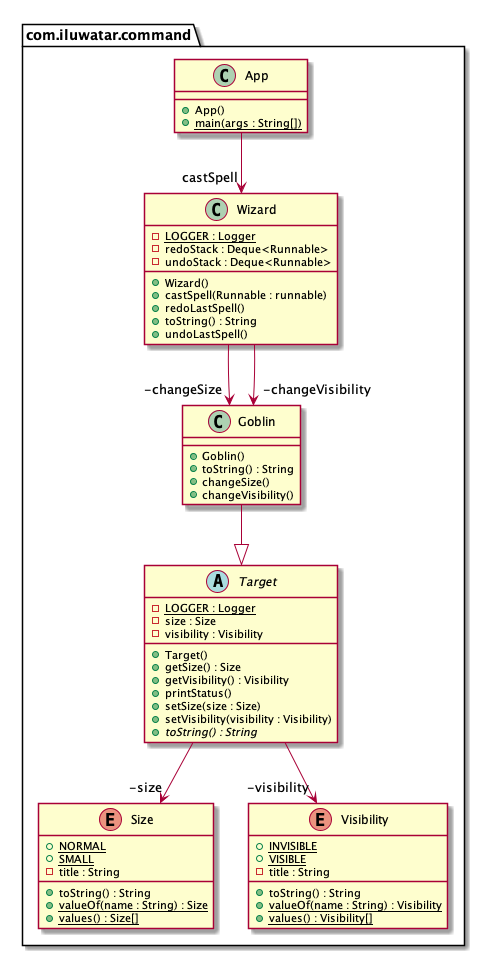

## 或稱
行動, 事務模式

## 目的
將請求封裝為物件，從而使你可以將具有不同請求的客戶端引數化，佇列或記錄請求，並且支援可撤銷操作。

## 解釋
真實世界例子

> 有一個巫師在地精上施放咒語。咒語在地精上一一執行。第一個咒語使地精縮小，第二個使他不可見。然後巫師將咒語一個個的反轉。這裡的每一個咒語都是一個可撤銷的命令物件。

用通俗的話說

> 用命令物件的方式儲存請求以在將來時可以執行它或撤銷它。

維基百科說

> 在物件導向程式設計中，命令模式是一種行為型設計模式，它把在稍後執行的一個動作或觸發的一個事件所需要的所有資訊封裝到一個物件中。

**程式設計示例**

這是巫師和地精的示例程式碼。讓我們從巫師類開始。

```java
public class Wizard {

  private static final Logger LOGGER = LoggerFactory.getLogger(Wizard.class);

  private final Deque<Runnable> undoStack = new LinkedList<>();
  private final Deque<Runnable> redoStack = new LinkedList<>();

  public Wizard() {}

  public void castSpell(Command command, Target target) {
    LOGGER.info("{} casts {} at {}", this, command, target);
    command.execute(target);
    undoStack.offerLast(command);
  }

  public void undoLastSpell() {
    if (!undoStack.isEmpty()) {
      var previousSpell = undoStack.pollLast();
      redoStack.offerLast(previousSpell);
      LOGGER.info("{} undoes {}", this, previousSpell);
      previousSpell.undo();
    }
  }

  public void redoLastSpell() {
    if (!redoStack.isEmpty()) {
      var previousSpell = redoStack.pollLast();
      undoStack.offerLast(previousSpell);
      LOGGER.info("{} redoes {}", this, previousSpell);
      previousSpell.redo();
    }
  }

  @Override
  public String toString() {
    return "Wizard";
  }
}
```

接下來我們介紹咒語層級

```java
public interface Command {

  void execute(Target target);

  void undo();

  void redo();

  String toString();
}

public class InvisibilitySpell implements Command {

  private Target target;

  @Override
  public void execute(Target target) {
    target.setVisibility(Visibility.INVISIBLE);
    this.target = target;
  }

  @Override
  public void undo() {
    if (target != null) {
      target.setVisibility(Visibility.VISIBLE);
    }
  }

  @Override
  public void redo() {
    if (target != null) {
      target.setVisibility(Visibility.INVISIBLE);
    }
  }

  @Override
  public String toString() {
    return "Invisibility spell";
  }
}

public class ShrinkSpell implements Command {

  private Size oldSize;
  private Target target;

  @Override
  public void execute(Target target) {
    oldSize = target.getSize();
    target.setSize(Size.SMALL);
    this.target = target;
  }

  @Override
  public void undo() {
    if (oldSize != null && target != null) {
      var temp = target.getSize();
      target.setSize(oldSize);
      oldSize = temp;
    }
  }

  @Override
  public void redo() {
    undo();
  }

  @Override
  public String toString() {
    return "Shrink spell";
  }
}
```

最後我們有咒語的目標地精。

```java
public abstract class Target {

  private static final Logger LOGGER = LoggerFactory.getLogger(Target.class);

  private Size size;

  private Visibility visibility;

  public Size getSize() {
    return size;
  }

  public void setSize(Size size) {
    this.size = size;
  }

  public Visibility getVisibility() {
    return visibility;
  }

  public void setVisibility(Visibility visibility) {
    this.visibility = visibility;
  }

  @Override
  public abstract String toString();

  public void printStatus() {
    LOGGER.info("{}, [size={}] [visibility={}]", this, getSize(), getVisibility());
  }
}

public class Goblin extends Target {

  public Goblin() {
    setSize(Size.NORMAL);
    setVisibility(Visibility.VISIBLE);
  }

  @Override
  public String toString() {
    return "Goblin";
  }

}
```

最後是整個示例的實踐。

```java
var wizard = new Wizard();
var goblin = new Goblin();
goblin.printStatus();
// Goblin, [size=normal] [visibility=visible]
wizard.castSpell(new ShrinkSpell(), goblin);
// Wizard casts Shrink spell at Goblin
goblin.printStatus();
// Goblin, [size=small] [visibility=visible]
wizard.castSpell(new InvisibilitySpell(), goblin);
// Wizard casts Invisibility spell at Goblin
goblin.printStatus();
// Goblin, [size=small] [visibility=invisible]
wizard.undoLastSpell();
// Wizard undoes Invisibility spell
goblin.printStatus();
// Goblin, [size=small] [visibility=visible]
```

## 類圖


## 適用性
使用命令模式當你想

* 透過操作將物件引數化。你可以使用回撥函式（即，已在某處註冊以便稍後呼叫的函式）以過程語言表示這種引數化。命令是回撥的一種物件導向替代方案。
* 在不同的時間指定，排隊和執行請求。一個命令物件的生存期可以獨立於原始請求。如果請求的接收方可以以地址空間無關的方式來表示，那麼你可以將請求的命令物件傳輸到其他程序並在那裡執行請求。
* 支援撤銷。命令的執行操作可以在命令本身中儲存狀態以反轉其效果。命令介面必須有新增的反執行操作，該操作可以逆轉上一次執行呼叫的效果。執行的命令儲存在歷史列表中。無限撤消和重做透過分別向後和向前遍歷此列表來實現，分別呼叫unexecute和execute。
* 支援日誌記錄更改，以便在系統崩潰時可以重新應用它們。透過使用載入和儲存操作擴充套件命令介面，你可以保留更改的永久日誌。從崩潰中恢復涉及從磁碟重新載入記錄的命令，並透過執行操作重新執行它們。
* 透過原始的操作來構建一個以高階操作圍繞的系統。這種結構在支援事務的資訊系統中很常見。事務封裝了一組資料更改。命令模式提供了一種對事務進行建模的方法。命令具有公共介面，讓你以相同的方式呼叫所有事務。該模式還可以透過新的事務來輕鬆擴充套件系統。

## 典型用例

* 保留請求歷史
* 實現回撥功能
* 實現撤銷功能

## Java世界例子

* [java.lang.Runnable](http://docs.oracle.com/javase/8/docs/api/java/lang/Runnable.html)
* [org.junit.runners.model.Statement](https://github.com/junit-team/junit4/blob/master/src/main/java/org/junit/runners/model/Statement.java)
* [Netflix Hystrix](https://github.com/Netflix/Hystrix/wiki)
* [javax.swing.Action](http://docs.oracle.com/javase/8/docs/api/javax/swing/Action.html)

## 鳴謝

* [Design Patterns: Elements of Reusable Object-Oriented Software](https://www.amazon.com/gp/product/0201633612/ref=as_li_tl?ie=UTF8&camp=1789&creative=9325&creativeASIN=0201633612&linkCode=as2&tag=javadesignpat-20&linkId=675d49790ce11db99d90bde47f1aeb59)
* [Head First Design Patterns: A Brain-Friendly Guide](https://www.amazon.com/gp/product/0596007124/ref=as_li_tl?ie=UTF8&camp=1789&creative=9325&creativeASIN=0596007124&linkCode=as2&tag=javadesignpat-20&linkId=6b8b6eea86021af6c8e3cd3fc382cb5b)
* [Refactoring to Patterns](https://www.amazon.com/gp/product/0321213351/ref=as_li_tl?ie=UTF8&camp=1789&creative=9325&creativeASIN=0321213351&linkCode=as2&tag=javadesignpat-20&linkId=2a76fcb387234bc71b1c61150b3cc3a7)
* [J2EE Design Patterns](https://www.amazon.com/gp/product/0596004273/ref=as_li_tl?ie=UTF8&camp=1789&creative=9325&creativeASIN=0596004273&linkCode=as2&tag=javadesignpat-20&linkId=f27d2644fbe5026ea448791a8ad09c94)
