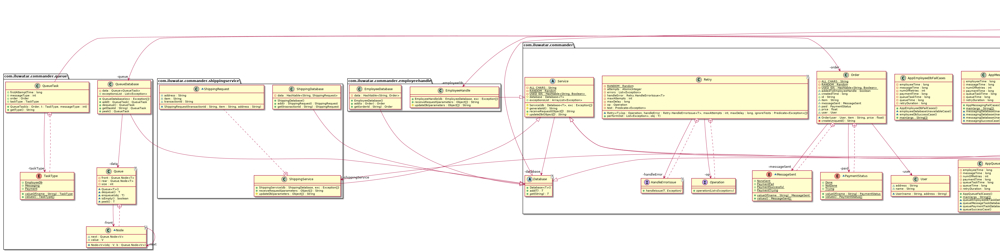

## 目的

> 用於處理執行分散式事務時可能遇到的所有問題。

## 類圖

## 適用場合
當我們需要提交兩個資料庫去完成事務，提交不是原子性且可能因此造成問題時，適合用這個設計模式。

## 解釋
處理分散式事務很棘手，但如果我們不仔細處理，可能會帶來不想要的後果。假設我們有一個電子商務網站，它有一個支付微服務和一個運輸微服務。如果當前運輸可用，但支付服務不可用，或者反之，當我們已經收到使用者的訂單後，我們應該如何處理？我們需要有一個機制來處理這些情況。我們必須將訂單指向其中一個服務（在這個例子中是運輸），然後將訂單新增到另一個服務的資料庫中（在這個例子中是支付），因為兩個資料庫不能原子地更新。如果我們當前無法做到這一點，應該有一個佇列，可以將這個請求排隊，並且必須有一個機制，允許佇列中出現失敗。所有這些都需要透過不斷的重試，在保證冪等性（即使請求多次，變化只應用一次）的情況下，由一個指揮類來完成，以達到最終一致性的狀態。

## 鳴謝

* [Distributed Transactions: The Icebergs of Microservices](https://www.grahamlea.com/2016/08/distributed-transactions-microservices-icebergs/)
