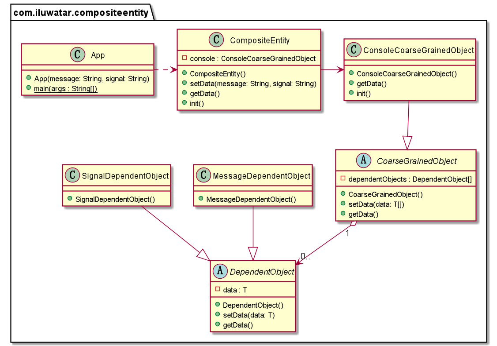

## 含義

複合實體模式用於對一組相關聯的持久化物件進行建模、描述和管理，用於取代對這組物件描述為單獨粒度的實體。

## 解釋

現例項子

> 對於一個控制檯物件，需要管理許多介面功能。透過使用複合實體模式，將訊息物件、訊號物件等依賴性物件組合在一起，直接使用單個物件對其進行控制。

簡單地說

> 複合實體模式允許使用一個統一物件來管理一組相互關聯的物件

**程式設計示例**

我們需要一個通用的解決方案來解決上述的控制檯問題。我們引入了以下的通用複合物件。

```java
public abstract class DependentObject<T> {

  T data;

  public void setData(T message) {
    this.data = message;
  }

  public T getData() {
    return data;
  }
}

public abstract class CoarseGrainedObject<T> {

  DependentObject<T>[] dependentObjects;

  public void setData(T... data) {
    IntStream.range(0, data.length).forEach(i -> dependentObjects[i].setData(data[i]));
  }

  public T[] getData() {
    return (T[]) Arrays.stream(dependentObjects).map(DependentObject::getData).toArray();
  }
}

```

專用的 `console` 複合實體繼承自這個基類，如下所示。

```java
public class MessageDependentObject extends DependentObject<String> {

}

public class SignalDependentObject extends DependentObject<String> {

}

public class ConsoleCoarseGrainedObject extends CoarseGrainedObject<String> {

  @Override
  public String[] getData() {
    super.getData();
    return new String[]{
        dependentObjects[0].getData(), dependentObjects[1].getData()
    };
  }

  public void init() {
    dependentObjects = new DependentObject[]{
        new MessageDependentObject(), new SignalDependentObject()};
  }
}

public class CompositeEntity {

  private final ConsoleCoarseGrainedObject console = new ConsoleCoarseGrainedObject();

  public void setData(String message, String signal) {
    console.setData(message, signal);
  }

  public String[] getData() {
    return console.getData();
  }
}
```

現在我們使用 `console` 複合實體來進行訊息物件、訊號物件的分配。

```java
var console = new CompositeEntity();
console.init();
console.setData("No Danger", "Green Light");
Arrays.stream(console.getData()).forEach(LOGGER::info);
console.setData("Danger", "Red Light");
Arrays.stream(console.getData()).forEach(LOGGER::info);
```

## 類圖



## 適用場景

複合實體模式適用於以下場景：

* 你想要透過一個物件來管理多個依賴物件，已調整物件之間的細化程度。同時將依賴物件的生命週期託管到這個粗粒度的複合實體物件。
## 引用

* [Composite Entity Pattern in wikipedia](https://en.wikipedia.org/wiki/Composite_entity_pattern)