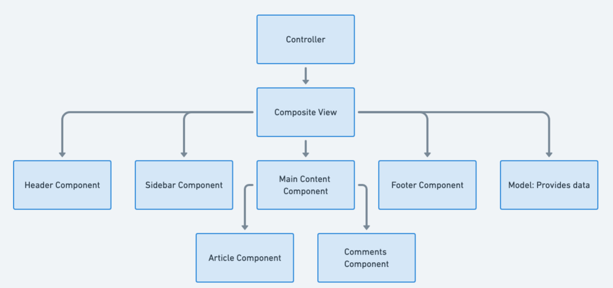

## 複合視圖設計模式的目的

複合視圖模式的主要目標，是將物件組合成代表部分與整體階層的樹狀結構，讓用戶端能以一致方式處理個別物件與物件組合，簡化複雜階層式視圖的管理。

## 複合視圖模式的詳細說明與真實世界範例

真實世界範例

> Web 應用程式的儀表板就是複合視圖的例子。金融儀表板可能顯示股價圖、近期交易、帳戶餘額與新聞摘要，每個元件都能獨立更新與管理。透過複合視圖，這些元件被組合成統一的儀表板，便於重新排列或加入新元件，同時維持整體版面的一致管理。

簡單來說

> 複合視圖是由較小子視圖組成的主要視圖。複合視圖的版面依照範本配置，再由視圖管理器決定要加入哪些子視圖。

維基百科指出，複合視圖由多個原子子視圖組成，各元件可以動態加入整體，版面也能與內容分開管理，藉由模組化範本片段的加入與替換來重複使用視圖元件。

流程圖



## Java 複合視圖模式的程式範例

新聞網站會依照使用者偏好顯示日期與新聞，並根據興趣替換不同的新聞摘要，若沒有偏好則顯示本地新聞。本範例使用 Tomcat 10.0.13，且需要 Tomcat 10 以上版本。

`AppServlet` 只負責將 GET 請求轉送到正確的 JSP；PUT、POST 與 DELETE 請求會顯示錯誤訊息。

```java
public class AppServlet extends HttpServlet {
    private String destination = "newsDisplay.jsp";

    @Override
    public void doGet(HttpServletRequest req, HttpServletResponse resp)
            throws ServletException, IOException {
        RequestDispatcher dispatcher = req.getRequestDispatcher(destination);
        ClientPropertiesBean properties = new ClientPropertiesBean(req);
        req.setAttribute("properties", properties);
        dispatcher.forward(req, resp);
    }
}
```

視圖管理由儲存使用者偏好的 JavaBean `ClientPropertiesBean` 負責：

```java
public class ClientPropertiesBean implements Serializable {
    private boolean worldNewsInterest;
    private boolean sportsInterest;
    private boolean businessInterest;
    private boolean scienceNewsInterest;
    private String name;

    public ClientPropertiesBean(HttpServletRequest req) {
        worldNewsInterest = Boolean.parseBoolean(req.getParameter("world"));
        sportsInterest = Boolean.parseBoolean(req.getParameter("sport"));
        businessInterest = Boolean.parseBoolean(req.getParameter("bus"));
        scienceNewsInterest = Boolean.parseBoolean(req.getParameter("sci"));
        name = req.getParameter("name");
    }
}
```

`newsDisplay.jsp` 是新聞頁面的範本，會依照 JavaBean 中的偏好條件加入不同的原子子視圖：

```html
<h1>Welcome <%= propertiesBean.getName()%></h1>
<jsp:include page="header.jsp"></jsp:include>
<table class="centerTable">
  <tr>
    <td></td>
    <% if(propertiesBean.isWorldNewsInterest()) { %>
      <td><%@include file="worldNews.jsp"%></td>
    <% } else { %>
      <td><%@include file="localNews.jsp"%></td>
    <% } %>
    <td></td>
  </tr>
</table>
```

這個範本有三列：第一列一個元件、第二列兩個元件、第三列一個元件。`businessNews.jsp`、`localNews.jsp` 等子視圖會依請求參數條件加入。

### 如何使用

安裝 Tomcat 10 以上版本，將模組建置為 WAR 檔並部署到伺服器。若使用 IntelliJ，請在 Run 的設定中加入 Tomcat，並在 Deployment 中加入 `composite-view:war exploded`，確認輸出內容包含 `web` 目錄與模組編譯結果後執行。

## 何時使用複合視圖模式

* 需要表示物件的部分與整體階層。
* 預期複合結構未來可能加入新元件。
* 希望用戶端忽略物件組合與個別物件的差異，以一致方式處理整個結構。

## 複合視圖模式的實際應用

* GUI 中可包含其他元件的元件，例如包含面板、按鈕與文字欄位的視窗。
* 文件結構，例如由列組成的表格，而列又由儲存格組成，所有元素都可視為統一階層中的成員。

## 複合視圖模式的優點與取捨

優點：

* 容易加入新元件，因為複合節點與葉節點以一致方式處理。
* 簡化用戶端程式碼，降低分別處理個別元素與複合結構的複雜度。

取捨：

* 若所有物件都設計成複合物件，可能造成過度泛化與額外複雜度。
* 限制複合結構只能包含特定類型的元件可能較困難。

## 相關 Java 設計模式

* [組合](https://java-design-patterns.com/patterns/composite/)：複合視圖的基礎結構模式。
* [裝飾者](https://java-design-patterns.com/patterns/decorator/)：不修改原視圖就能增加個別視圖的行為。
* [享元](https://java-design-patterns.com/patterns/flyweight/)：管理大量相似視圖物件的記憶體使用量。
* 視圖輔助器：將視圖邏輯與商業邏輯分離。

## 參考資料與致謝

* [Head First Design Patterns](https://amzn.to/3xfntGJ)
* [Patterns of Enterprise Application Architecture](https://amzn.to/49jpQG3)
* [Core J2EE Patterns - Composite View（Oracle）](https://www.oracle.com/java/technologies/composite-view.html)