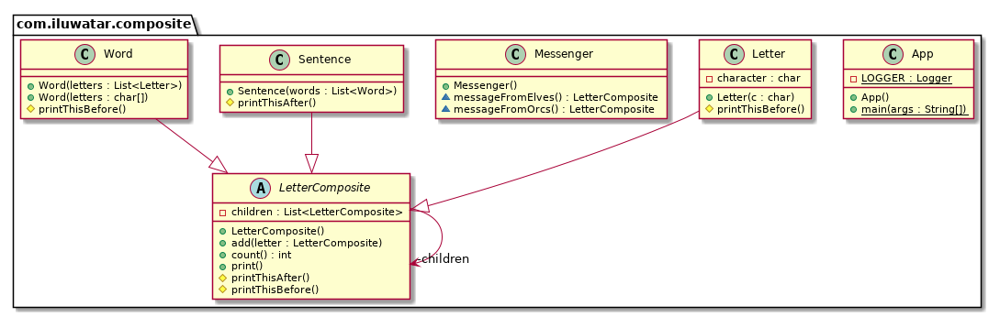

## 目的

將物件組合成樹結構以表示部分整體層次結構。 組合可以使客戶統一對待單個物件和組合物件。

## 解釋

真實世界例子

> 每個句子由單片語成，單詞又由字元組成。這些物件中的每一個都是可列印的，它們可以在它們之前或之後列印一些內容，例如句子始終以句號結尾，單詞始終在其前面有空格。

通俗的說

> 組合模式使客戶能夠以統一的方式對待各個物件。

維基百科說

> 在軟體工程中，組合模式是一種分割槽設計模式。組合模式中，一組物件將像一個物件的單獨例項一樣被對待。組合的目的是將物件“組成”樹狀結構，以表示部分整體層次結構。實現組合模式可使客戶統一對待單個物件和組合物件。

**程式示例**

使用上面的句子例子。 這裡我們有基類`LetterComposite`和不同的可列印型別`Letter`，`Word`和`Sentence`。

```java
public abstract class LetterComposite {

  private final List<LetterComposite> children = new ArrayList<>();

  public void add(LetterComposite letter) {
    children.add(letter);
  }

  public int count() {
    return children.size();
  }

  protected void printThisBefore() {
  }

  protected void printThisAfter() {
  }

  public void print() {
    printThisBefore();
    children.forEach(LetterComposite::print);
    printThisAfter();
  }
}

public class Letter extends LetterComposite {

  private final char character;

  public Letter(char c) {
    this.character = c;
  }

  @Override
  protected void printThisBefore() {
    System.out.print(character);
  }
}

public class Word extends LetterComposite {

  public Word(List<Letter> letters) {
    letters.forEach(this::add);
  }

  public Word(char... letters) {
    for (char letter : letters) {
      this.add(new Letter(letter));
    }
  }

  @Override
  protected void printThisBefore() {
    System.out.print(" ");
  }
}

public class Sentence extends LetterComposite {

  public Sentence(List<Word> words) {
    words.forEach(this::add);
  }

  @Override
  protected void printThisAfter() {
    System.out.print(".");
  }
}
```

然後我們有一個訊息攜帶者來攜帶訊息。

```java
public class Messenger {

  LetterComposite messageFromOrcs() {

    var words = List.of(
        new Word('W', 'h', 'e', 'r', 'e'),
        new Word('t', 'h', 'e', 'r', 'e'),
        new Word('i', 's'),
        new Word('a'),
        new Word('w', 'h', 'i', 'p'),
        new Word('t', 'h', 'e', 'r', 'e'),
        new Word('i', 's'),
        new Word('a'),
        new Word('w', 'a', 'y')
    );

    return new Sentence(words);

  }

  LetterComposite messageFromElves() {

    var words = List.of(
        new Word('M', 'u', 'c', 'h'),
        new Word('w', 'i', 'n', 'd'),
        new Word('p', 'o', 'u', 'r', 's'),
        new Word('f', 'r', 'o', 'm'),
        new Word('y', 'o', 'u', 'r'),
        new Word('m', 'o', 'u', 't', 'h')
    );

    return new Sentence(words);

  }

}
```

然後它可以這樣使用:

```java
var orcMessage = new Messenger().messageFromOrcs();
orcMessage.print(); // Where there is a whip there is a way.
var elfMessage = new Messenger().messageFromElves();
elfMessage.print(); // Much wind pours from your mouth.
```

## 類圖



## 適用性

使用組合模式當

* 你想要表示物件的整體層次結構
* 你希望客戶能夠忽略組合物件和單個物件之間的差異。 客戶將統一對待組合結構中的所有物件。

## 真實世界例子

* [java.awt.Container](http://docs.oracle.com/javase/8/docs/api/java/awt/Container.html) and [java.awt.Component](http://docs.oracle.com/javase/8/docs/api/java/awt/Component.html)
* [Apache Wicket](https://github.com/apache/wicket) component tree, see [Component](https://github.com/apache/wicket/blob/91e154702ab1ff3481ef6cbb04c6044814b7e130/wicket-core/src/main/java/org/apache/wicket/Component.java) and [MarkupContainer](https://github.com/apache/wicket/blob/b60ec64d0b50a611a9549809c9ab216f0ffa3ae3/wicket-core/src/main/java/org/apache/wicket/MarkupContainer.java)

## 鳴謝

* [Design Patterns: Elements of Reusable Object-Oriented Software](https://www.amazon.com/gp/product/0201633612/ref=as_li_tl?ie=UTF8&camp=1789&creative=9325&creativeASIN=0201633612&linkCode=as2&tag=javadesignpat-20&linkId=675d49790ce11db99d90bde47f1aeb59)
* [Head First Design Patterns: A Brain-Friendly Guide](https://www.amazon.com/gp/product/0596007124/ref=as_li_tl?ie=UTF8&camp=1789&creative=9325&creativeASIN=0596007124&linkCode=as2&tag=javadesignpat-20&linkId=6b8b6eea86021af6c8e3cd3fc382cb5b)
* [Refactoring to Patterns](https://www.amazon.com/gp/product/0321213351/ref=as_li_tl?ie=UTF8&camp=1789&creative=9325&creativeASIN=0321213351&linkCode=as2&tag=javadesignpat-20&linkId=2a76fcb387234bc71b1c61150b3cc3a7)
