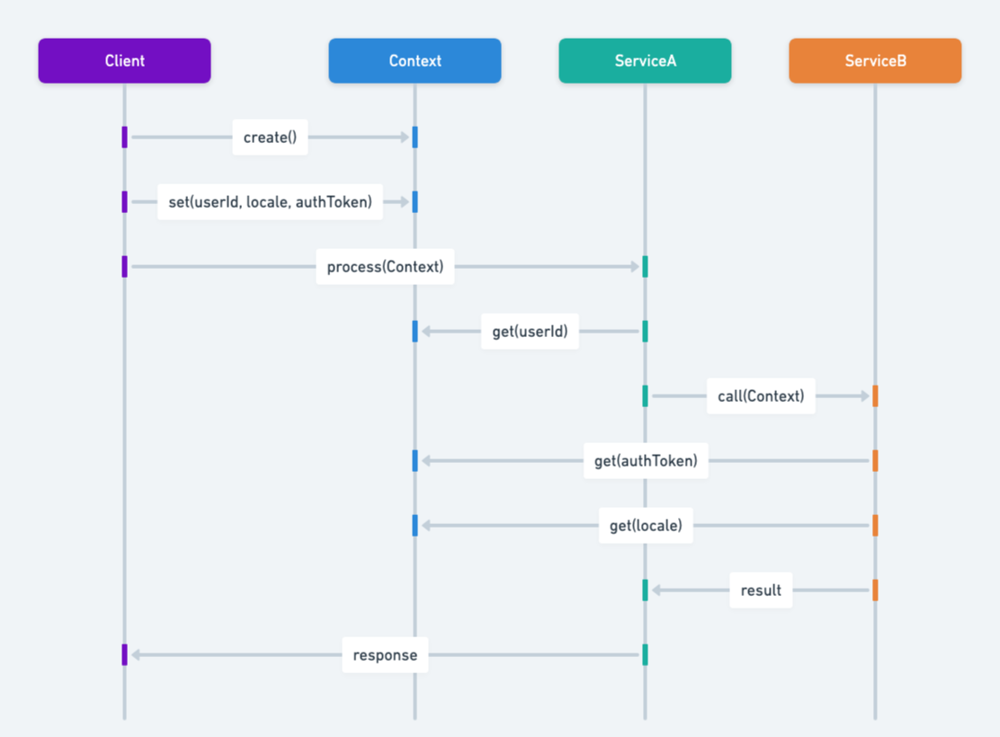

## 又稱為

* Context
* 情境封裝
* 情境持有者
* 封裝情境

## 情境物件設計模式的目的

封裝與使用者或目前處理的請求相關的情境狀態與行為，使 Java 應用程式元件不必直接面對環境複雜度，並有效管理應用程式情境。

## 情境物件模式的詳細說明與真實世界範例

真實世界範例

> 忙碌的機場中，多個服務都需要在旅途中存取與共享旅客資訊。機場不讓每個服務分別要求與傳遞資料，而是使用「旅客情境物件」保存身分、航班細節與偏好。報到、安檢、登機與客服服務都能依需要讀取或更新它，既保持一致，也避免服務緊密耦合。

簡單來說

> 建立物件儲存與管理情境資料，並在 Java 應用程式需要時傳遞此情境物件，讓程式更解耦、更乾淨。

[Core J2EE Patterns](http://corej2eepatterns.com/ContextObject.htm)指出：

> 使用情境物件，以與協定無關的方式封裝狀態，並在整個應用程式中共享。

序列圖



## Java 情境物件的程式範例

多層 Java 應用程式中的 A、B、C 層會從共享情境取得不同資訊。逐一傳遞每筆資料效率不佳，因此使用情境物件集中保存與傳遞。

```java
@Getter
@Setter
public class ServiceContext {
    String accountService;
    String sessionService;
    String searchService;
}

public class ServiceContextFactory {
    public static ServiceContext createContext() {
        return new ServiceContext();
    }
}
```

第一層建立情境，後續層取得目前層的情境並繼續填入資料：

```java
@Getter
public class LayerA {
    private static ServiceContext context;
    public LayerA() { context = ServiceContextFactory.createContext(); }
    public void addAccountInfo(String accountService) {
        context.setACCOUNT_SERVICE(accountService);
    }
}

@Getter
public class LayerB {
    private final ServiceContext context;
    public LayerB(LayerA layerA) { context = layerA.getContext(); }
    public void addSessionInfo(String sessionService) {
        context.setSESSION_SERVICE(sessionService);
    }
}

@Getter
public class LayerC {
    private final ServiceContext context;
    public LayerC(LayerB layerB) { context = layerB.getContext(); }
    public void addSearchInfo(String searchService) {
        context.setSEARCH_SERVICE(searchService);
    }
}
```

情境物件在各層之間傳遞，且保留先前層加入的資訊：

```java
public static void main(String[] args) {
    var layerA = new LayerA();
    layerA.addAccountInfo("SERVICE");
    logContext(layerA.getContext());
    var layerB = new LayerB(layerA);
    layerB.addSessionInfo("SERVICE");
    logContext(layerB.getContext());
    var layerC = new LayerC(layerB);
    layerC.addSearchInfo("SERVICE");
    logContext(layerC.getContext());
}
```

程式輸出中三次記錄會顯示同一個 `ServiceContext` 實例。

## 何時使用情境物件模式

* 需要抽象與封裝情境資訊，避免環境專屬程式碼污染商業邏輯。
* Web 應用程式需要封裝請求專屬資訊，讓整個應用程式都能存取。
* 分散式系統需要傳遞工作情境、使用者偏好或安全憑證。

## 情境物件模式的實際應用

* Web 框架封裝 HTTP 請求與回應、工作階段及其他請求資料。
* 企業 Java 應用程式在不同層與服務間傳遞交易資訊、安全憑證與使用者設定。
* [Spring ApplicationContext](https://docs.spring.io/spring-framework/docs/current/javadoc-api/org/springframework/context/ApplicationContext.html)
* [Oracle SecurityContext](https://docs.oracle.com/javaee/7/api/javax/ws/rs/core/SecurityContext.html)
* [Oracle ServletContext](https://docs.oracle.com/javaee/6/api/javax/servlet/ServletContext.html)

## 情境物件模式的優點與取捨

優點：

* 解耦：元件與服務不依賴特定執行環境，提高模組化與可維護性。
* 集中：情境資訊集中在一處，容易管理、存取與除錯。
* 彈性：可依環境或需求變化彈性管理情境。

取捨：

* 若實作效率不佳，加入情境物件可能增加效能負擔。
* 設計不當時可能變成難以管理與理解的龐大單體物件。

## 相關 Java 設計模式

* [單例](https://java-design-patterns.com/patterns/singleton/)：情境物件常以單例實作，提供全域存取點。
* [策略](https://java-design-patterns.com/patterns/strategy/)：可依封裝的情境使用策略調整行為。
* [裝飾者](https://java-design-patterns.com/patterns/decorator/)：可動態為情境物件加入責任。

## 參考資料與致謝

* [Core J2EE Design Patterns](https://amzn.to/3IhcY9w)
* [Context Object（Core J2EE Patterns）](http://corej2eepatterns.com/ContextObject.htm)
* [The Encapsulate Context Pattern](https://accu.org/journals/overload/12/63/kelly_246/)
* [Context Object - A Design Pattern for Efficient Information Sharing](https://www.dre.vanderbilt.edu/~schmidt/PDF/Context-Object-Pattern.pdf)