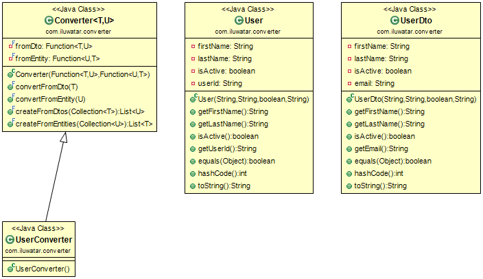

## 目的

轉換器模式的目的是提供相應型別之間雙向轉換的通用方法，允許進行乾淨的實現，而型別之間無需相互瞭解。此外，Converter模式引入了雙向集合對映，從而將樣板程式碼減少到最少。

## 解釋

真實世界例子

> 在真實的應用中經常有這種情況，資料庫層包含需要被轉換成業務邏輯層DTO來使用的實體。對於潛在的大量類進行類似的對映，我們需要一種通用的方法來實現這一點。

通俗的說

> 轉換器模式讓一個類的例項對映成另一個類的例項變得簡單

**程式示例**

我們需要一個通用的方案來解決對映問題。讓我們來介紹一個通用的轉換器。

```java
public class Converter<T, U> {

  private final Function<T, U> fromDto;
  private final Function<U, T> fromEntity;

  public Converter(final Function<T, U> fromDto, final Function<U, T> fromEntity) {
    this.fromDto = fromDto;
    this.fromEntity = fromEntity;
  }

  public final U convertFromDto(final T dto) {
    return fromDto.apply(dto);
  }

  public final T convertFromEntity(final U entity) {
    return fromEntity.apply(entity);
  }

  public final List<U> createFromDtos(final Collection<T> dtos) {
    return dtos.stream().map(this::convertFromDto).collect(Collectors.toList());
  }

  public final List<T> createFromEntities(final Collection<U> entities) {
    return entities.stream().map(this::convertFromEntity).collect(Collectors.toList());
  }
}
```

專屬的轉換器像下面一樣從基類繼承。

```java
public class UserConverter extends Converter<UserDto, User> {

  public UserConverter() {
    super(UserConverter::convertToEntity, UserConverter::convertToDto);
  }

  private static UserDto convertToDto(User user) {
    return new UserDto(user.getFirstName(), user.getLastName(), user.isActive(), user.getUserId());
  }

  private static User convertToEntity(UserDto dto) {
    return new User(dto.getFirstName(), dto.getLastName(), dto.isActive(), dto.getEmail());
  }

}
```

現在，在User和UserDto之間的對映變得輕而易舉。

```java
var userConverter = new UserConverter();
var dtoUser = new UserDto("John", "Doe", true, "whatever[at]wherever.com");
var user = userConverter.convertFromDto(dtoUser);
```

## 類圖



## 適用性

在下面這些情況下使用轉換器模式：

* 如果你的型別在邏輯上相互對應，並需要在它們之間轉換實體
* 當你想根據上下文提供不同的型別轉換方式時
* 每當你引入DTO（資料傳輸物件）時你可能都需要將其轉換為
  DO

## 鳴謝

* [Converter](http://www.xsolve.pl/blog/converter-pattern-in-java-8/)
