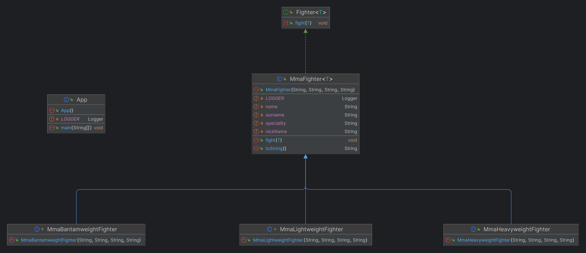

## 名稱/分類

Curiously Recurring Template Pattern，CRTP，奇異遞迴模板模式

## 別名

遞迴型別繫結，遞迴泛型

## 目的

允許派生元件從與派生型別相容的基本元件繼承某些功能。

## 解釋

真實世界的例子

> 對於正在策劃賽事的綜合格鬥推廣活動來說，確保在相同重量級的運動員之間組織比賽至關重要。這樣可以防止體型明顯不同的拳手之間的不匹配，例如重量級拳手與雛量級拳手的對決。

用通俗的話來講

> 使型別中的某些方法接受特定於其子型別的引數。

維基百科介紹

> 奇異遞迴模板模式（curiously recurring template pattern，CRTP）是C++模板程式設計時的一種慣用法：其中類X派生自使用X本身作為模板引數的類别範本例項化。

**程式示例**

讓我們來定義通用介面Fighter

```java
public interface Fighter<T> {

  void fight(T t);

}
```

MmaFighter類用於例項化按重量級別區分的拳手

``` Java
public class MmaFighter<T extends MmaFighter<T>> implements Fighter<T> {

  private final String name;
  private final String surname;
  private final String nickName;
  private final String speciality;

  public MmaFighter(String name, String surname, String nickName, String speciality) {
    this.name = name;
    this.surname = surname;
    this.nickName = nickName;
    this.speciality = speciality;
  }

  @Override
  public void fight(T opponent) {
    LOGGER.info("{} is going to fight against {}", this, opponent);
  }

  @Override
  public String toString() {
    return name + " \"" + nickName + "\" " + surname;
  }
```

以下是 MmaFighter 的一些子型別

```Java
class MmaBantamweightFighter extends MmaFighter<MmaBantamweightFighter> {

  public MmaBantamweightFighter(String name, String surname, String nickName, String speciality) {
    super(name, surname, nickName, speciality);
  }

}

public class MmaHeavyweightFighter extends MmaFighter<MmaHeavyweightFighter> {

  public MmaHeavyweightFighter(String name, String surname, String nickName, String speciality) {
    super(name, surname, nickName, speciality);
  }

}
```

允許拳手與相同重量級的對手交手，如果對手是不同重量級，則會出現錯誤

``` Java
MmaBantamweightFighter fighter1 = new MmaBantamweightFighter("Joe", "Johnson", "The Geek", "Muay Thai");
MmaBantamweightFighter fighter2 = new MmaBantamweightFighter("Ed", "Edwards", "The Problem Solver", "Judo");
fighter1.fight(fighter2); // This is fine

MmaHeavyweightFighter fighter3 = new MmaHeavyweightFighter("Dave", "Davidson", "The Bug Smasher", "Kickboxing");
MmaHeavyweightFighter fighter4 = new MmaHeavyweightFighter("Jack", "Jackson", "The Pragmatic", "Brazilian Jiu-Jitsu");
fighter3.fight(fighter4); // This is fine too

fighter1.fight(fighter3); // This will raise a compilation error
```

## 類圖



## 適用性

在以下情況下使用CRTP

* 在物件層次結構中連結方法時存在型別衝突
* 你想使用一個引數化的類方法，該方法可以接受類的子類作為引數，從而可以應用於繼承自類的物件
* 你希望某些方法僅適用於相同型別的例項，例如實現相互比較。

## 教程

* [The NuaH Blog](https://nuah.livejournal.com/328187.html)
* Yogesh Umesh Vaity answer to [What does "Recursive type bound" in Generics mean?](https://stackoverflow.com/questions/7385949/what-does-recursive-type-bound-in-generics-mean)

## 已知用途

* [java.lang.Enum](https://docs.oracle.com/en/java/javase/17/docs/api/java.base/java/lang/Enum.html)

## 鳴謝

* [How do I decrypt "Enum<E extends Enum\<E>>"?](http://www.angelikalanger.com/GenericsFAQ/FAQSections/TypeParameters.html#FAQ106)
* Chapter 5 Generics, Item 30 in [Effective Java](https://www.amazon.com/gp/product/0134685997/ref=as_li_tl?ie=UTF8&camp=1789&creative=9325&creativeASIN=0134685997&linkCode=as2&tag=javadesignpat-20&linkId=4e349f4b3ff8c50123f8147c828e53eb)
