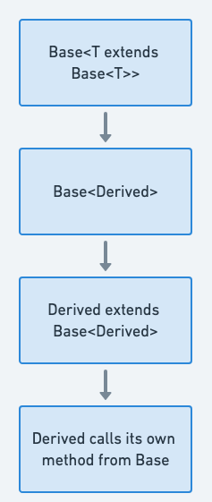

## 又稱為

* CRTP
* Mixin 繼承
* 遞迴型別界限
* 遞迴泛型
* 靜態多型

## 奇異遞迴模板模式的目的

奇異遞迴模板模式（CRTP）是 Java 中用來實現靜態多型的設計模式。類別模板繼承自己類別的模板實例，讓方法覆寫與編譯期多型行為更有效率。

## 詳細說明與真實世界範例

真實世界範例

> 圖書館管理書籍、DVD 與雜誌等媒體。每種媒體都有自己的屬性與行為，但都共用借閱與歸還功能。透過 Java 的 CRTP，可以建立包含共用方法的 `MediaItem` 基底模板，讓 `Book`、`DVD` 與 `Magazine` 以自身作為模板參數繼承它，避免虛擬方法的負擔。

簡單來說

> CRTP 讓型別中的方法能接受特定子型別的參數，在編譯期提供更有效率且型別安全的多型行為。

維基百科指出：

> 奇異遞迴模板模式原本是 C++ 的慣用法，類別 X 會以自己作為模板參數，繼承類別模板的實例。

流程圖



## Java CRTP 的程式範例

綜合格鬥賽事必須確保選手與相同量級的對手比賽，避免重量級選手對上雛量級選手。

```java
public interface Fighter<T> {
    void fight(T opponent);
}

@Slf4j
@Data
public class MmaFighter<T extends MmaFighter<T>> implements Fighter<T> {
    private final String name;
    private final String surname;
    private final String nickName;
    private final String speciality;

    @Override
    public void fight(T opponent) {
        LOGGER.info("{} is going to fight against {}", this, opponent);
    }
}

class MmaBantamweightFighter extends MmaFighter<MmaBantamweightFighter> {
    public MmaBantamweightFighter(String name, String surname,
            String nickName, String speciality) {
        super(name, surname, nickName, speciality);
    }
}

public class MmaHeavyweightFighter extends MmaFighter<MmaHeavyweightFighter> {
    public MmaHeavyweightFighter(String name, String surname,
            String nickName, String speciality) {
        super(name, surname, nickName, speciality);
    }
}
```

選手只能與相同量級的對手比賽；若量級不同，編譯器會拒絕該呼叫。

```java
MmaBantamweightFighter fighter1 = new MmaBantamweightFighter(
    "Joe", "Johnson", "The Geek", "Muay Thai");
MmaBantamweightFighter fighter2 = new MmaBantamweightFighter(
    "Ed", "Edwards", "The Problem Solver", "Judo");
fighter1.fight(fighter2);
```

## 何時在 Java 中使用 CRTP

* 需要透過繼承擴充類別，但為了效率偏好編譯期多型。
* 想避免虛擬函式呼叫負擔，同時保有多型行為。
* 使用模板元程式設計，在編譯期選擇函式或策略的實作。
* 物件階層鏈式方法呼叫時遇到型別衝突。
* 方法只應接受與目前類別相同型別的實例，例如互相比較。

## CRTP 的實際應用

* 在模板函式庫中實作編譯期多型介面。
* 在數學運算、嵌入式系統與即時處理等效能關鍵函式庫中提升程式碼重用。
* Java 函式庫中 `Cloneable` 介面的實作。

## CRTP 的優點與取捨

優點：

* 消除虛擬函式呼叫負擔，提高效能。
* 安全重用基底類別程式碼，不必承受多重繼承的風險。
* 編譯期多型情境中具有更高彈性與可擴充性。

取捨：

* 模板與繼承互動複雜，理解與除錯較困難。
* 每次模板實例化都可能產生新類別，造成程式碼膨脹。
* 相較於執行期多型較不靈活，行為必須在編譯期決定。

## 相關 Java 設計模式

* [工廠方法](https://java-design-patterns.com/patterns/factory-method/)：可搭配 CRTP，在未知具體型別時建立衍生類別。
* [策略](https://java-design-patterns.com/patterns/strategy/)：CRTP 可實作編譯期策略選擇。
* [模板方法](https://java-design-patterns.com/patterns/template-method/)：結構相似，但模板方法在執行期變化行為，CRTP 則在編譯期變化。

## 參考資料與致謝

* [Design Patterns: Elements of Reusable Object-Oriented Software](https://amzn.to/3w0pvKI)
* [Effective Java](https://amzn.to/3cGk2Jz)