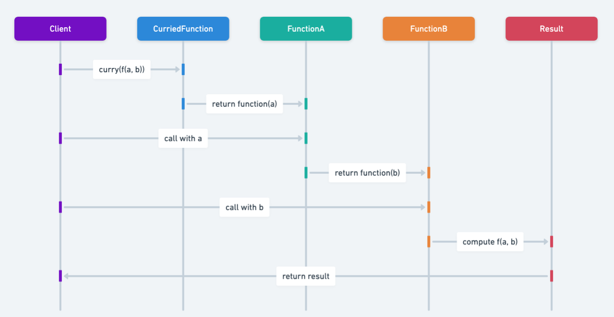

## 又稱為

* 部分函式應用

## 柯里化設計模式的目的

柯里化將接受多個參數的函式拆成一連串各自只接受一個參數的函式。這是函數式程式設計的重要技巧，可透過部分套用參數建立高階函式，讓 Java 程式更模組化、可重用且易維護。

## 柯里化模式的詳細說明與真實世界範例

真實世界範例

> 柯里化可以比喻為工廠的裝配線。每個工作站只執行一項任務，例如安裝引擎、烤漆或裝輪子；每站接收部分完成的汽車，處理後傳給下一站。柯里化也將多參數函式拆成一連串單參數函式，逐步完成複雜工作。

簡單來說

> 將接受多個參數的函式拆成多個各自接受單一參數的函式。

維基百科指出：

> 在數學與電腦科學中，柯里化是將接受多個參數的函式轉換成一連串函式族的技巧，每個函式只接受一個參數。

序列圖



## Java 柯里化模式的程式範例

圖書館員想建立不同類型與作者的書籍。柯里化可以建立柯里化的書籍建構函式，再透過部分套用產生專用函式。

```java
public class Book {
    private final Genre genre;
    private final String author;
    private final String title;
    private final LocalDate publicationDate;

    Book(Genre genre, String author, String title, LocalDate publicationDate) {
        this.genre = genre;
        this.author = author;
        this.title = title;
        this.publicationDate = publicationDate;
    }
}

public enum Genre { FANTASY, HORROR, SCI_FI }

Book createBook(Genre genre, String author, String title, LocalDate date) {
    return new Book(genre, author, title, date);
}
```

若只想建立奇幻類書籍，每次都傳入 `FANTASY` 很重複，為每種分類建立方法又不切實際，因此可以使用柯里化函式：

```java
static Function<Genre, Function<String, Function<String,
        Function<LocalDate, Book>>>> bookCreator = genre -> author -> title
        -> publicationDate -> new Book(genre, author, title, publicationDate);

Function<String, Function<String, Function<LocalDate, Book>>> fantasyBookFunc
        = bookCreator.apply(Genre.FANTASY);
```

上面的型別簽章不易閱讀，可以搭配建造者模式與函數介面改善：

```java
public static AddGenre builder() {
    return genre -> author -> title -> publicationDate
            -> new Book(genre, author, title, publicationDate);
}

public interface AddGenre { AddAuthor withGenre(Genre genre); }
public interface AddAuthor { AddTitle withAuthor(String author); }
public interface AddTitle { AddPublicationDate withTitle(String title); }
public interface AddPublicationDate { Book withPublicationDate(LocalDate date); }
```

函式會依序加入分類、作者、標題與出版日期：

```java
Book book = Book.builder().withGenre(Genre.FANTASY)
    .withAuthor("Author")
    .withTitle("Title")
    .withPublicationDate(LocalDate.of(2000, 7, 2));
```

部分套用也能建立專用的書籍建構函式，例如先固定作者或分類，再建立多本書。

## 何時在 Java 中使用柯里化模式

* Java 中需要預先固定部分參數再呼叫函式時。
* 函數式程式設計中，需要簡化接受多個參數的函式。
* 想將函式拆成簡單的一元函式，提升重用性、組合性與模組化。

## 柯里化模式的實際應用

* Haskell、Scala 與 JavaScript 等函數式程式語言。
* Java 8 引入 Lambda 與串流後的函數式程式設計。
* UI 事件處理，需要在事件發生時觸發帶有特定參數的函式。
* 需要以多個參數進行設定的 API。

## 柯里化模式的優點與取捨

優點：

* 可由通用函式建立專用函式，提高函式重用性。
* 將複雜函式拆成單參數函式，提高可讀性與可維護性。
* 促進函式組合，產生更宣告式且精簡的程式碼。

取捨：

* 建立額外閉包可能造成效能負擔。
* 增加函式呼叫層次，讓除錯更困難。
* 不熟悉函數式概念的開發者可能覺得不直觀。
* Java 中參數很多的柯里化函式會有冗長的型別簽章。

## 相關 Java 設計模式

* 函式組合：常與柯里化一起使用，讓程式碼更精簡易讀。
* [裝飾者](https://java-design-patterns.com/patterns/decorator/)：柯里化與裝飾者都包含包裝功能的概念。
* [工廠](https://java-design-patterns.com/patterns/factory/)：可建立預先固定部分參數的工廠函式。

## 參考資料與致謝

* [Currying in Java（Baeldung）](https://www.baeldung.com/java-currying)
* [What Is Currying in Programming](https://towardsdatascience.com/what-is-currying-in-programming-56fd57103431)
* [Why the fudge should I use currying?](https://medium.com/dailyjs/why-the-fudge-should-i-use-currying-84e4000c8743)