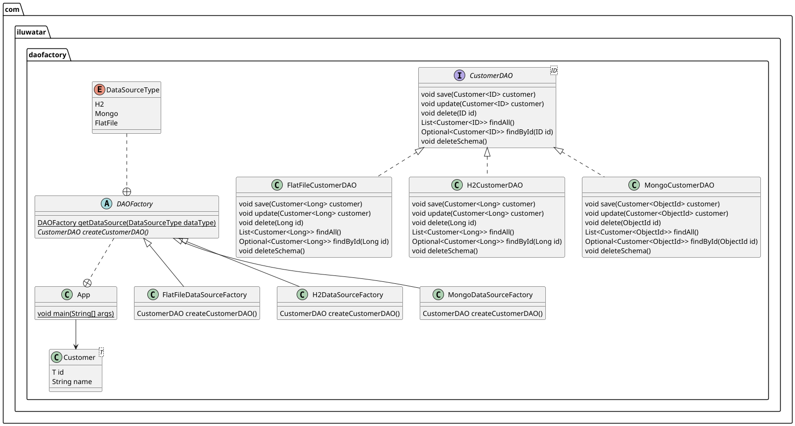

## 又稱為

* DAO 工廠
* 使用抽象工廠實作的資料存取物件策略工廠

## DAO 工廠設計模式的目的

DAO 工廠結合資料存取物件與抽象工廠模式，將商業邏輯與資料存取邏輯分離，並提高切換不同資料來源時的彈性。

## DAO 工廠模式的詳細說明與真實世界範例

真實世界範例

> DAO 工廠可以比喻為多語言客服中心。銀行服務說英語、法語與西班牙語的客戶；來電時，系統先辨識偏好語言，再將電話轉給對應團隊。每個團隊遵守相同公司政策，但以特定語言處理互動。
>
> 同樣地，DAO 工廠會依資料來源（例如 MySQL 或 MongoDB）選擇正確的 DAO 實作集合。每個工廠都回傳符合相同介面的 DAO，讓應用程式能以一致方式使用支援的資料庫，而不必修改商業邏輯。

簡單來說

> DAO 工廠抽象化資料存取物件的建立，讓你從中央工廠取得特定 DAO，而不必了解底層實作。切換資料庫或儲存機制時，程式更容易維護與調整。

維基百科指出，DAO 提供資料庫或其他持久化機制的抽象介面，將應用程式呼叫映射到持久化層而不暴露資料庫細節。DAO 工廠則負責產生所需的 DAO 實作。

類別圖



## Java DAO 工廠的程式範例

本範例的持久化物件是 `Customer`。應用程式可以使用 H2 記憶體內關聯式資料庫、MongoDB 或 JSON 檔案三種資料來源。

```java
public enum DataSourceType { H2, Mongo, FlatFile }

@Getter
@Setter
@NoArgsConstructor
@AllArgsConstructor
@ToString
public class Customer<T> implements Serializable {
    private T id;
    private String name;
}

public interface CustomerDAO<T> {
    void save(Customer<T> customer);
    void update(Customer<T> customer);
    void delete(T id);
    List<Customer<T>> findAll();
    Optional<Customer<T>> findById(T id);
}
```

每種資料來源都有對應的 `CustomerDAO` 實作：

```java
public class H2CustomerDAO implements CustomerDAO<Long> {
    private final DataSource dataSource;
    public void save(Customer<Long> customer) { /* H2 儲存操作 */ }
    public void update(Customer<Long> customer) { /* H2 更新操作 */ }
    public void delete(Long id) { /* H2 刪除操作 */ }
    public List<Customer<Long>> findAll() { /* H2 查詢全部 */ return List.of(); }
    public Optional<Customer<Long>> findById(Long id) { return Optional.empty(); }
}

public class MongoCustomerDAO implements CustomerDAO<ObjectId> {
    private final MongoCollection<Document> customerCollection;
    // 使用 MongoDB 實作 CRUD 操作
}

public class FlatFileCustomerDAO implements CustomerDAO<Long> {
    private final Path filePath;
    private final Gson gson;
    // 使用 JSON 檔案實作 CRUD 操作
}
```

接著建立抽象 `DAOFactory`，由 `getDataSource` 選擇具體工廠，並由 `createCustomerDAO` 建立對應的 DAO：

```java
public abstract class DAOFactory {
    public static DAOFactory getDataSource(DataSourceType type) {
        return switch (type) {
            case H2 -> new H2DataSourceFactory();
            case Mongo -> new MongoDataSourceFactory();
            case FlatFile -> new FlatFileDataSourceFactory();
        };
    }

    public abstract CustomerDAO createCustomerDAO();
}
```

H2 工廠建立 H2 資料來源與 DAO：

```java
public class H2DataSourceFactory extends DAOFactory {
    @Override
    public CustomerDAO createCustomerDAO() {
        return new H2CustomerDAO(createDataSource());
    }

    private DataSource createDataSource() {
        var dataSource = new JdbcDataSource();
        dataSource.setURL("jdbc:h2:~/test");
        dataSource.setUser("sa");
        dataSource.setPassword("");
        return dataSource;
    }
}
```

MongoDB 與 JSON 檔案工廠則分別建立 `MongoCustomerDAO` 與 `FlatFileCustomerDAO`，封裝各自的連線、集合、檔案路徑與序列化設定。

用戶端可以在執行期選擇資料來源，並以同一組 CRUD 方法操作資料：

```java
DAOFactory daoFactory = DAOFactory.getDataSource(DataSourceType.H2);
CustomerDAO customerDAO = daoFactory.createCustomerDAO();
performCreateCustomer(customerDAO, List.of(customer1, customer2));
performUpdateCustomer(customerDAO, customerUpdate);
performDeleteCustomer(customerDAO, 3L);

daoFactory = DAOFactory.getDataSource(DataSourceType.Mongo);
customerDAO = daoFactory.createCustomerDAO();
performCreateCustomer(customerDAO, List.of(customer3, customer4));

daoFactory = DAOFactory.getDataSource(DataSourceType.FlatFile);
customerDAO = daoFactory.createCustomerDAO();
performCreateCustomer(customerDAO, List.of(customer5, customer6));
```

## 何時在 Java 中使用 DAO 工廠模式

* 應用程式需要支援多種儲存方式，且希望只少量修改商業邏輯。
* 想將持久化邏輯抽象並隔離於核心應用程式邏輯。
* 想讓資料存取層可插拔，容易加入新的儲存技術。
* 想透過 DAO 的模擬實作簡化單元測試與相依性注入。
* 執行期設定會決定要使用的資料來源。

## DAO 工廠模式的實際應用

* 企業 Java 應用程式在測試、開發與正式資料庫間切換。
* Spring Data JPA 與儲存庫抽象。
* 使用 SQL、NoSQL 或檔案儲存的微服務。
* 支援 CSV、JSON 與資料庫匯入匯出的資料整合工具。
* 需要支援多種資料庫類型的內部框架。

## DAO 工廠模式的優點與取捨

優點：

* 資料來源邏輯抽象化，用戶端只依賴 DAO 介面。
* 只需變更工廠設定即可切換 H2、MongoDB 或檔案等資料來源。
* 各資料來源的儲存邏輯封裝在自己的 DAO 與工廠中，易於維護。
* 共用 CRUD 邏輯可在不同實作與專案間重複使用。
* DAO 與工廠容易模擬或替代，支援單元測試與相依性注入。

取捨：

* 抽象 DAO 與多個工廠類別會增加架構複雜度。
* 即使是簡單需求，也需要定義多個介面與實作，增加樣板程式碼。
* 用戶端透過工廠間接取得 DAO，理解實際資料來源行為可能需要深入追蹤。

## 相關 Java 設計模式

* [工廠方法](https://java-design-patterns.com/patterns/factory-method/)：DAO 工廠是以彈性方式建立 DAO 的工廠模式應用。
* [抽象工廠](https://java-design-patterns.com/patterns/abstract-factory/)：支援多種資料來源時，DAO 工廠可以作為抽象工廠。
* [資料存取物件](https://java-design-patterns.com/patterns/data-access-object/)：DAO 工廠管理的核心模式，分離資料存取與商業邏輯。
* [單例](https://java-design-patterns.com/patterns/singleton/)：可確保只有一個實例負責建立 DAO。
* [服務定位器](https://java-design-patterns.com/patterns/service-locator/)：可搭配 DAO 工廠有效取得 DAO 服務。
* [相依性注入](https://java-design-patterns.com/patterns/dependency-injection/)：Spring 等框架通常將 DAO 注入服務層，而不是從工廠取得。

## 參考資料與致謝

* [DAO Factory - J2EE Design Patterns Book](https://www.oreilly.com/library/view/j2ee-design-patterns/0596004273/re15.html)
* [DAO Factory patterns with Hibernate](http://www.giuseppeurso.eu/en/dao-factory-patterns-with-hibernate/)
* [Design Patterns - Java Means DURGA SOFT](https://www.scribd.com/document/407219980/2-DAO-Factory-Design-Pattern)
* [Generic DAO pattern - Hibernate](https://in.relation.to/2005/09/09/generic-dao-pattern-with-jdk-50/)