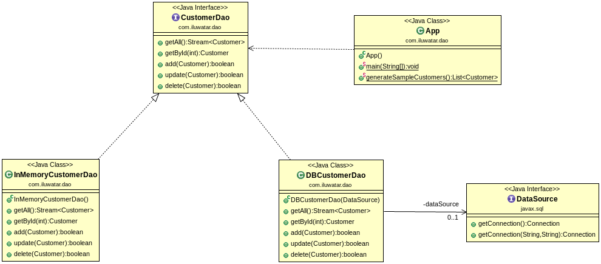

## 目的

物件為某種型別的資料庫或其他永續性機制提供了抽象介面。

## 解釋

真實世界例子

> 有一組客戶資料需要持久化到資料庫中。 我們需要整個額外的增刪改查操作以便操作客戶資料。

通俗的說

> DAO是我們透過基本永續性機制提供的介面。

維基百科說

> 在計算機軟體中，資料訪問物件（DAO）是一種模式，可為某種型別的資料庫或其他永續性機制提供抽象介面。

**程式示例**

透過我們的客戶示例，下面是基本的`客戶`實體。

```java
public class Customer {

  private int id;
  private String firstName;
  private String lastName;

  public Customer(int id, String firstName, String lastName) {
    this.id = id;
    this.firstName = firstName;
    this.lastName = lastName;
  }
  // getters and setters ->
  ...
}
```

這是`CustomerDao`介面及其兩個不同的實現。

Here's the `CustomerDao` interface and two different implementations for it. `InMemoryCustomerDao` 
將簡單的客戶資料對映儲存在記憶體中 而`DBCustomerDao`是真正的RDBMS實現。

```java
public interface CustomerDao {

  Stream<Customer> getAll() throws Exception;

  Optional<Customer> getById(int id) throws Exception;

  boolean add(Customer customer) throws Exception;

  boolean update(Customer customer) throws Exception;

  boolean delete(Customer customer) throws Exception;
}

public class InMemoryCustomerDao implements CustomerDao {

  private final Map<Integer, Customer> idToCustomer = new HashMap<>();

  // implement the interface using the map
  ...
}

public class DbCustomerDao implements CustomerDao {

  private static final Logger LOGGER = LoggerFactory.getLogger(DbCustomerDao.class);

  private final DataSource dataSource;

  public DbCustomerDao(DataSource dataSource) {
    this.dataSource = dataSource;
  }

  // implement the interface using the data source
  ...
```

最後，這是我們使用DAO管理客戶資料的方式。

```java
    final var dataSource = createDataSource();
    createSchema(dataSource);
    final var customerDao = new DbCustomerDao(dataSource);
    
    addCustomers(customerDao);
    log.info(ALL_CUSTOMERS);
    try (var customerStream = customerDao.getAll()) {
      customerStream.forEach((customer) -> log.info(customer.toString()));
    }
    log.info("customerDao.getCustomerById(2): " + customerDao.getById(2));
    final var customer = new Customer(4, "Dan", "Danson");
    customerDao.add(customer);
    log.info(ALL_CUSTOMERS + customerDao.getAll());
    customer.setFirstName("Daniel");
    customer.setLastName("Danielson");
    customerDao.update(customer);
    log.info(ALL_CUSTOMERS);
    try (var customerStream = customerDao.getAll()) {
      customerStream.forEach((cust) -> log.info(cust.toString()));
    }
    customerDao.delete(customer);
    log.info(ALL_CUSTOMERS + customerDao.getAll());
    
    deleteSchema(dataSource);
```

程式輸出:

```java
customerDao.getAllCustomers(): 
Customer{id=1, firstName='Adam', lastName='Adamson'}
Customer{id=2, firstName='Bob', lastName='Bobson'}
Customer{id=3, firstName='Carl', lastName='Carlson'}
customerDao.getCustomerById(2): Optional[Customer{id=2, firstName='Bob', lastName='Bobson'}]
customerDao.getAllCustomers(): java.util.stream.ReferencePipeline$Head@7cef4e59
customerDao.getAllCustomers(): 
Customer{id=1, firstName='Adam', lastName='Adamson'}
Customer{id=2, firstName='Bob', lastName='Bobson'}
Customer{id=3, firstName='Carl', lastName='Carlson'}
Customer{id=4, firstName='Daniel', lastName='Danielson'}
customerDao.getAllCustomers(): java.util.stream.ReferencePipeline$Head@2db0f6b2
customerDao.getAllCustomers(): 
Customer{id=1, firstName='Adam', lastName='Adamson'}
Customer{id=2, firstName='Bob', lastName='Bobson'}
Customer{id=3, firstName='Carl', lastName='Carlson'}
customerDao.getCustomerById(2): Optional[Customer{id=2, firstName='Bob', lastName='Bobson'}]
customerDao.getAllCustomers(): java.util.stream.ReferencePipeline$Head@12c8a2c0
customerDao.getAllCustomers(): 
Customer{id=1, firstName='Adam', lastName='Adamson'}
Customer{id=2, firstName='Bob', lastName='Bobson'}
Customer{id=3, firstName='Carl', lastName='Carlson'}
Customer{id=4, firstName='Daniel', lastName='Danielson'}
customerDao.getAllCustomers(): java.util.stream.ReferencePipeline$Head@6ec8211c
```

## 類圖



## 適用性

在以下情況下，請使用資料訪問物件：:

* 當您要鞏固如何訪問資料層時。
* 當您要避免編寫多個資料檢索/持久層時。

## 鳴謝

* [J2EE Design Patterns](https://www.amazon.com/gp/product/0596004273/ref=as_li_tl?ie=UTF8&camp=1789&creative=9325&creativeASIN=0596004273&linkCode=as2&tag=javadesignpat-20&linkId=48d37c67fb3d845b802fa9b619ad8f31)
