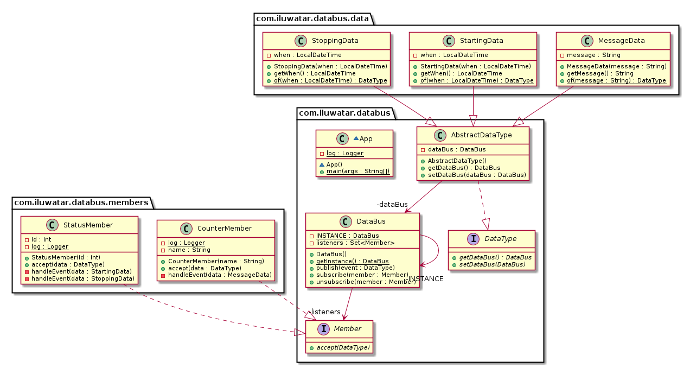

## 含義

資料匯流排模式（譯者：實際上，就是 Event-Bus 訊息匯流排模式）允許在一個應用程式的元件之間收發訊息/事件，而不需要這些元件相互感知，它們只需要知道所傳送/接收的訊息/事件的型別即可。

## 類圖

## 適用場景
可以在以下場景使用資料匯流排模式：

* 你希望由你的元件自己決定要接收哪些資訊/事件
* 你希望實現多對多的通訊
* 你希望你的元件不需要感知彼此

## 相關模式
資料匯流排類似於以下設計模式：

* 中介者模式（Mediator pattern），由資料匯流排成員自己決定是否要接受任何給定的訊息。
* 觀察者模式（Observer pattern），但進一步支援了多對多的通訊。
* 釋出/訂閱模式（Publish/Subscribe pattern），但是資料匯流排將釋出者和訂閱者解耦。