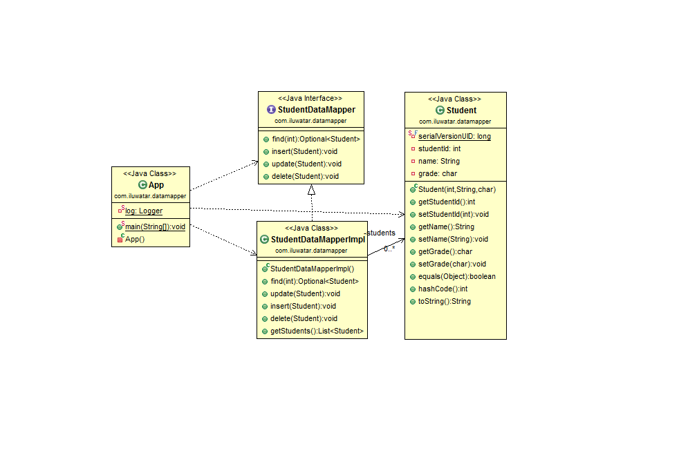

## 含義
一個用於在持久化物件和資料庫之間傳輸資料的對映器，同時保持它們之間和對映器本身的獨立性。

## 類圖

## 適用場景
資料對映器適用於以下場景：

* 當你想把資料物件從資料庫訪問層解耦時時
* 當你想編寫多個資料查詢/持久化實現時

## 引用

* [Data Mapper](http://richard.jp.leguen.ca/tutoring/soen343-f2010/tutorials/implementing-data-mapper/)