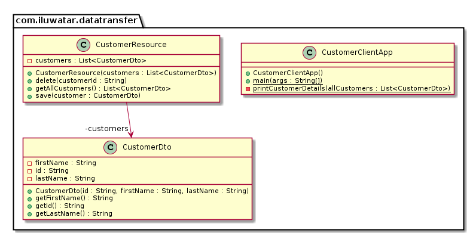

## 目的

次將具有多個屬性的資料從客戶端傳遞到伺服器，以避免多次呼叫遠端伺服器。

## 解釋

真實世界例子

> 我們需要從遠端資料庫中獲取有關客戶的資訊。 我們不使用一次查詢一個屬性，而是使用DTO一次傳送所有相關屬性。

通俗的說

> 使用DTO，可以透過單個後端查詢獲取相關資訊。

維基百科說

> 在程式設計領域，資料傳輸物件（DTO）是在程序之間承載資料的物件。 使用它的動機是，通常依靠遠端介面（例如Web服務）來完成程序之間的通訊，在這種情況下，每個呼叫都是昂貴的操作。
> 
> 因為每個（方法）呼叫的大部分成本與客戶端和伺服器之間的往返時間有關，所以減少呼叫數量的一種方法是使用一個物件（DTO）來聚合將要在多次呼叫間傳輸的資料，但僅由一個呼叫提供。

**程式示例**

讓我們來介紹我們簡單的`CustomerDTO` 類

```java
public class CustomerDto {
  private final String id;
  private final String firstName;
  private final String lastName;

  public CustomerDto(String id, String firstName, String lastName) {
    this.id = id;
    this.firstName = firstName;
    this.lastName = lastName;
  }

  public String getId() {
    return id;
  }

  public String getFirstName() {
    return firstName;
  }

  public String getLastName() {
    return lastName;
  }
}
```

`CustomerResource` 類充當客戶資訊的伺服器。

```java
public class CustomerResource {
  private final List<CustomerDto> customers;

  public CustomerResource(List<CustomerDto> customers) {
    this.customers = customers;
  }

  public List<CustomerDto> getAllCustomers() {
    return customers;
  }

  public void save(CustomerDto customer) {
    customers.add(customer);
  }

  public void delete(String customerId) {
    customers.removeIf(customer -> customer.getId().equals(customerId));
  }
}
```

現在拉取客戶資訊變得簡單自從我們有了DTOs。

```java
    var allCustomers = customerResource.getAllCustomers();
    allCustomers.forEach(customer -> LOGGER.info(customer.getFirstName()));
    // Kelly
    // Alfonso
```

## 類圖



## 適用性

使用資料傳輸物件模式當

* 客戶端請求多種資訊。資訊都是相關的
* 當你想提高獲取資源的效能
* 你想降低遠端方法呼叫的次數

## 鳴謝

* [Design Pattern - Transfer Object Pattern](https://www.tutorialspoint.com/design_pattern/transfer_object_pattern.htm)
* [Data Transfer Object](https://msdn.microsoft.com/en-us/library/ff649585.aspx)
* [J2EE Design Patterns](https://www.amazon.com/gp/product/0596004273/ref=as_li_tl?ie=UTF8&camp=1789&creative=9325&creativeASIN=0596004273&linkCode=as2&tag=javadesignpat-20&linkId=f27d2644fbe5026ea448791a8ad09c94)
* [Patterns of Enterprise Application Architecture](https://www.amazon.com/gp/product/0321127420/ref=as_li_tl?ie=UTF8&camp=1789&creative=9325&creativeASIN=0321127420&linkCode=as2&tag=javadesignpat-20&linkId=014237a67c9d46f384b35e10151956bd)
