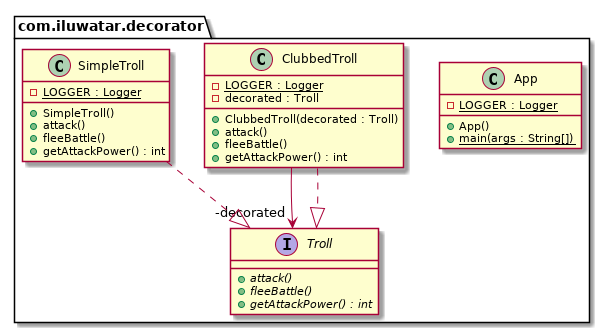

## 或稱
包裝器

## 目的
動態的為物件附加額外的職責。裝飾器為子類提供了靈活的替代方案，以擴充套件功能。

## 解釋

真實世界例子

> 附近的山丘上住著一個憤怒的巨魔。通常它是徒手的，但有時它有武器。為了武裝巨魔不必建立新的巨魔，而是用合適的武器動態的裝飾它。

通俗的說

> 裝飾者模式讓你可以在執行時透過把物件包裝進一個裝飾類物件中來動態的改變一個物件的行為。

維基百科說

> 在物件導向的程式設計中，裝飾器模式是一種設計模式，它允許將行為靜態或動態地新增到單個物件中，而不會影響同一類中其他物件的行為。裝飾器模式通常對於遵守單一責任原則很有用，因為它允許將功能劃分到具有唯一關注領域的類之間。

**程式示例**

以巨魔的為例。首先我有有一個簡單的巨魔，實現了巨魔介面。

```java
public interface Troll {
  void attack();
  int getAttackPower();
  void fleeBattle();
}

@Slf4j
public class SimpleTroll implements Troll {

  @Override
  public void attack() {
    LOGGER.info("The troll tries to grab you!");
  }

  @Override
  public int getAttackPower() {
    return 10;
  }

  @Override
  public void fleeBattle() {
    LOGGER.info("The troll shrieks in horror and runs away!");
  }
}
```

下面我們想為巨魔新增球棒。我們可以用裝飾者來動態的實現。

```java
@Slf4j
public class ClubbedTroll implements Troll {

  private final Troll decorated;

  public ClubbedTroll(Troll decorated) {
    this.decorated = decorated;
  }

  @Override
  public void attack() {
    decorated.attack();
    LOGGER.info("The troll swings at you with a club!");
  }

  @Override
  public int getAttackPower() {
    return decorated.getAttackPower() + 10;
  }

  @Override
  public void fleeBattle() {
    decorated.fleeBattle();
  }
}
```

這裡是巨魔的實戰

```java
// simple troll
var troll = new SimpleTroll();
troll.attack(); // The troll tries to grab you!
troll.fleeBattle(); // The troll shrieks in horror and runs away!

// change the behavior of the simple troll by adding a decorator
var clubbedTroll = new ClubbedTroll(troll);
clubbedTroll.attack(); // The troll tries to grab you! The troll swings at you with a club!
clubbedTroll.fleeBattle(); // The troll shrieks in horror and runs away!
```

## 類圖


## 適用性
使用裝飾者

* 動態透明地向單個物件新增職責，即不影響其他物件
* 對於可以撤銷的責任
* 當透過子類化進行擴充套件是不切實際的。有時可能會有大量的獨立擴充套件，並且會產生大量的子類來支援每種組合。 否則類定義可能被隱藏或無法用於子類化。

## 教程
* [Decorator Pattern Tutorial](https://www.journaldev.com/1540/decorator-design-pattern-in-java-example)

## Java世界的例子
 * [java.io.InputStream](http://docs.oracle.com/javase/8/docs/api/java/io/InputStream.html), [java.io.OutputStream](http://docs.oracle.com/javase/8/docs/api/java/io/OutputStream.html),
 [java.io.Reader](http://docs.oracle.com/javase/8/docs/api/java/io/Reader.html) and [java.io.Writer](http://docs.oracle.com/javase/8/docs/api/java/io/Writer.html)
 * [java.util.Collections#synchronizedXXX()](http://docs.oracle.com/javase/8/docs/api/java/util/Collections.html#synchronizedCollection-java.util.Collection-)
 * [java.util.Collections#unmodifiableXXX()](http://docs.oracle.com/javase/8/docs/api/java/util/Collections.html#unmodifiableCollection-java.util.Collection-)
 * [java.util.Collections#checkedXXX()](http://docs.oracle.com/javase/8/docs/api/java/util/Collections.html#checkedCollection-java.util.Collection-java.lang.Class-)


## 鳴謝

* [Design Patterns: Elements of Reusable Object-Oriented Software](https://www.amazon.com/gp/product/0201633612/ref=as_li_tl?ie=UTF8&camp=1789&creative=9325&creativeASIN=0201633612&linkCode=as2&tag=javadesignpat-20&linkId=675d49790ce11db99d90bde47f1aeb59)
* [Functional Programming in Java: Harnessing the Power of Java 8 Lambda Expressions](https://www.amazon.com/gp/product/1937785467/ref=as_li_tl?ie=UTF8&camp=1789&creative=9325&creativeASIN=1937785467&linkCode=as2&tag=javadesignpat-20&linkId=7e4e2fb7a141631491534255252fd08b)
* [J2EE Design Patterns](https://www.amazon.com/gp/product/0596004273/ref=as_li_tl?ie=UTF8&camp=1789&creative=9325&creativeASIN=0596004273&linkCode=as2&tag=javadesignpat-20&linkId=48d37c67fb3d845b802fa9b619ad8f31)
* [Head First Design Patterns: A Brain-Friendly Guide](https://www.amazon.com/gp/product/0596007124/ref=as_li_tl?ie=UTF8&camp=1789&creative=9325&creativeASIN=0596007124&linkCode=as2&tag=javadesignpat-20&linkId=6b8b6eea86021af6c8e3cd3fc382cb5b)
* [Refactoring to Patterns](https://www.amazon.com/gp/product/0321213351/ref=as_li_tl?ie=UTF8&camp=1789&creative=9325&creativeASIN=0321213351&linkCode=as2&tag=javadesignpat-20&linkId=2a76fcb387234bc71b1c61150b3cc3a7)
* [J2EE Design Patterns](https://www.amazon.com/gp/product/0596004273/ref=as_li_tl?ie=UTF8&camp=1789&creative=9325&creativeASIN=0596004273&linkCode=as2&tag=javadesignpat-20&linkId=f27d2644fbe5026ea448791a8ad09c94)
