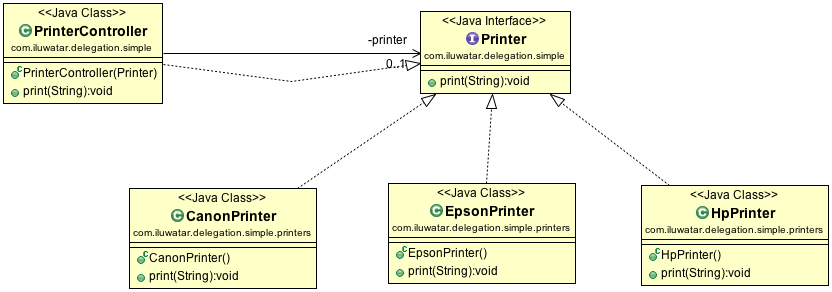

## 或稱
代理模式

## 目的
它是一種讓物件將某種行為向外部表達，但實際上將實現該行為的責任委託給關聯物件的技術。

## 類圖

## 適用性
使用委託模式以實現以下目的

* 降低類的耦合性
* 元件的行為相同，但是意識到這種情況將來可能會改變。

## 鳴謝

* [Delegate Pattern: Wikipedia ](https://en.wikipedia.org/wiki/Delegation_pattern)
* [Proxy Pattern: Wikipedia ](https://en.wikipedia.org/wiki/Proxy_pattern)
