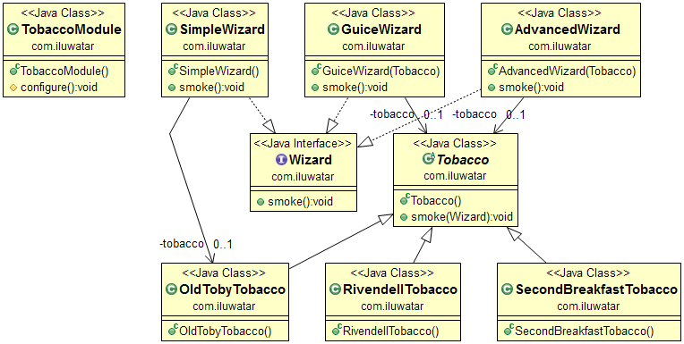

## 目的

依賴注入是一種軟體設計模式，其中一個或多個依賴項（或服務）被注入或透過引用傳遞到一個依賴物件（或客戶端）中，併成為客戶端狀態的一部分。該模式將客戶的依賴關係的建立與其自身的行為分開，這使程式設計可以鬆散耦合，並遵循控制反轉和單一職責原則。

## 解釋

真實世界例子

> 老巫師喜歡不時地裝滿菸斗抽菸。 但是，他不想只依賴一個菸草品牌，而是希望能夠互換使用它們。 

通俗的說

> 依賴注入將客戶端依賴的建立與其自身行為分開。

維基百科說

> 在軟體工程中，依賴注入是一種物件接收其依賴的其他物件的技術。 這些其他物件稱為依賴項。

**程式示例**

先介紹一下菸草介面和具體的品牌。

```java
public abstract class Tobacco {

  private static final Logger LOGGER = LoggerFactory.getLogger(Tobacco.class);

  public void smoke(Wizard wizard) {
    LOGGER.info("{} smoking {}", wizard.getClass().getSimpleName(),
        this.getClass().getSimpleName());
  }
}

public class SecondBreakfastTobacco extends Tobacco {
}

public class RivendellTobacco extends Tobacco {
}

public class OldTobyTobacco extends Tobacco {
}
```

下面是老巫師的類的層次結構。

```java
public interface Wizard {

  void smoke();
}

public class AdvancedWizard implements Wizard {

  private final Tobacco tobacco;

  public AdvancedWizard(Tobacco tobacco) {
    this.tobacco = tobacco;
  }

  @Override
  public void smoke() {
    tobacco.smoke(this);
  }
}
```

最後我們可以看到給老巫師任意品牌的菸草是多麼的簡單。

```java
    var advancedWizard = new AdvancedWizard(new SecondBreakfastTobacco());
    advancedWizard.smoke();
```

## 類圖



## 適用性

使用依賴注入當：

- 當你需要從物件中移除掉具體的實現內容時

* 使用模擬物件或存根隔離地啟用類的單元測試

## 鳴謝

* [Dependency Injection Principles, Practices, and Patterns](https://www.amazon.com/gp/product/161729473X/ref=as_li_qf_asin_il_tl?ie=UTF8&tag=javadesignpat-20&creative=9325&linkCode=as2&creativeASIN=161729473X&linkId=57079257a5c7d33755493802f3b884bd)
* [Clean Code: A Handbook of Agile Software Craftsmanship](https://www.amazon.com/gp/product/0132350882/ref=as_li_tl?ie=UTF8&camp=1789&creative=9325&creativeASIN=0132350882&linkCode=as2&tag=javadesignpat-20&linkId=2c390d89cc9e61c01b9e7005c7842871)
* [Java 9 Dependency Injection: Write loosely coupled code with Spring 5 and Guice](https://www.amazon.com/gp/product/1788296257/ref=as_li_tl?ie=UTF8&tag=javadesignpat-20&camp=1789&creative=9325&linkCode=as2&creativeASIN=1788296257&linkId=4e9137a3bf722a8b5b156cce1eec0fc1)
* [Google Guice Tutorial: Open source Java based dependency injection framework](https://www.amazon.com/gp/product/B083P7DZ8M/ref=as_li_tl?ie=UTF8&tag=javadesignpat-20&camp=1789&creative=9325&linkCode=as2&creativeASIN=B083P7DZ8M&linkId=04f0f902c877921e45215b624a124bfe)
