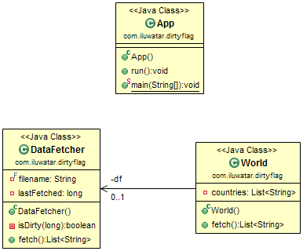

## 或稱
* 是否髒 模式

## 目的
避免昂貴資源的重新獲取。資源保留其身份，保留在某些快速訪問的儲存中，並被重新使用以避免再次獲取它們。

## 類圖

## 適用性
在以下情況下使用髒標誌模式

* 重複獲取，初始化，釋放相同資源所導致不必要的效能開銷

## 鳴謝

* [Design Patterns: Dirty Flag](https://www.takeupcode.com/podcast/89-design-patterns-dirty-flag/)
* [J2EE Design Patterns](https://www.amazon.com/gp/product/0596004273/ref=as_li_tl?ie=UTF8&camp=1789&creative=9325&creativeASIN=0596004273&linkCode=as2&tag=javadesignpat-20&linkId=48d37c67fb3d845b802fa9b619ad8f31)
