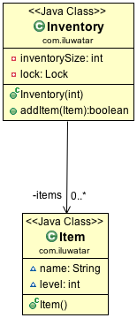

## 含義
透過先測試鎖定標準（"鎖提示"）而不實際獲取鎖的方式來減少獲取鎖的開銷。只有當鎖定標準檢查表明需要鎖定時，才進行實際的鎖定邏輯。

## 類圖

## 適用場景
在以下場景適合使用雙重鎖檢查模式：

* 在建立物件時有存在併發的訪問。如單例模式中，你想建立同一個類的單個例項，如果存在兩個或更多的執行緒對例項進行判空，僅僅檢查該該例項是否為空可能是不夠的。
* 在一個方法上存在併發訪問，該方法的行為是根據一些約束條件而改變，而這些約束條件在該方法中也會發生變化。