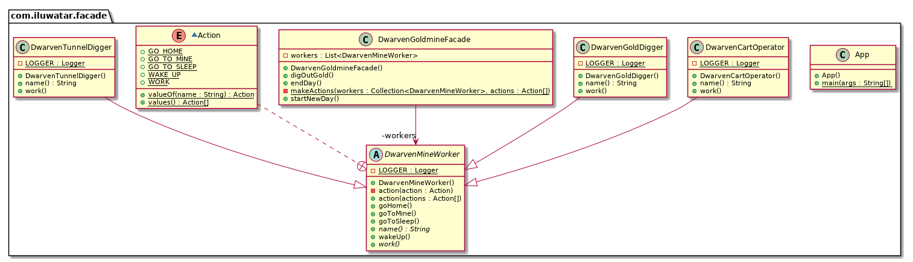

## 目的
為一個子系統中的一系列介面提供一個統一的介面。外觀定義了一個更高階別的介面以便子系統更容易使用。

## 解釋

真實世界的例子

> 一個金礦是怎麼工作的？“嗯，礦工下去然後挖金子！”你說。這是你所相信的因為你在使用一個金礦對外提供的一個簡單介面，在內部它要卻要做很多事情。這個簡單的介面對複雜的子系統來說就是一個外觀。

用通俗的話說

> 外觀模式為一個複雜的子系統提供一個簡單的介面。

維基百科說

> 外觀是為很大體量的程式碼（比如類庫）提供簡單介面的一種物件。

**程式示例**

使用上面金礦的例子。這裡我們有矮人的礦工等級制度。

```java

@Slf4j
public abstract class DwarvenMineWorker {

    public void goToSleep() {
        LOGGER.info("{} goes to sleep.", name());
    }

    public void wakeUp() {
        LOGGER.info("{} wakes up.", name());
    }

    public void goHome() {
        LOGGER.info("{} goes home.", name());
    }

    public void goToMine() {
        LOGGER.info("{} goes to the mine.", name());
    }

    private void action(Action action) {
        switch (action) {
            case GO_TO_SLEEP -> goToSleep();
            case WAKE_UP -> wakeUp();
            case GO_HOME -> goHome();
            case GO_TO_MINE -> goToMine();
            case WORK -> work();
            default -> LOGGER.info("Undefined action");
        }
    }

    public void action(Action... actions) {
        Arrays.stream(actions).forEach(this::action);
    }

    public abstract void work();

    public abstract String name();

    enum Action {
        GO_TO_SLEEP, WAKE_UP, GO_HOME, GO_TO_MINE, WORK
    }
}

@Slf4j
public class DwarvenTunnelDigger extends DwarvenMineWorker {

    @Override
    public void work() {
        LOGGER.info("{} creates another promising tunnel.", name());
    }

    @Override
    public String name() {
        return "Dwarven tunnel digger";
    }
}

@Slf4j
public class DwarvenGoldDigger extends DwarvenMineWorker {

    @Override
    public void work() {
        LOGGER.info("{} digs for gold.", name());
    }

    @Override
    public String name() {
        return "Dwarf gold digger";
    }
}

@Slf4j
public class DwarvenCartOperator extends DwarvenMineWorker {

    @Override
    public void work() {
        LOGGER.info("{} moves gold chunks out of the mine.", name());
    }

    @Override
    public String name() {
        return "Dwarf cart operator";
    }
}

```

為了操縱所有這些礦工我們有了這個外觀

```java
public class DwarvenGoldmineFacade {

  private final List<DwarvenMineWorker> workers;

  public DwarvenGoldmineFacade() {
      workers = List.of(
            new DwarvenGoldDigger(),
            new DwarvenCartOperator(),
            new DwarvenTunnelDigger());
  }

  public void startNewDay() {
    makeActions(workers, DwarvenMineWorker.Action.WAKE_UP, DwarvenMineWorker.Action.GO_TO_MINE);
  }

  public void digOutGold() {
    makeActions(workers, DwarvenMineWorker.Action.WORK);
  }

  public void endDay() {
    makeActions(workers, DwarvenMineWorker.Action.GO_HOME, DwarvenMineWorker.Action.GO_TO_SLEEP);
  }

  private static void makeActions(Collection<DwarvenMineWorker> workers,
      DwarvenMineWorker.Action... actions) {
    workers.forEach(worker -> worker.action(actions));
  }
}
```

現在來使用外觀

```java
DwarvenGoldmineFacade facade = new DwarvenGoldmineFacade();
facade.startNewDay();
// Dwarf gold digger wakes up.
// Dwarf gold digger goes to the mine.
// Dwarf cart operator wakes up.
// Dwarf cart operator goes to the mine.
// Dwarven tunnel digger wakes up.
// Dwarven tunnel digger goes to the mine.
facade.digOutGold();
// Dwarf gold digger digs for gold.
// Dwarf cart operator moves gold chunks out of the mine.
// Dwarven tunnel digger creates another promising tunnel.
facade.endDay();
// Dwarf gold digger goes home.
// Dwarf gold digger goes to sleep.
// Dwarf cart operator goes home.
// Dwarf cart operator goes to sleep.
// Dwarven tunnel digger goes home.
// Dwarven tunnel digger goes to sleep.
```

## 類圖


## 適用性
使用外觀模式當

* 你想為一個複雜的子系統提供一個簡單的介面。隨著子系統的發展，它們通常會變得更加複雜。多數模式在應用時會導致更多和更少的類。這使子系統更可重用，更易於自定義，但是對於不需要自定義它的客戶來說，使用它也變得更加困難。 外觀可以提供子系統的簡單預設檢視，足以滿足大多數客戶端的需求。只有需要更多可定製性的客戶才需要檢視外觀外的東西（原子系統提供的介面）。
* 客戶端與抽象的實現類之間存在許多依賴關係。 引入外觀以使子系統與客戶端和其他子系統分離，從而提高子系統的獨立性和可移植性。
* 你想對子系統進行分層。 使用外觀來定義每個子系統級別的入口點。 如果子系統是相關的，則可以透過使子系統僅透過其外觀相互通訊來簡化它們之間的依賴性。

## 鳴謝

* [Design Patterns: Elements of Reusable Object-Oriented Software](https://www.amazon.com/gp/product/0201633612/ref=as_li_tl?ie=UTF8&camp=1789&creative=9325&creativeASIN=0201633612&linkCode=as2&tag=javadesignpat-20&linkId=675d49790ce11db99d90bde47f1aeb59)
* [Head First Design Patterns: A Brain-Friendly Guide](https://www.amazon.com/gp/product/0596007124/ref=as_li_tl?ie=UTF8&camp=1789&creative=9325&creativeASIN=0596007124&linkCode=as2&tag=javadesignpat-20&linkId=6b8b6eea86021af6c8e3cd3fc382cb5b)
