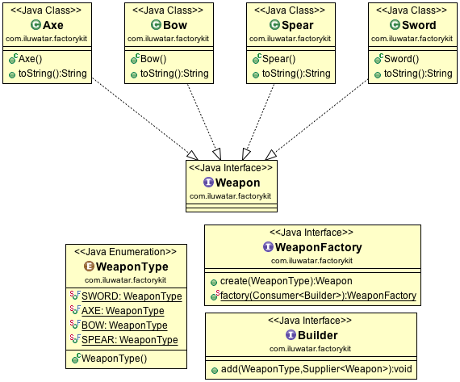

## 含義
使用分離的構建器和工廠介面來定義一個不可變內容的工廠。

## 類圖

## 適用場景
工廠套件模式適用於與以下場景：

* 一個類無法預知它需要建立的物件的類別
- 你只是想要一個新的自定義構建器(builder)的例項，而非全域性的構建器
- 你明確地想要定義物件的型別，而且工廠可以建立這些物件
- 你想要分離構建器(builder)和建立器(creator)介面

## 引用

* [Design Pattern Reloaded by Remi Forax: ](https://www.youtube.com/watch?v=-k2X7guaArU)