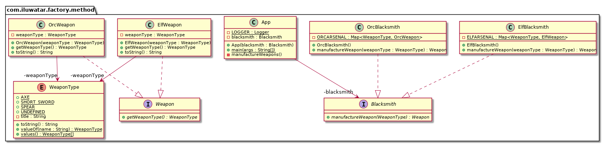

## Also known as
# 或稱

虛擬構造器

## 目的
為建立一個物件定義一個介面，但是讓子類決定例項化哪個類。工廠方法允許類將例項化延遲到子類。

## 解釋
真實世界例子

> 鐵匠生產武器。精靈需要精靈武器，而獸人需要獸人武器。根據客戶來召喚正確型別的鐵匠。

通俗的說

> 它為類提供了一種把例項化的邏輯委託給子類的方式。

維基百科上說

> 在基於類的程式設計中，工廠方法模式是一種建立型設計模式用來解決建立物件的問題，而不需要指定將要建立物件的確切類。這是透過呼叫工廠方法建立物件來完成的，而不是透過呼叫構造器。該工廠方法在介面中指定並由子類實現，或者在基類實現並可以選擇由子類重寫。

 **程式示例**

以上面的鐵匠為例，首先我們有鐵匠的介面和一些它的實現。

```java
public interface Blacksmith {
  Weapon manufactureWeapon(WeaponType weaponType);
}

public class ElfBlacksmith implements Blacksmith {
  public Weapon manufactureWeapon(WeaponType weaponType) {
    return ELFARSENAL.get(weaponType);
  }
}

public class OrcBlacksmith implements Blacksmith {
  public Weapon manufactureWeapon(WeaponType weaponType) {
    return ORCARSENAL.get(weaponType);
  }
}
```

現在隨著客戶的到來，會召喚出正確型別的鐵匠並製造出要求的武器。

```java
var blacksmith = new ElfBlacksmith();
blacksmith.manufactureWeapon(WeaponType.SPEAR);
blacksmith.manufactureWeapon(WeaponType.AXE);
// Elvish weapons are created
```

## 類圖


## 適用性
使用工廠方法模式當

* 一個類無法預料它所要必須建立的物件的類
* 一個類想要它的子類來指定它要建立的物件
* 類將責任委派給幾個幫助子類中的一個，而你想定位瞭解是具體之中的哪一個

## Java中的例子

* [java.util.Calendar](http://docs.oracle.com/javase/8/docs/api/java/util/Calendar.html#getInstance--)
* [java.util.ResourceBundle](http://docs.oracle.com/javase/8/docs/api/java/util/ResourceBundle.html#getBundle-java.lang.String-)
* [java.text.NumberFormat](http://docs.oracle.com/javase/8/docs/api/java/text/NumberFormat.html#getInstance--)
* [java.nio.charset.Charset](http://docs.oracle.com/javase/8/docs/api/java/nio/charset/Charset.html#forName-java.lang.String-)
* [java.net.URLStreamHandlerFactory](http://docs.oracle.com/javase/8/docs/api/java/net/URLStreamHandlerFactory.html#createURLStreamHandler-java.lang.String-)
* [java.util.EnumSet](https://docs.oracle.com/javase/8/docs/api/java/util/EnumSet.html#of-E-)
* [javax.xml.bind.JAXBContext](https://docs.oracle.com/javase/8/docs/api/javax/xml/bind/JAXBContext.html#createMarshaller--)

## 鳴謝

* [Design Patterns: Elements of Reusable Object-Oriented Software](https://www.amazon.com/gp/product/0201633612/ref=as_li_tl?ie=UTF8&camp=1789&creative=9325&creativeASIN=0201633612&linkCode=as2&tag=javadesignpat-20&linkId=675d49790ce11db99d90bde47f1aeb59)
* [Head First Design Patterns: A Brain-Friendly Guide](https://www.amazon.com/gp/product/0596007124/ref=as_li_tl?ie=UTF8&camp=1789&creative=9325&creativeASIN=0596007124&linkCode=as2&tag=javadesignpat-20&linkId=6b8b6eea86021af6c8e3cd3fc382cb5b)
* [Refactoring to Patterns](https://www.amazon.com/gp/product/0321213351/ref=as_li_tl?ie=UTF8&camp=1789&creative=9325&creativeASIN=0321213351&linkCode=as2&tag=javadesignpat-20&linkId=2a76fcb387234bc71b1c61150b3cc3a7)
