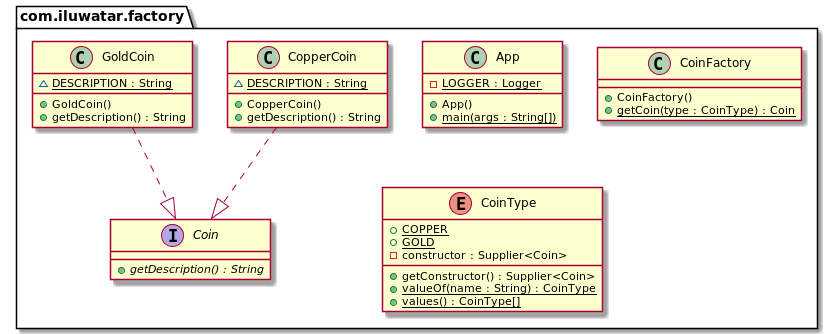

## 也被稱為

* 簡單工廠
* 靜態工廠方法

## 含義

在工廠類中提供一個封裝的靜態工廠方法，用於隱藏物件初始化細節，使客戶端程式碼可以專注於使用，而不用關心類的初始化過程。

## 解釋

現例項子

>
> 假設我們有一個需要連線到 SQL Server 的 Web 應用，但現在我們需要切換到連線 Oracle。為了不修改現有程式碼的情況下做到這一點，我們需要實現簡單工廠模式。在這種模式下，可以透過呼叫一個靜態方法來建立與給定資料庫的連線。

維基百科

> 工廠類是一個用於建立其他物件的物件 -- 從形式上看，工廠方法是一個用於返回不同原型或型別的函式或方法。

**程式設計示例**

我們有一個  `Car` 介面，以及實現類 `Ford`, `Ferrari`。

```java
public interface Car {
  String getDescription();
}

public class Ford implements Car {

  static final String DESCRIPTION = "This is Ford.";

  @Override
  public String getDescription() {
    return DESCRIPTION;
  }
}

public class Ferrari implements Car {
   
  static final String DESCRIPTION = "This is Ferrari.";

  @Override
  public String getDescription() {
    return DESCRIPTION;
  }
}
```

Enumeration above represents types of cars that we support (`Ford` and `Ferrari`).

以下的列舉用於表示支援的 `Car` 型別（`Ford` 和 `Ferrari`）

```java
public enum CarType {
  
  FORD(Ford::new), 
  FERRARI(Ferrari::new);
  
  private final Supplier<Car> constructor; 
  
  CarType(Supplier<Car> constructor) {
    this.constructor = constructor;
  }
  
  public Supplier<Car> getConstructor() {
    return this.constructor;
  }
}
```
接著我們實現了一個靜態方法  `getCar` 用於封裝工廠類 `CarsFactory`  建立 `Car` 具體物件例項的細節。

```java
public class CarsFactory {
  
  public static Car getCar(CarType type) {
    return type.getConstructor().get();
  }
}
```

現在我們可以在客戶端程式碼中透過工廠類建立不同型別的 `Car` 物件例項。

```java
var car1 = CarsFactory.getCar(CarType.FORD);
var car2 = CarsFactory.getCar(CarType.FERRARI);
LOGGER.info(car1.getDescription());
LOGGER.info(car2.getDescription());
```

程式輸出：

```java
This is Ford.
This is Ferrari.
```

## 類圖



## 適用場景

在你只關心物件的建立，但不關心如何建立、管理它的時候，請使用簡單工廠模式。

**優點**

* 可以把物件建立程式碼集中在一個地方，避免在程式碼庫存散佈 "new" 關鍵字。
* 可以讓程式碼更加低耦合。它的一些主要優點包括更好的可測試性、更好的可讀性、元件可替換性、可拓展性、更好的隔離性。

**缺點**

* 會使程式碼變得比原來的更加複雜一些。

## 現實案例

* [java.util.Calendar#getInstance()](https://docs.oracle.com/javase/8/docs/api/java/util/Calendar.html#getInstance--)
* [java.util.ResourceBundle#getBundle()](https://docs.oracle.com/javase/8/docs/api/java/util/ResourceBundle.html#getBundle-java.lang.String-)
* [java.text.NumberFormat#getInstance()](https://docs.oracle.com/javase/8/docs/api/java/text/NumberFormat.html#getInstance--)
* [java.nio.charset.Charset#forName()](https://docs.oracle.com/javase/8/docs/api/java/nio/charset/Charset.html#forName-java.lang.String-)
* [java.net.URLStreamHandlerFactory#createURLStreamHandler(String)](https://docs.oracle.com/javase/8/docs/api/java/net/URLStreamHandlerFactory.html) (Returns different singleton objects, depending on a protocol)
* [java.util.EnumSet#of()](https://docs.oracle.com/javase/8/docs/api/java/util/EnumSet.html#of(E))
* [javax.xml.bind.JAXBContext#createMarshaller()](https://docs.oracle.com/javase/8/docs/api/javax/xml/bind/JAXBContext.html#createMarshaller--) and other similar methods.

## 相關模式

* [Factory Method](https://java-design-patterns.com/patterns/factory-method/)
* [Factory Kit](https://java-design-patterns.com/patterns/factory-kit/)
* [Abstract Factory](https://java-design-patterns.com/patterns/abstract-factory/)

