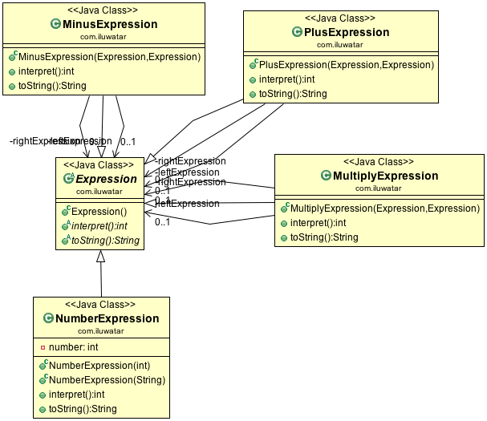

## 目的
給定一種語言，請定義其語法的表示形式，以及使用該表示形式來解釋該語言中的句子的直譯器。

## 類圖

## 適用性
有一種要解釋的語言時，請使用直譯器模式，並且可以將語言中的語句表示為抽象語法樹。直譯器模式在以下情況下效果最佳

* 語法很簡單。 對於複雜的語法，語法的類層次結構變得龐大且難以管理。 在這種情況下，解析器生成器之類的工具是更好的選擇。 他們可以在不構建抽象語法樹的情況下解釋表示式，這可以節省空間並可能節省時間
* 效率不是關鍵問題。 通常，最有效的直譯器不是透過直接解釋解析樹來實現的，而是先將其轉換為另一種形式。 例如，正規表示式通常會轉換為狀態機。 但是即使這樣，翻譯器也可以透過直譯器模式實現，因此該模式仍然適用。

## 真實世界例子

* [java.util.Pattern](http://docs.oracle.com/javase/8/docs/api/java/util/regex/Pattern.html)
* [java.text.Normalizer](http://docs.oracle.com/javase/8/docs/api/java/text/Normalizer.html)
* All subclasses of [java.text.Format](http://docs.oracle.com/javase/8/docs/api/java/text/Format.html)
* [javax.el.ELResolver](http://docs.oracle.com/javaee/7/api/javax/el/ELResolver.html)

## 鳴謝

* [Design Patterns: Elements of Reusable Object-Oriented Software](https://www.amazon.com/gp/product/0201633612/ref=as_li_tl?ie=UTF8&camp=1789&creative=9325&creativeASIN=0201633612&linkCode=as2&tag=javadesignpat-20&linkId=675d49790ce11db99d90bde47f1aeb59)
* [Head First Design Patterns: A Brain-Friendly Guide](https://www.amazon.com/gp/product/0596007124/ref=as_li_tl?ie=UTF8&camp=1789&creative=9325&creativeASIN=0596007124&linkCode=as2&tag=javadesignpat-20&linkId=6b8b6eea86021af6c8e3cd3fc382cb5b)
* [Refactoring to Patterns](https://www.amazon.com/gp/product/0321213351/ref=as_li_tl?ie=UTF8&camp=1789&creative=9325&creativeASIN=0321213351&linkCode=as2&tag=javadesignpat-20&linkId=2a76fcb387234bc71b1c61150b3cc3a7)
