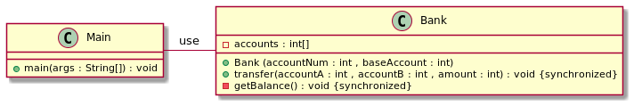

## 或稱

監控物件模式

## 目的

主要目的是為多個執行緒或程序提供一種結構化和受控的方式來安全地訪問和操作共享資源，例如變數、資料結構或程式碼的關鍵部分，而不會導致衝突或競爭條件。

## 解釋

通俗的說

> 監視器模式用於強制對資料進行單執行緒訪問。 一次只允許一個執行緒在監視器物件內執行程式碼。

維基百科說

> 在併發程式設計（也稱為並行程式設計）中，監視器是一種同步構造，它允許執行緒具有互斥性和等待（阻止）特定條件變為假的能力。 監視器還具有向其他執行緒發出訊號通知其條件已滿足的機制。

**程式示例**

考慮有一家銀行透過轉賬方式將錢從一個帳戶轉移到另一個帳戶。 它是`同步`意味著只有一個執行緒可以訪問此方法，因為如果許多執行緒訪問它並在同一時間將資金從一個帳戶轉移到另一個帳戶，則餘額會發生變化！
 
```
class Bank {

     private int[] accounts;
     Logger logger;
 
     public Bank(int accountNum, int baseAmount, Logger logger) {
         this.logger = logger;
         accounts = new int[accountNum];
         Arrays.fill(accounts, baseAmount);
     }
 
     public synchronized void transfer(int accountA, int accountB, int amount) {
         if (accounts[accountA] >= amount) {
             accounts[accountB] += amount;
             accounts[accountA] -= amount;
             logger.info("Transferred from account :" + accountA + " to account :" + accountB + " , amount :" + amount + " . balance :" + getBalance());
         }
     }
```

getBalance 始終返回總金額，並且每次轉賬後總金額應相同

```
     private synchronized int getBalance() {
         int balance = 0;
         for (int account : accounts) {
             balance += account;
         }
         return balance;
     }
 }
```

## 類圖


## 適用性

監視器設計模式應該用於具有需要由多個執行緒或程序同時訪問和操作的共享資源的情況。 此模式在需要同步以防止競爭條件、資料損壞和不一致狀態的情況下特別有用。 以下是您應該考慮使用監視器模式的一些情況：

1. **共享資料**：當您的應用程式涉及需要由多個執行緒訪問和更新的共享資料結構、變數或資源時。 監視器確保一次只有一個執行緒可以訪問共享資源，從而防止衝突並確保資料一致性。

2. **關鍵部分**：當您有程式碼的關鍵部分一次只需要由一個執行緒執行時。 關鍵部分是操作共享資源的程式碼部分，併發訪問可能會導致問題。 監視器有助於確保在任何給定時間只有一個執行緒可以執行關鍵部分。

3. **執行緒安全**：當您需要確保執行緒安全而不是僅僅依賴鎖和訊號量等低階同步機制時。 監視器提供了封裝同步和資源管理的更高階別的抽象。

4. **等待和發訊號**：當您遇到執行緒需要等待滿足某些條件才能繼續操作時。 監視器通常包含執行緒等待特定條件以及其他執行緒在滿足條件時通知它們的機制。

5. **死鎖預防**：當您希望透過提供結構化方式來獲取和釋放共享資源上的鎖來防止死鎖時。 監視器透過確保資源訪問得到良好管理來幫助避免常見的死鎖情況。

6. **併發資料結構**：當您實現併發資料結構（例如佇列、堆疊或雜湊表）時，多個執行緒需要操作該結構，同時保持其完整性。

7. **資源共享**：當多個執行緒需要共享有限的資源時，例如連線資料庫或訪問網路套接字。 監視器可以幫助以受控方式管理這些資源的分配和釋放。

8. **改進可維護性**：當您想要將同步邏輯和共享資源管理封裝在單個物件中時，改進程式碼組織並使併發相關程式碼更容易推理。

但是，需要注意的是，監視器模式可能並不最適合所有併發場景。 在某些情況下，其他同步機制（例如鎖、訊號量或併發資料結構）可能更合適。 此外，現代程式語言和框架通常提供更高階別的併發結構，抽象出低階別同步的複雜性。

在應用監視器模式之前，建議徹底分析應用程式的併發需求，並選擇最適合您需求的同步方法，同時考慮效能、複雜性和可用語言功能等因素。

## 相關模式

* Active object
* Double-checked locking
