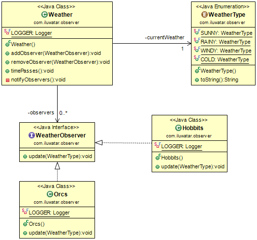

## Also known as
## 又被稱為

家屬，釋出訂閱模式

## 目的

定義一種一對多的物件依賴關係這樣當一個物件改變狀態時，所有依賴它的物件都將自動通知或更新。

## 解釋

真實世界例子

> 在遙遠的土地上生活著霍位元人和獸人的種族。他們都是戶外生活的人所以他們密切關注天氣的變化。可以說他們不斷地關注著天氣。

通俗的說

> 註冊成為一個觀察者以接收物件狀態的改變。

維基百科說

> 觀察者模式是這樣的一種軟體設計模式：它有一個被稱為主題的物件，維護著一個所有依賴於它的依賴者清單，也就是觀察者清單，當主題的狀態發生改變時，主題通常會呼叫觀察者的方法來自動通知觀察者們。

**程式設計示例**

讓我們先來介紹天氣觀察者的介面以及我們的種族，獸人和霍位元人。

```java
public interface WeatherObserver {

  void update(WeatherType currentWeather);
}

@Slf4j
public class Orcs implements WeatherObserver {

  @Override
  public void update(WeatherType currentWeather) {
    LOGGER.info("The orcs are facing " + currentWeather.getDescription() + " weather now");
  }
}

@Slf4j
public class Hobbits implements WeatherObserver {

  @Override
  public void update(WeatherType currentWeather) {
    switch (currentWeather) {
      LOGGER.info("The hobbits are facing " + currentWeather.getDescription() + " weather now");
  }
}
```

然後這裡是不斷變化的天氣。

```java
@Slf4j
public class Weather {

  private WeatherType currentWeather;
  private final List<WeatherObserver> observers;

  public Weather() {
    observers = new ArrayList<>();
    currentWeather = WeatherType.SUNNY;
  }

  public void addObserver(WeatherObserver obs) {
    observers.add(obs);
  }

  public void removeObserver(WeatherObserver obs) {
    observers.remove(obs);
  }

  /**
   * Makes time pass for weather.
   */
  public void timePasses() {
    var enumValues = WeatherType.values();
    currentWeather = enumValues[(currentWeather.ordinal() + 1) % enumValues.length];
    LOGGER.info("The weather changed to {}.", currentWeather);
    notifyObservers();
  }

  private void notifyObservers() {
    for (var obs : observers) {
      obs.update(currentWeather);
    }
  }
}
```

這是完整的示例。

```java
    var weather = new Weather();
    weather.addObserver(new Orcs());
    weather.addObserver(new Hobbits());

    weather.timePasses();
    // The weather changed to rainy.
    // The orcs are facing rainy weather now
    // The hobbits are facing rainy weather now
    weather.timePasses();
    // The weather changed to windy.
    // The orcs are facing windy weather now
    // The hobbits are facing windy weather now
    weather.timePasses();
    // The weather changed to cold.
    // The orcs are facing cold weather now
    // The hobbits are facing cold weather now
    weather.timePasses();
    // The weather changed to sunny.
    // The orcs are facing sunny weather now
    // The hobbits are facing sunny weather now
```

## Class diagram


## 應用
在下面任何一種情況下都可以使用觀察者模式

* 當抽象具有兩個方面時，一個方面依賴於另一個方面。將這些方面封裝在單獨的物件中，可以使你分別進行更改和重用
* 當一個物件的改變的同時需要改變其他物件，同時你又不知道有多少物件需要改變時
* 當一個物件可以通知其他物件而無需假設這些物件是誰時。換句話說，你不想讓這些物件緊耦合。

## 典型用例

* 一個物件的改變導致其他物件的改變

## Java中的例子

* [java.util.Observer](http://docs.oracle.com/javase/8/docs/api/java/util/Observer.html)
* [java.util.EventListener](http://docs.oracle.com/javase/8/docs/api/java/util/EventListener.html)
* [javax.servlet.http.HttpSessionBindingListener](http://docs.oracle.com/javaee/7/api/javax/servlet/http/HttpSessionBindingListener.html)
* [RxJava](https://github.com/ReactiveX/RxJava)

## 鳴謝

* [Design Patterns: Elements of Reusable Object-Oriented Software](https://www.amazon.com/gp/product/0201633612/ref=as_li_tl?ie=UTF8&camp=1789&creative=9325&creativeASIN=0201633612&linkCode=as2&tag=javadesignpat-20&linkId=675d49790ce11db99d90bde47f1aeb59)
* [Java Generics and Collections](https://www.amazon.com/gp/product/0596527756/ref=as_li_tl?ie=UTF8&camp=1789&creative=9325&creativeASIN=0596527756&linkCode=as2&tag=javadesignpat-20&linkId=246e5e2c26fe1c3ada6a70b15afcb195)
* [Head First Design Patterns: A Brain-Friendly Guide](https://www.amazon.com/gp/product/0596007124/ref=as_li_tl?ie=UTF8&camp=1789&creative=9325&creativeASIN=0596007124&linkCode=as2&tag=javadesignpat-20&linkId=6b8b6eea86021af6c8e3cd3fc382cb5b)
* [Refactoring to Patterns](https://www.amazon.com/gp/product/0321213351/ref=as_li_tl?ie=UTF8&camp=1789&creative=9325&creativeASIN=0321213351&linkCode=as2&tag=javadesignpat-20&linkId=2a76fcb387234bc71b1c61150b3cc3a7)
