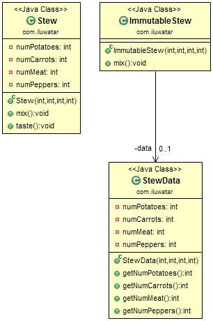

## 目的

私有類資料設計模式試圖透過限制屬性的可見性來減少屬性的暴露。 透過將它們封裝在單個Data物件中，可以減少類屬性的數量。

## 解釋

真實世界例子

> 想象一下你在為家人做晚餐燉湯。你想阻止家庭成員在你烹飪時偷偷品嚐菜品，否則後面可能東西不夠吃了。

通俗的說

> 私有類資料模式透過將資料與使用它的方法分離到維護資料狀態的類中，從而防止了對不可變資料的操縱。

維基百科說

> 私有類資料是計算機程式設計中的一種設計模式，用於封裝類屬性及其操作。

**程式示例**

使用上面燉湯的例子。 首先我們有 `燉湯`類 ，它的屬性沒有被私有類資料保護，從而使燉菜的成分對類方法易變。

```java
public class Stew {
  private static final Logger LOGGER = LoggerFactory.getLogger(Stew.class);
  private int numPotatoes;
  private int numCarrots;
  private int numMeat;
  private int numPeppers;
  public Stew(int numPotatoes, int numCarrots, int numMeat, int numPeppers) {
    this.numPotatoes = numPotatoes;
    this.numCarrots = numCarrots;
    this.numMeat = numMeat;
    this.numPeppers = numPeppers;
  }
  public void mix() {
    LOGGER.info("Mixing the stew we find: {} potatoes, {} carrots, {} meat and {} peppers",
        numPotatoes, numCarrots, numMeat, numPeppers);
  }
  public void taste() {
    LOGGER.info("Tasting the stew");
    if (numPotatoes > 0) {
      numPotatoes--;
    }
    if (numCarrots > 0) {
      numCarrots--;
    }
    if (numMeat > 0) {
      numMeat--;
    }
    if (numPeppers > 0) {
      numPeppers--;
    }
  }
}
```

現在，我們有了` ImmutableStew`類，其中的資料受`StewData`類保護。 現在，其中的方法無法處理`ImmutableStew`類的資料。

```java
public class StewData {
  private final int numPotatoes;
  private final int numCarrots;
  private final int numMeat;
  private final int numPeppers;
  public StewData(int numPotatoes, int numCarrots, int numMeat, int numPeppers) {
    this.numPotatoes = numPotatoes;
    this.numCarrots = numCarrots;
    this.numMeat = numMeat;
    this.numPeppers = numPeppers;
  }
  public int getNumPotatoes() {
    return numPotatoes;
  }
  public int getNumCarrots() {
    return numCarrots;
  }
  public int getNumMeat() {
    return numMeat;
  }
  public int getNumPeppers() {
    return numPeppers;
  }
}
public class ImmutableStew {
  private static final Logger LOGGER = LoggerFactory.getLogger(ImmutableStew.class);
  private final StewData data;
  public ImmutableStew(int numPotatoes, int numCarrots, int numMeat, int numPeppers) {
    data = new StewData(numPotatoes, numCarrots, numMeat, numPeppers);
  }
  public void mix() {
    LOGGER
        .info("Mixing the immutable stew we find: {} potatoes, {} carrots, {} meat and {} peppers",
            data.getNumPotatoes(), data.getNumCarrots(), data.getNumMeat(), data.getNumPeppers());
  }
}
```

讓我們嘗試建立每個類的例項並呼叫其方法：

```java
var stew = new Stew(1, 2, 3, 4);
stew.mix();   // Mixing the stew we find: 1 potatoes, 2 carrots, 3 meat and 4 peppers
stew.taste(); // Tasting the stew
stew.mix();   // Mixing the stew we find: 0 potatoes, 1 carrots, 2 meat and 3 peppers
var immutableStew = new ImmutableStew(2, 4, 3, 6);
immutableStew.mix();  // Mixing the immutable stew we find: 2 potatoes, 4 carrots, 3 meat and 6 peppers
```

## 類圖



## 適用性

在以下情況下使用私有類資料模式

* 你要阻止對類資料成員的寫訪問。
