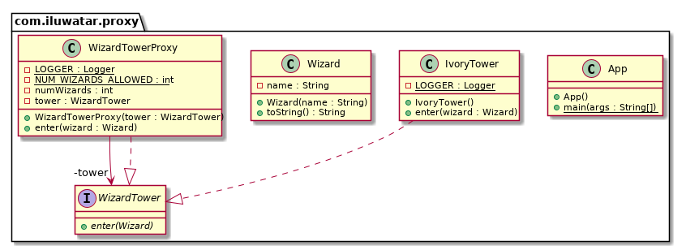

## 又被稱為

替代（代孕）模式

## 目的

為另一個物件提供代理或佔位符以控制對其的訪問。

## 解釋

真實世界例子

> 想象有一個塔，當地的巫師去那裡學習他們的法術。象牙塔只能夠透過代理來進入以此來保證只有首先3個巫師才能進入。這裡的代理就代表的塔的功能並新增訪問控制。

通俗的說

> 使用代理模式，一個類代表另一個類的功能。

維基百科說

> 在最一般的形式上，代理是一個類，它充當與其他物件的介面。代理是客戶端呼叫的包裝器或代理物件，以訪問後臺的實際服務物件。代理本身可以簡單地轉發到真實物件，也可以提供其他邏輯。在代理中，可以提供額外的功能，例如在對實物件的操作佔用大量資源時進行快取，或者在對實物件的操作被呼叫之前檢查前提條件。

**程式示例**

使用上面的巫師塔為例。首先我們有**巫師塔**介面和**象牙塔**類 。

```java
public interface WizardTower {

  void enter(Wizard wizard);
}

public class IvoryTower implements WizardTower {

  private static final Logger LOGGER = LoggerFactory.getLogger(IvoryTower.class);

  public void enter(Wizard wizard) {
    LOGGER.info("{} enters the tower.", wizard);
  }

}
```

然後有個簡單的巫師類。

```java
public class Wizard {

  private final String name;

  public Wizard(String name) {
    this.name = name;
  }

  @Override
  public String toString() {
    return name;
  }
}
```

然後我們有巫師塔代理類為巫師塔新增訪問控制。

```java
public class WizardTowerProxy implements WizardTower {

  private static final Logger LOGGER = LoggerFactory.getLogger(WizardTowerProxy.class);

  private static final int NUM_WIZARDS_ALLOWED = 3;

  private int numWizards;

  private final WizardTower tower;

  public WizardTowerProxy(WizardTower tower) {
    this.tower = tower;
  }

  @Override
  public void enter(Wizard wizard) {
    if (numWizards < NUM_WIZARDS_ALLOWED) {
      tower.enter(wizard);
      numWizards++;
    } else {
      LOGGER.info("{} is not allowed to enter!", wizard);
    }
  }
}
```

然後這是進入塔的場景。

```java
var proxy = new WizardTowerProxy(new IvoryTower());
proxy.enter(new Wizard("Red wizard"));
proxy.enter(new Wizard("White wizard"));
proxy.enter(new Wizard("Black wizard"));
proxy.enter(new Wizard("Green wizard"));
proxy.enter(new Wizard("Brown wizard"));
```

程式輸出：

```
Red wizard enters the tower.
White wizard enters the tower.
Black wizard enters the tower.
Green wizard is not allowed to enter!
Brown wizard is not allowed to enter!
```

## 類圖



## 適用性

代理適用於需要比簡單指標更廣泛或更復雜的物件引用的情況。這是代理模式適用的幾種常見情況。

* 遠端代理為不同地址空間中的物件提供了本地代表。
* 虛擬代理根據需要建立昂貴的物件。
* 保護代理控制對原始物件的訪問。當物件有不同的接入許可權時保護代理很有用。

## 典型用例

* 物件的訪問控制
* 懶載入
* 實現日誌記錄
* 簡化網路連線
* 物件的訪問計數

## 教程

* [Controlling Access With Proxy Pattern](http://java-design-patterns.com/blog/controlling-access-with-proxy-pattern/)

## 已知使用

* [java.lang.reflect.Proxy](http://docs.oracle.com/javase/8/docs/api/java/lang/reflect/Proxy.html)
* [Apache Commons Proxy](https://commons.apache.org/proper/commons-proxy/)
* Mocking frameworks [Mockito](https://site.mockito.org/), 
[Powermock](https://powermock.github.io/), [EasyMock](https://easymock.org/)

## 相關設計模式

* [Ambassador](https://java-design-patterns.com/patterns/ambassador/)

## 鳴謝

* [Design Patterns: Elements of Reusable Object-Oriented Software](https://www.amazon.com/gp/product/0201633612/ref=as_li_tl?ie=UTF8&camp=1789&creative=9325&creativeASIN=0201633612&linkCode=as2&tag=javadesignpat-20&linkId=675d49790ce11db99d90bde47f1aeb59)
* [Head First Design Patterns: A Brain-Friendly Guide](https://www.amazon.com/gp/product/0596007124/ref=as_li_tl?ie=UTF8&camp=1789&creative=9325&creativeASIN=0596007124&linkCode=as2&tag=javadesignpat-20&linkId=6b8b6eea86021af6c8e3cd3fc382cb5b)
