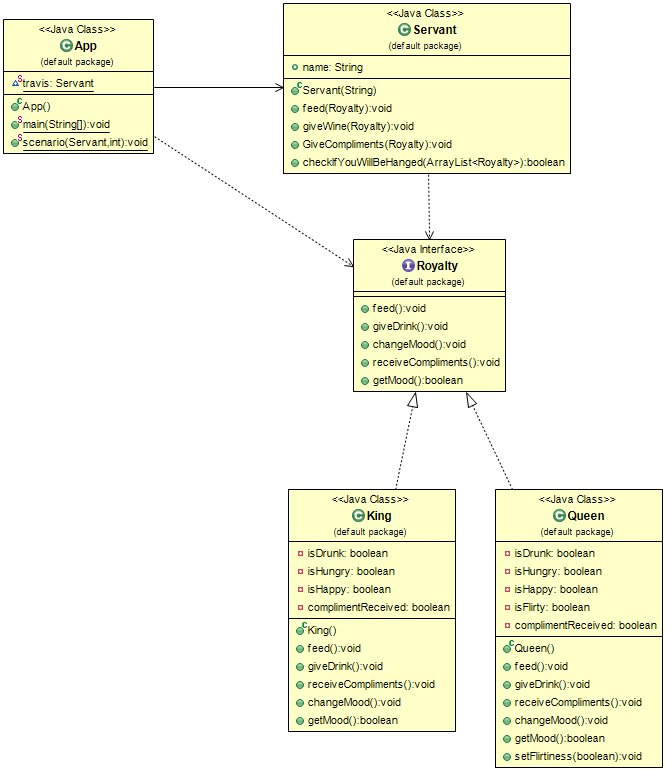

## 含義
僕人類被用於向一組類提供一些行為，區別於在每個類定義行為-或者當我們無法排除
公共父類中的這種行為，這些行為在僕人類被定義一次

## 解釋

現例項子

> 國王、王后和其他宮廷皇室成員需要僕人為他們提供飲食、準備飲料等服務

簡單地說

> 確保一個僕人物件為一組被服務的物件提供一些特定的服務

維基百科

> 在軟體工程中，僕人模式定義了一個物件，用於向一組類提供某些功能，而無需在每個類中定義該功能。 僕人是一個類，其例項（甚至只是類）提供了處理所需服務的方法，而僕人為其（或與誰）做某事的物件被視為引數。

**程式設計示例**

那些能夠為其他宮廷皇室成員提供服務的僕人類

```java
/**
 * Servant.
 */
public class Servant {

  public String name;

  /**
   * Constructor.
   */
  public Servant(String name) {
    this.name = name;
  }

  public void feed(Royalty r) {
    r.getFed();
  }

  public void giveWine(Royalty r) {
    r.getDrink();
  }

  public void giveCompliments(Royalty r) {
    r.receiveCompliments();
  }

  /**
   * Check if we will be hanged.
   */
  public boolean checkIfYouWillBeHanged(List<Royalty> tableGuests) {
    return tableGuests.stream().allMatch(Royalty::getMood);
  }
}
```

皇家是一個介面，它被國王和女王類實現，以獲取僕人的服務

```java
interface Royalty {

    void getFed();

    void getDrink();

    void changeMood();

    void receiveCompliments();

    boolean getMood();
}
```
國王類正在實現皇家介面
```java
public class King implements Royalty {

    private boolean isDrunk;
    private boolean isHungry = true;
    private boolean isHappy;
    private boolean complimentReceived;

    @Override
    public void getFed() {
        isHungry = false;
    }

    @Override
    public void getDrink() {
        isDrunk = true;
    }

    public void receiveCompliments() {
        complimentReceived = true;
    }

    @Override
    public void changeMood() {
        if (!isHungry && isDrunk) {
            isHappy = true;
        }
        if (complimentReceived) {
            isHappy = false;
        }
    }

    @Override
    public boolean getMood() {
        return isHappy;
    }
}
```
女王類正在實現皇家介面
```java
public class Queen implements Royalty {

    private boolean isDrunk = true;
    private boolean isHungry;
    private boolean isHappy;
    private boolean isFlirty = true;
    private boolean complimentReceived;

    @Override
    public void getFed() {
        isHungry = false;
    }

    @Override
    public void getDrink() {
        isDrunk = true;
    }

    public void receiveCompliments() {
        complimentReceived = true;
    }

    @Override
    public void changeMood() {
        if (complimentReceived && isFlirty && isDrunk && !isHungry) {
            isHappy = true;
        }
    }

    @Override
    public boolean getMood() {
        return isHappy;
    }

    public void setFlirtiness(boolean f) {
        this.isFlirty = f;
    }

}
```

然後，為了使用:

```java
public class App {

    private static final Servant jenkins = new Servant("Jenkins");
    private static final Servant travis = new Servant("Travis");

    /**
     * Program entry point.
     */
    public static void main(String[] args) {
        scenario(jenkins, 1);
        scenario(travis, 0);
    }

    /**
     * Can add a List with enum Actions for variable scenarios.
     */
    public static void scenario(Servant servant, int compliment) {
        var k = new King();
        var q = new Queen();

        var guests = List.of(k, q);

        // feed
        servant.feed(k);
        servant.feed(q);
        // serve drinks
        servant.giveWine(k);
        servant.giveWine(q);
        // compliment
        servant.giveCompliments(guests.get(compliment));

        // outcome of the night
        guests.forEach(Royalty::changeMood);

        // check your luck
        if (servant.checkIfYouWillBeHanged(guests)) {
            LOGGER.info("{} will live another day", servant.name);
        } else {
            LOGGER.info("Poor {}. His days are numbered", servant.name);
        }
    }
}
```

程式輸出

```
Jenkins will live another day
Poor Travis. His days are numbered
```


## 類圖


## 適用場景
在什麼時候使用僕人模式

* 當我們希望某些物件執行一個公共操作並且不想將該操作定義為每個類中的方法時

## 鳴謝

* [Let's Modify the Objects-First Approach into Design-Patterns-First](http://edu.pecinovsky.cz/papers/2006_ITiCSE_Design_Patterns_First.pdf)
