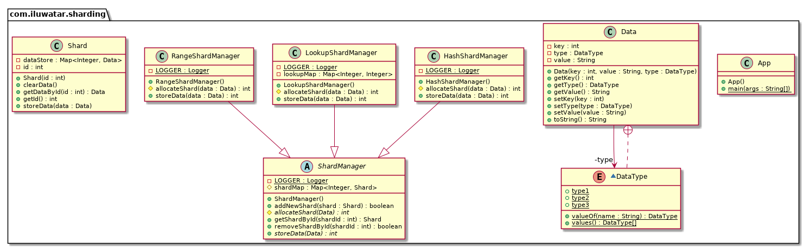

## 含義 
分片模式是指將資料儲存劃分為水平分割槽或分片。每個分片都有相同的模式，但持有自己獨特的資料子集。

一個分片本身就是一個資料儲存（它可以包含許多不同型別的實體的資料），執行在作為儲存節點的伺服器上。

## 類圖

## 適用場景 
這種設計模式提供了一下的好處：

- 你可以透過增加在額外的儲存節點上，執行的更多分片來實現系統擴容。
- 系統可以使用現成的廉價硬體，而不是為每個儲存節點使用專門（或者昂貴）的伺服器硬體。
- 你可以透過平衡各分片之間的工作負載來減少競爭，以提高效能。
- 在雲環境中，分片可以在物理上靠近訪問該節點資料的使用者。

## 引用

* [Sharding pattern](https://docs.microsoft.com/en-us/azure/architecture/patterns/sharding)