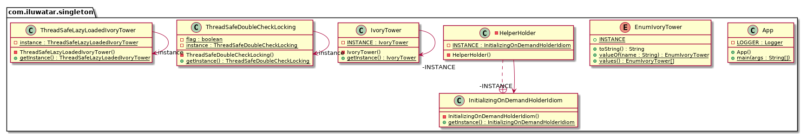

## 目的

確保一個類只有一個例項，併為其提供一個全域性訪問點。

## 解釋

情境示例

> 巫師們之在一個象牙塔中學習他們的魔法，並且始終使用同一座附魔的象牙塔。
> 
> 這裡的象牙塔是一個單例物件。

通俗來說

> 對於一個特定的類，確保只會建立一個物件。

維基百科說

> 在軟體工程中，單例模式是一種軟體設計模式，它將類的例項化限制為一個物件。當系統中只需要一個物件來協調各種操作時，這種模式非常有用。

**程式示例**

詳見 Joshua Bloch, Effective Java 2nd Edition p.18。

> 一個只有一個元素的列舉型別是實現單例模式的最佳方式。

```java
public enum EnumIvoryTower {
  INSTANCE
}
```

使用：

```java
    var enumIvoryTower1 = EnumIvoryTower.INSTANCE;
    var enumIvoryTower2 = EnumIvoryTower.INSTANCE;
    LOGGER.info("enumIvoryTower1={}", enumIvoryTower1);
    LOGGER.info("enumIvoryTower2={}", enumIvoryTower2);
```

控制檯輸出：

```
enumIvoryTower1=com.iluwatar.singleton.EnumIvoryTower@1221555852
enumIvoryTower2=com.iluwatar.singleton.EnumIvoryTower@1221555852
```

## 類圖



## 適用性

當滿足以下情況時，使用單例模式：

* 確保一個類只有一個例項，並且客戶端能夠透過一個眾所周知的訪問點訪問該例項。
* 唯一的例項能夠被子類擴充套件, 同時客戶端不需要修改程式碼就能使用擴充套件後的例項。

一些典型的單例模式用例包括：

* logging類
* 管理與資料庫的連結
* 檔案管理器（File manager）

## 已知使用

* [java.lang.Runtime#getRuntime()](http://docs.oracle.com/javase/8/docs/api/java/lang/Runtime.html#getRuntime%28%29)
* [java.awt.Desktop#getDesktop()](http://docs.oracle.com/javase/8/docs/api/java/awt/Desktop.html#getDesktop--)
* [java.lang.System#getSecurityManager()](http://docs.oracle.com/javase/8/docs/api/java/lang/System.html#getSecurityManager--)


## 影響

* 透過控制例項的建立和生命週期，違反了單一職責原則（SRP）。
* 鼓勵使用全域性共享例項，組織了物件及其使用的資源被釋放。     
* 程式碼變得耦合，給客戶端的測試帶來難度。
* 單例模式的設計可能會使得子類化（繼承）單例變得幾乎不可能

## 鳴謝

* [Design Patterns: Elements of Reusable Object-Oriented Software](https://www.amazon.com/gp/product/0201633612/ref=as_li_tl?ie=UTF8&camp=1789&creative=9325&creativeASIN=0201633612&linkCode=as2&tag=javadesignpat-20&linkId=675d49790ce11db99d90bde47f1aeb59)
* [Effective Java](https://www.amazon.com/gp/product/0134685997/ref=as_li_tl?ie=UTF8&camp=1789&creative=9325&creativeASIN=0134685997&linkCode=as2&tag=javadesignpat-20&linkId=4e349f4b3ff8c50123f8147c828e53eb)
* [Head First Design Patterns: A Brain-Friendly Guide](https://www.amazon.com/gp/product/0596007124/ref=as_li_tl?ie=UTF8&camp=1789&creative=9325&creativeASIN=0596007124&linkCode=as2&tag=javadesignpat-20&linkId=6b8b6eea86021af6c8e3cd3fc382cb5b)
* [Refactoring to Patterns](https://www.amazon.com/gp/product/0321213351/ref=as_li_tl?ie=UTF8&camp=1789&creative=9325&creativeASIN=0321213351&linkCode=as2&tag=javadesignpat-20&linkId=2a76fcb387234bc71b1c61150b3cc3a7)
