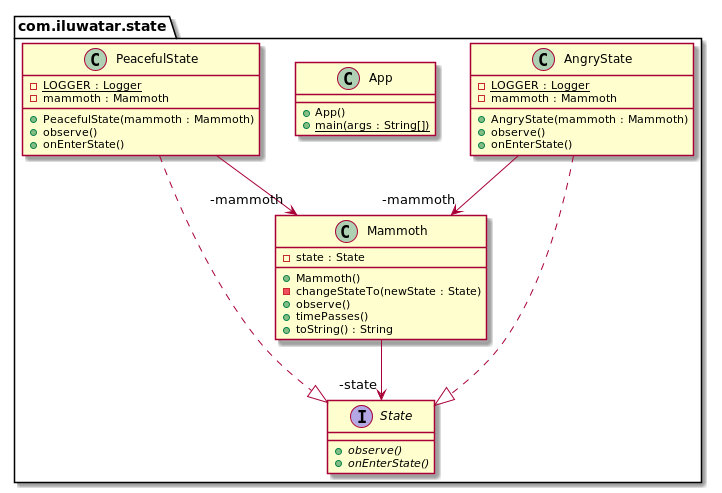

## 又被稱為
物件狀態

## 目的
允許物件在內部狀態改變時改變它的行為。物件看起來好像修改了它的類。

## 解釋
真實世界例子

> 當在長毛象的自然棲息地觀察長毛象時，似乎它會根據情況來改變自己的行為。它開始可能很平靜但是隨著時間推移當它檢測到威脅時它會對周圍的環境感到憤怒和危險。

通俗的說

> 狀態模式允許物件改變它的行為。

維基百科說

> 狀態模式是一種允許物件在內部狀態改變時改變它的行為的行為型設計模式。這種模式接近於有限狀態機的概念。狀態模式可以被理解為策略模式，它能夠透過呼叫在模式介面中定義的方法來切換策略。

**程式設計示例**

這裡是模式介面和它具體的實現。

```java
public interface State {

  void onEnterState();

  void observe();
}

public class PeacefulState implements State {

  private static final Logger LOGGER = LoggerFactory.getLogger(PeacefulState.class);

  private final Mammoth mammoth;

  public PeacefulState(Mammoth mammoth) {
    this.mammoth = mammoth;
  }

  @Override
  public void observe() {
    LOGGER.info("{} is calm and peaceful.", mammoth);
  }

  @Override
  public void onEnterState() {
    LOGGER.info("{} calms down.", mammoth);
  }
}

public class AngryState implements State {

  private static final Logger LOGGER = LoggerFactory.getLogger(AngryState.class);

  private final Mammoth mammoth;

  public AngryState(Mammoth mammoth) {
    this.mammoth = mammoth;
  }

  @Override
  public void observe() {
    LOGGER.info("{} is furious!", mammoth);
  }

  @Override
  public void onEnterState() {
    LOGGER.info("{} gets angry!", mammoth);
  }
}
```

然後這裡是包含狀態的長毛象。

```java
public class Mammoth {

  private State state;

  public Mammoth() {
    state = new PeacefulState(this);
  }

  public void timePasses() {
    if (state.getClass().equals(PeacefulState.class)) {
      changeStateTo(new AngryState(this));
    } else {
      changeStateTo(new PeacefulState(this));
    }
  }

  private void changeStateTo(State newState) {
    this.state = newState;
    this.state.onEnterState();
  }

  @Override
  public String toString() {
    return "The mammoth";
  }

  public void observe() {
    this.state.observe();
  }
}
```

然後這裡是長毛象隨著時間的推移後的整個行為示例。

```java
    var mammoth = new Mammoth();
    mammoth.observe();
    mammoth.timePasses();
    mammoth.observe();
    mammoth.timePasses();
    mammoth.observe();
    
    // The mammoth gets angry!
    // The mammoth is furious!
    // The mammoth calms down.
    // The mammoth is calm and peaceful.
```

## 類圖


## 適用性

在以下兩種情況下，請使用State模式

* 物件的行為取決於它的狀態，並且它必須在執行時根據狀態更改其行為。
* 根據物件狀態的不同，操作有大量的條件語句。此狀態通常由一個或多個列舉常量表示。通常，幾個操作將包含此相同的條件結構。狀態模式把條件語句的分支分別放入單獨的類中。這樣一來，你就可以將物件的狀態視為獨立的物件，該物件可以獨立於其他物件而變化。

## Java中例子

* [javax.faces.lifecycle.Lifecycle#execute()](http://docs.oracle.com/javaee/7/api/javax/faces/lifecycle/Lifecycle.html#execute-javax.faces.context.FacesContext-) controlled by [FacesServlet](http://docs.oracle.com/javaee/7/api/javax/faces/webapp/FacesServlet.html), the behavior is dependent on current phase of lifecycle.
* [JDiameter - Diameter State Machine](https://github.com/npathai/jdiameter/blob/master/core/jdiameter/api/src/main/java/org/jdiameter/api/app/State.java)

## 鳴謝

* [Design Patterns: Elements of Reusable Object-Oriented Software](https://www.amazon.com/gp/product/0201633612/ref=as_li_tl?ie=UTF8&camp=1789&creative=9325&creativeASIN=0201633612&linkCode=as2&tag=javadesignpat-20&linkId=675d49790ce11db99d90bde47f1aeb59)
* [Head First Design Patterns: A Brain-Friendly Guide](https://www.amazon.com/gp/product/0596007124/ref=as_li_tl?ie=UTF8&camp=1789&creative=9325&creativeASIN=0596007124&linkCode=as2&tag=javadesignpat-20&linkId=6b8b6eea86021af6c8e3cd3fc382cb5b)
* [Refactoring to Patterns](https://www.amazon.com/gp/product/0321213351/ref=as_li_tl?ie=UTF8&camp=1789&creative=9325&creativeASIN=0321213351&linkCode=as2&tag=javadesignpat-20&linkId=2a76fcb387234bc71b1c61150b3cc3a7)
