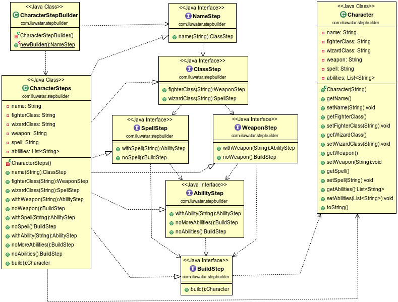

## 又被稱為
分步構建

## 目的
這是構建者模式的一個擴充套件，完全指導使用者建立物件，沒有混淆的機會。
使用者體驗會大大提升，因為他只能看到下一個步驟的方法，直到適當的時機才會出現構建物件的“build”方法。

## 類圖

## 應用
使用分佈構建模式當建立複雜物件的演算法需要獨立於組成物件的部分以及它們的組裝方式，且構造過程必須允許物件有不同的表示形式，並且在此過程中順序很重要時。

## 鳴謝

* [Marco Castigliego - Step Builder](http://rdafbn.blogspot.co.uk/2012/07/step-builder-pattern_28.html)
