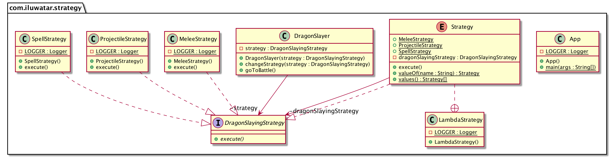

## 又被稱為
政策（方針）模式

## 目的

定義一個家族演算法，並封裝好其中每一個，使它們可以互相替換。策略模式使演算法的變化獨立於使用它的客戶。

## 解釋

現實世界例子

> 屠龍是一項危險的職業。有經驗將會使它變得簡單。經驗豐富的屠龍者對不同型別的龍有不同的戰鬥策略。       

直白點說

> 策略模式允許在執行時選擇最匹配的演算法。

維基百科上說

> 在程式程式設計領域，策略模式（又叫政策模式）是一種啟用在執行時選擇演算法的行為型軟體設計模式。

**程式設計例項**

讓我們先介紹屠龍的策略模式介面和它的實現。

```java
@FunctionalInterface
public interface DragonSlayingStrategy {

  void execute();
}

@Slf4j
public class MeleeStrategy implements DragonSlayingStrategy {

  @Override
  public void execute() {
    LOGGER.info("With your Excalibur you sever the dragon's head!");
  }
}

@Slf4j
public class ProjectileStrategy implements DragonSlayingStrategy {

  @Override
  public void execute() {
    LOGGER.info("You shoot the dragon with the magical crossbow and it falls dead on the ground!");
  }
}

@Slf4j
public class SpellStrategy implements DragonSlayingStrategy {

  @Override
  public void execute() {
    LOGGER.info("You cast the spell of disintegration and the dragon vaporizes in a pile of dust!");
  }
}
```

現在有一個強力的屠龍者要基於上面的元件來選擇他的戰鬥策略。

```java
public class DragonSlayer {

  private DragonSlayingStrategy strategy;

  public DragonSlayer(DragonSlayingStrategy strategy) {
    this.strategy = strategy;
  }

  public void changeStrategy(DragonSlayingStrategy strategy) {
    this.strategy = strategy;
  }

  public void goToBattle() {
    strategy.execute();
  }
}
```

最後是屠龍者的行動。

```java
    LOGGER.info("Green dragon spotted ahead!");
    var dragonSlayer = new DragonSlayer(new MeleeStrategy());
    dragonSlayer.goToBattle();
    LOGGER.info("Red dragon emerges.");
    dragonSlayer.changeStrategy(new ProjectileStrategy());
    dragonSlayer.goToBattle();
    LOGGER.info("Black dragon lands before you.");
    dragonSlayer.changeStrategy(new SpellStrategy());
    dragonSlayer.goToBattle();
    
    // Green dragon spotted ahead!
    // With your Excalibur you sever the dragon's head!
    // Red dragon emerges.
    // You shoot the dragon with the magical crossbow and it falls dead on the ground!
    // Black dragon lands before you.
    // You cast the spell of disintegration and the dragon vaporizes in a pile of dust!    
```

## 類圖


## 應用
使用策略模式當

* 許多相關的類只是行為不同。策略模式提供了一種為一種類配置多種行為的能力。
* 你需要一種演算法的不同變體。比如，你可能定義反應不用時間空間權衡的演算法。當這些演算法的變體使用類的層次結構來實現時就可以使用策略模式。
* 一個演算法使用的資料客戶不應該對其知曉。使用策略模式來避免暴露覆雜的，特定於演算法的資料結構。
* 一個類定義了許多行為，這些行為在其操作中展現為多個條件語句。移動相關的條件分支到它們分別的策略類中來代替這些條件語句。

## 教學

* [Strategy Pattern Tutorial](https://www.journaldev.com/1754/strategy-design-pattern-in-java-example-tutorial)

## 鳴謝

* [Design Patterns: Elements of Reusable Object-Oriented Software](https://www.amazon.com/gp/product/0201633612/ref=as_li_tl?ie=UTF8&camp=1789&creative=9325&creativeASIN=0201633612&linkCode=as2&tag=javadesignpat-20&linkId=675d49790ce11db99d90bde47f1aeb59)
* [Functional Programming in Java: Harnessing the Power of Java 8 Lambda Expressions](https://www.amazon.com/gp/product/1937785467/ref=as_li_tl?ie=UTF8&camp=1789&creative=9325&creativeASIN=1937785467&linkCode=as2&tag=javadesignpat-20&linkId=7e4e2fb7a141631491534255252fd08b)
* [Head First Design Patterns: A Brain-Friendly Guide](https://www.amazon.com/gp/product/0596007124/ref=as_li_tl?ie=UTF8&camp=1789&creative=9325&creativeASIN=0596007124&linkCode=as2&tag=javadesignpat-20&linkId=6b8b6eea86021af6c8e3cd3fc382cb5b)
* [Refactoring to Patterns](https://www.amazon.com/gp/product/0321213351/ref=as_li_tl?ie=UTF8&camp=1789&creative=9325&creativeASIN=0321213351&linkCode=as2&tag=javadesignpat-20&linkId=2a76fcb387234bc71b1c61150b3cc3a7)
