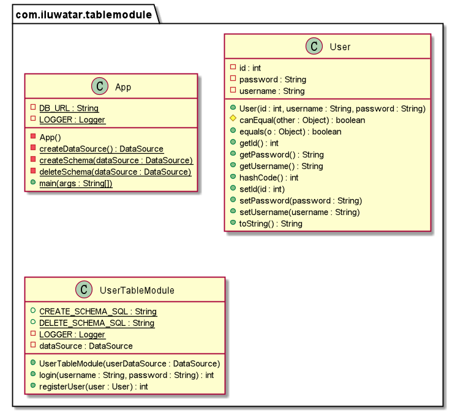

## 又被稱為
表模組

## Intent
表模組模式將域邏輯按資料庫中的每個表組織為一個類，並且一個類的單個例項包含將對資料執行的各種過程。

## Explanation

現實世界例子

> 當處理一個使用者系統時，我們需要在使用者表上進行一些操作。在這種情況下，我們可以使用表模組模式。我們可以建立一個名為 UserTableModule 的類，並初始化該類的一個例項，來處理使用者表中所有行的業務邏輯。

直白點說

> 一個單獨的例項，處理資料庫表或檢視中所有行的業務邏輯。

**程式設計例項**

在使用者系統的示例中，我們需要處理使用者登入和使用者註冊的域邏輯。我們可以使用表模組模式，並建立UserTableModule類的一個例項來處理使用者表中所有行的業務邏輯。

以下是基本的User實體。

```java
@Setter
@Getter
@ToString
@EqualsAndHashCode
@AllArgsConstructor
public class User {
  private int id;
  private String username;
  private String password;
}
```

下面的是 `UserTableModule` 類.

```java
public class UserTableModule {
  private final DataSource dataSource;
  private Connection connection = null;
  private ResultSet resultSet = null;
  private PreparedStatement preparedStatement = null;

  public UserTableModule(final DataSource userDataSource) {
    this.dataSource = userDataSource;
  }
  
  /**
   * Login using username and password.
   *
   * @param username the username of a user
   * @param password the password of a user
   * @return the execution result of the method
   * @throws SQLException if any error
   */
  public int login(final String username, final String password) throws SQLException {
  		// Method implementation.

  }

  /**
   * Register a new user.
   *
   * @param user a user instance
   * @return the execution result of the method
   * @throws SQLException if any error
   */
  public int registerUser(final User user) throws SQLException {
  		// Method implementation.
  }
}
```

在App類中，我們使用UserTableModule的一個例項來處理使用者登入和註冊。

```java
// Create data source and create the user table.
final var dataSource = createDataSource();
createSchema(dataSource);
userTableModule = new UserTableModule(dataSource);

//Initialize two users.
var user1 = new User(1, "123456", "123456");
var user2 = new User(2, "test", "password");

//Login and register using the instance of userTableModule.
userTableModule.registerUser(user1);
userTableModule.login(user1.getUsername(), user1.getPassword());
userTableModule.login(user2.getUsername(), user2.getPassword());
userTableModule.registerUser(user2);
userTableModule.login(user2.getUsername(), user2.getPassword());

deleteSchema(dataSource);
```

程式輸出：

```java
12:22:13.095 [main] INFO com.iluwatar.tablemodule.UserTableModule - Register successfully!
12:22:13.117 [main] INFO com.iluwatar.tablemodule.UserTableModule - Login successfully!
12:22:13.128 [main] INFO com.iluwatar.tablemodule.UserTableModule - Fail to login!
12:22:13.136 [main] INFO com.iluwatar.tablemodule.UserTableModule - Register successfully!
12:22:13.144 [main] INFO com.iluwatar.tablemodule.UserTableModule - Login successfully!
```

## 類圖



## 應用
使用表模組模式當：

- 域邏輯簡單且資料呈表格形式。
- 應用程式僅使用少量共享的常見的面向表格的資料結構。

## 教學

- [Transaction Script](https://java-design-patterns.com/patterns/transaction-script/)

- [Domain Model](https://java-design-patterns.com/patterns/domain-model/)

## 鳴謝

* [Table Module Pattern](http://wiki3.cosc.canterbury.ac.nz/index.php/Table_module_pattern)
* [Patterns of Enterprise Application Architecture](https://www.amazon.com/gp/product/0321127420/ref=as_li_qf_asin_il_tl?ie=UTF8&tag=javadesignpat-20&creative=9325&linkCode=as2&creativeASIN=0321127420&linkId=18acc13ba60d66690009505577c45c04)
* [Architecture patterns: domain model and friends](https://inviqa.com/blog/architecture-patterns-domain-model-and-friends)