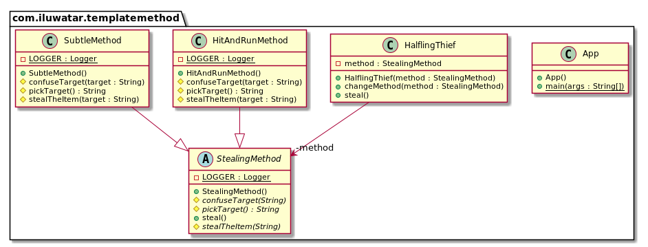

## 目的
在一個操作中定義演算法的骨架，將某些步驟推遲到子類。模板方法允許子類重新定義演算法的某些步驟，而無需更改演算法的結構。

## 解釋
真實世界例子

> 偷東西的一般步驟是相同的。 首先，選擇目標，然後以某種方式使其迷惑，最後，你偷走了該物品。然而這些步驟有很多實現方式。

通俗的說

> 模板方法模式在父類中列出一般的步驟然後讓具體的子類定義實現細節。

維基百科說

> 在物件導向的程式設計中，模板方法是Gamma等人確定的行為設計模式之一。在《設計模式》一書中。模板方法是父類中一個方法，通常是一個抽象父類，根據許多高階步驟定義了操作的骨架。這些步驟本身由與模板方法在同一類中的其他幫助程式方法實現。

**程式設計示例**

讓我們首先介紹模板方法類及其具體實現。

```java
public abstract class StealingMethod {

  private static final Logger LOGGER = LoggerFactory.getLogger(StealingMethod.class);

  protected abstract String pickTarget();

  protected abstract void confuseTarget(String target);

  protected abstract void stealTheItem(String target);

  public void steal() {
    var target = pickTarget();
    LOGGER.info("The target has been chosen as {}.", target);
    confuseTarget(target);
    stealTheItem(target);
  }
}

public class SubtleMethod extends StealingMethod {

  private static final Logger LOGGER = LoggerFactory.getLogger(SubtleMethod.class);

  @Override
  protected String pickTarget() {
    return "shop keeper";
  }

  @Override
  protected void confuseTarget(String target) {
    LOGGER.info("Approach the {} with tears running and hug him!", target);
  }

  @Override
  protected void stealTheItem(String target) {
    LOGGER.info("While in close contact grab the {}'s wallet.", target);
  }
}

public class HitAndRunMethod extends StealingMethod {

  private static final Logger LOGGER = LoggerFactory.getLogger(HitAndRunMethod.class);

  @Override
  protected String pickTarget() {
    return "old goblin woman";
  }

  @Override
  protected void confuseTarget(String target) {
    LOGGER.info("Approach the {} from behind.", target);
  }

  @Override
  protected void stealTheItem(String target) {
    LOGGER.info("Grab the handbag and run away fast!");
  }
}
```

這是包含模板方法的半身賊類。

```java
public class HalflingThief {

  private StealingMethod method;

  public HalflingThief(StealingMethod method) {
    this.method = method;
  }

  public void steal() {
    method.steal();
  }

  public void changeMethod(StealingMethod method) {
    this.method = method;
  }
}
```
最後，我們展示半身人賊如何利用不同的偷竊方法。

```java
    var thief = new HalflingThief(new HitAndRunMethod());
    thief.steal();
    thief.changeMethod(new SubtleMethod());
    thief.steal();
```

## 類圖


## 適用性

使用模板方法模式可以

* 一次性實現一個演算法中不變的部分並將其留給子類來實現可能變化的行為。
* 子類之間的共同行為應分解並集中在一個共同類中，以避免程式碼重複。如Opdyke和Johnson所描述的，這是“重構概括”的一個很好的例子。你首先要確定現有程式碼中的差異，然後將差異拆分為新的操作。最後，將不同的程式碼替換為呼叫這些新操作之一的模板方法。
* 控制子類擴充套件。你可以定義一個模板方法，該方法在特定點呼叫“ 鉤子”操作，從而僅允許在這些點進行擴充套件

## 教程

* [Template-method Pattern Tutorial](https://www.journaldev.com/1763/template-method-design-pattern-in-java)

## Java例子

* [javax.servlet.GenericServlet.init](https://jakarta.ee/specifications/servlet/4.0/apidocs/javax/servlet/GenericServlet.html#init--): 
Method `GenericServlet.init(ServletConfig config)` calls the parameterless method `GenericServlet.init()` which is intended to be overridden in subclasses.
Method `GenericServlet.init(ServletConfig config)` is the template method in this example.

## 鳴謝

* [Design Patterns: Elements of Reusable Object-Oriented Software](https://www.amazon.com/gp/product/0201633612/ref=as_li_tl?ie=UTF8&camp=1789&creative=9325&creativeASIN=0201633612&linkCode=as2&tag=javadesignpat-20&linkId=675d49790ce11db99d90bde47f1aeb59)
* [Head First Design Patterns: A Brain-Friendly Guide](https://www.amazon.com/gp/product/0596007124/ref=as_li_tl?ie=UTF8&camp=1789&creative=9325&creativeASIN=0596007124&linkCode=as2&tag=javadesignpat-20&linkId=6b8b6eea86021af6c8e3cd3fc382cb5b)
* [Refactoring to Patterns](https://www.amazon.com/gp/product/0321213351/ref=as_li_tl?ie=UTF8&camp=1789&creative=9325&creativeASIN=0321213351&linkCode=as2&tag=javadesignpat-20&linkId=2a76fcb387234bc71b1c61150b3cc3a7)
