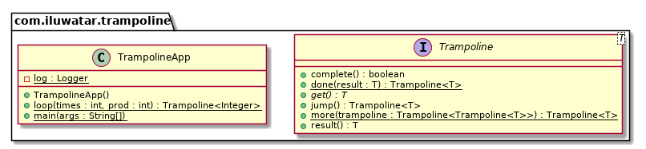

## 目的

蹦床模式是用於在 Java 中遞迴地實現演算法，而不會破壞堆疊，並且可以交錯地執行函式，而無需將它們編碼在一起。

## 解釋

遞迴是一種常用的技術，用於以分而治之的方式解決演算法問題。例如，計算斐波那契累加和與階乘。在這類問題中，遞迴比迴圈更簡單直接。此外，遞迴可能需要更少的代
碼並且看起來更簡明。有一種說法是，每個遞迴問題都可以使用迴圈來解決，但代價是編寫更難以理解的程式碼。然而，遞迴型解決方案有一個很大的警告。對於每個
遞迴呼叫，通常需要儲存一箇中間值，並且可用的棧記憶體有限。棧記憶體不足會導致棧溢位錯誤並停止程式執行。蹦床模式是一種允許在 Java 中定義遞迴演算法而無需破壞
堆疊的技巧。

現實世界例子

> 使用蹦床模式進行遞迴斐波那契計算，不存在堆疊溢位問題。

通俗地說

> 蹦床模式允許遞迴而不會耗盡棧記憶體。

維基百科上說

> 在 Java 中，蹦床是指使用反射來避免使用內部類，例如在事件偵聽器中。反射呼叫的整理操作時間換成了內部類的整理操作空間。 Java 中的蹦床通常涉及建立 GenericListener 以將事件傳遞到外部類。

**程式設計例項**

這是 Java 中的蹦床實現。

當在返回的蹦床上呼叫 `get` 時，只要返回的具體例項是蹦床，內部就會在返回的蹦床上迭代呼叫跳轉，並在返回的例項完成後停止。

```java
public interface Trampoline<T> {

  T get();

  default Trampoline<T> jump() {
    return this;
  }

  default T result() {
    return get();
  }

  default boolean complete() {
    return true;
  }

  static <T> Trampoline<T> done(final T result) {
    return () -> result;
  }

  static <T> Trampoline<T> more(final Trampoline<Trampoline<T>> trampoline) {
    return new Trampoline<T>() {
      @Override
      public boolean complete() {
        return false;
      }

      @Override
      public Trampoline<T> jump() {
        return trampoline.result();
      }

      @Override
      public T get() {
        return trampoline(this);
      }

      T trampoline(final Trampoline<T> trampoline) {
        return Stream.iterate(trampoline, Trampoline::jump)
            .filter(Trampoline::complete)
            .findFirst()
            .map(Trampoline::result)
            .orElseThrow();
      }
    };
  }
}
```

使用蹦床獲取斐波那契值。

```java
public static void main(String[] args) {
    LOGGER.info("Start calculating war casualties");
    var result = loop(10, 1).result();
    LOGGER.info("The number of orcs perished in the war: {}", result);
}

public static Trampoline<Integer> loop(int times, int prod) {
    if (times == 0) {
        return Trampoline.done(prod);
    } else {
        return Trampoline.more(() -> loop(times - 1, prod * times));
    }
}
```

程式輸出：

```java
19:22:24.462 [main] INFO com.iluwatar.trampoline.TrampolineApp - Start calculating war casualties
19:22:24.472 [main] INFO com.iluwatar.trampoline.TrampolineApp - The number of orcs perished in the war: 3628800
```

## 類圖



## 適用場景

使用蹦床模式時
* 用於實現尾遞迴函式。該模式允許切換無堆疊操作。
* 用於在同一執行緒上交錯執行兩個或多個函式。

## 現實案例

* [cyclops-react](https://github.com/aol/cyclops-react)

## 鳴謝

* [Trampolining: a practical guide for awesome Java Developers](https://medium.com/@johnmcclean/trampolining-a-practical-guide-for-awesome-java-developers-4b657d9c3076)
* [Trampoline in java ](http://mindprod.com/jgloss/trampoline.html)
* [Laziness, trampolines, monoids and other functional amenities: this is not your father's Java](https://www.slideshare.net/mariofusco/lazine)
* [Trampoline implementation](https://github.com/bodar/totallylazy/blob/master/src/com/googlecode/totallylazy/Trampoline.java)
* [What is a trampoline function?](https://stackoverflow.com/questions/189725/what-is-a-trampoline-function)
* [Modern Java in Action: Lambdas, streams, functional and reactive programming](https://www.amazon.com/gp/product/1617293563/ref=as_li_qf_asin_il_tl?ie=UTF8&tag=javadesignpat-20&creative=9325&linkCode=as2&creativeASIN=1617293563&linkId=ad53ae6f9f7c0982e759c3527bd2595c)
* [Java 8 in Action: Lambdas, Streams, and functional-style programming](https://www.amazon.com/gp/product/1617291994/ref=as_li_qf_asin_il_tl?ie=UTF8&tag=javadesignpat-20&creative=9325&linkCode=as2&creativeASIN=1617291994&linkId=e3e5665b0732c59c9d884896ffe54f4f)
