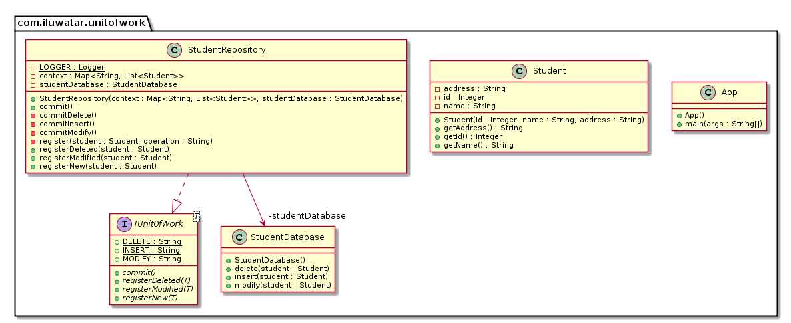

## 又被稱為
工作單元

## 目的

當一個業務事務完成時，所有的更新都作為一個大的工作單元一次性傳送，以最小化資料庫的往返次數進行持久化。

## 解釋

現實世界例子

> 武器商人擁有一個包含武器資訊的資料庫。
> 全城的商販們都在不斷地更新這些資訊，這導致資料庫伺服器的負載很高。
> 為了使負載更易於管理，我們應用了工作單元模式，將許多小的更新批次傳送。

用直白的話來說

> 工作單元將許多小的資料庫更新合併成一個批次。
> 以最佳化往返次數。

[MartinFowler.com](https://martinfowler.com/eaaCatalog/unitOfWork.html) 中說

> 維護一個受業務事務影響的物件列表。
> 並協調寫出更改和解決併發問題。

**程式設計樣例**

以下是要持久化到資料庫中的 `Weapon` 的實體。

```java
@Getter
@RequiredArgsConstructor
public class Weapon {
    private final Integer id;
    private final String name;
}
```

實現的核心是 `ArmsDealer` 實現了工作單元模式。
它維護了一個需要完成的資料庫操作對映 (`context`) 當呼叫 `commit` 時
它會一次性批次應用這些操作。

```java
public interface IUnitOfWork<T> {
    
  String INSERT = "INSERT";
  String DELETE = "DELETE";
  String MODIFY = "MODIFY";

  void registerNew(T entity);

  void registerModified(T entity);

  void registerDeleted(T entity);

  void commit();
}

@Slf4j
@RequiredArgsConstructor
public class ArmsDealer implements IUnitOfWork<Weapon> {

    private final Map<String, List<Weapon>> context;
    private final WeaponDatabase weaponDatabase;

    @Override
    public void registerNew(Weapon weapon) {
        LOGGER.info("Registering {} for insert in context.", weapon.getName());
        register(weapon, UnitActions.INSERT.getActionValue());
    }

    @Override
    public void registerModified(Weapon weapon) {
        LOGGER.info("Registering {} for modify in context.", weapon.getName());
        register(weapon, UnitActions.MODIFY.getActionValue());

    }

    @Override
    public void registerDeleted(Weapon weapon) {
        LOGGER.info("Registering {} for delete in context.", weapon.getName());
        register(weapon, UnitActions.DELETE.getActionValue());
    }

    private void register(Weapon weapon, String operation) {
        var weaponsToOperate = context.get(operation);
        if (weaponsToOperate == null) {
            weaponsToOperate = new ArrayList<>();
        }
        weaponsToOperate.add(weapon);
        context.put(operation, weaponsToOperate);
    }

    /**
     * All UnitOfWork operations are batched and executed together on commit only.
     */
    @Override
    public void commit() {
        if (context == null || context.size() == 0) {
            return;
        }
        LOGGER.info("Commit started");
        if (context.containsKey(UnitActions.INSERT.getActionValue())) {
            commitInsert();
        }

        if (context.containsKey(UnitActions.MODIFY.getActionValue())) {
            commitModify();
        }
        if (context.containsKey(UnitActions.DELETE.getActionValue())) {
            commitDelete();
        }
        LOGGER.info("Commit finished.");
    }

    private void commitInsert() {
        var weaponsToBeInserted = context.get(UnitActions.INSERT.getActionValue());
        for (var weapon : weaponsToBeInserted) {
            LOGGER.info("Inserting a new weapon {} to sales rack.", weapon.getName());
            weaponDatabase.insert(weapon);
        }
    }

    private void commitModify() {
        var modifiedWeapons = context.get(UnitActions.MODIFY.getActionValue());
        for (var weapon : modifiedWeapons) {
            LOGGER.info("Scheduling {} for modification work.", weapon.getName());
            weaponDatabase.modify(weapon);
        }
    }

    private void commitDelete() {
        var deletedWeapons = context.get(UnitActions.DELETE.getActionValue());
        for (var weapon : deletedWeapons) {
            LOGGER.info("Scrapping {}.", weapon.getName());
            weaponDatabase.delete(weapon);
        }
    }
}
```

以下描述了整個應用是如何組裝起來的。

```java
// create some weapons
var enchantedHammer = new Weapon(1, "enchanted hammer");
var brokenGreatSword = new Weapon(2, "broken great sword");
var silverTrident = new Weapon(3, "silver trident");

// create repository
var weaponRepository = new ArmsDealer(new HashMap<String, List<Weapon>>(), new WeaponDatabase());

// perform operations on the weapons
weaponRepository.registerNew(enchantedHammer);
weaponRepository.registerModified(silverTrident);
weaponRepository.registerDeleted(brokenGreatSword);
weaponRepository.commit();
```

以下是控制檯輸出。

```
21:39:21.984 [main] INFO com.iluwatar.unitofwork.ArmsDealer - Registering enchanted hammer for insert in context.
21:39:21.989 [main] INFO com.iluwatar.unitofwork.ArmsDealer - Registering silver trident for modify in context.
21:39:21.989 [main] INFO com.iluwatar.unitofwork.ArmsDealer - Registering broken great sword for delete in context.
21:39:21.989 [main] INFO com.iluwatar.unitofwork.ArmsDealer - Commit started
21:39:21.989 [main] INFO com.iluwatar.unitofwork.ArmsDealer - Inserting a new weapon enchanted hammer to sales rack.
21:39:21.989 [main] INFO com.iluwatar.unitofwork.ArmsDealer - Scheduling silver trident for modification work.
21:39:21.989 [main] INFO com.iluwatar.unitofwork.ArmsDealer - Scrapping broken great sword.
21:39:21.989 [main] INFO com.iluwatar.unitofwork.ArmsDealer - Commit finished.
```

## 類圖



## 應用

在以下情況時使用單元模式

* 為了最佳化資料庫事務所需的時間。
* 作為工作單元將更改傳送到資料庫，確保事務的原子性。
* 為了減少資料庫呼叫的次數。

## 教程

* [Repository and Unit of Work Pattern](https://www.programmingwithwolfgang.com/repository-and-unit-of-work-pattern/)
* [Unit of Work - a Design Pattern](https://mono.software/2017/01/13/unit-of-work-a-design-pattern/)

## 鳴謝

* [Design Pattern - Unit Of Work Pattern](https://www.codeproject.com/Articles/581487/Unit-of-Work-Design-Pattern)
* [Unit Of Work](https://martinfowler.com/eaaCatalog/unitOfWork.html)
* [Patterns of Enterprise Application Architecture](https://www.amazon.com/gp/product/0321127420/ref=as_li_tl?ie=UTF8&camp=1789&creative=9325&creativeASIN=0321127420&linkCode=as2&tag=javadesignpat-20&linkId=d9f7d37b032ca6e96253562d075fcc4a)
