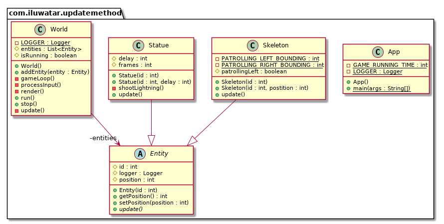

---  
title: Update Method
shortTitle: Update Method
category: Behavioral
language: zn
tag:  
 - Game programming
---  

## 又被稱為
更新方法

## 目的
更新方法模式透過告訴每個物件一次處理一個行為幀來模擬一組獨立的物件。

## 解釋
遊戲世界維護了一個物件的集合。每個物件都實現了一個更新方法，用來模擬該物件行為的一幀。在每一幀中，遊戲會更新集合中的每一個物件。

要了解更多關於遊戲迴圈是如何執行的，以及何時呼叫更新方法，請參考“遊戲迴圈模式”。

## 類圖

## 應用 
如果說遊戲迴圈模式是自切麵包以來最好的東西，那麼更新方法模式就是它的奶油。有很多玩家與動態實體互動的遊戲都以某種形式使用這個模式。如果遊戲裡有宇航兵、龍、火星人、幽靈或運動員，那麼它很可能使用了這種模式。

並且，如果遊戲更為抽象，且移動的部分不像是生動的角色，而更像是棋盤上的棋子，那麼這種模式往往並不合適。在像國際象棋這樣的遊戲中，你不需要同時模擬所有的棋子，也可能不需要告訴每一個兵卒在每一幀都更新自己。

當以下情況發生時，更新方法工作得很好：

- 你的遊戲中有許多物件或系統需要同時執行。
- 每個物件的行為大部分都獨立於其他物件。
- 這些物件需要隨時間進行模擬。

## 鳴謝
  
* [Game Programming Patterns - Update Method](http://gameprogrammingpatterns.com/update-method.html)
