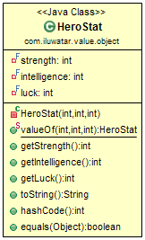

## 又被稱為
值物件

## 目的

提供的物件應遵循值語義而不是引用語義。這意味著兩個值物件的相等性不是基於它們的身份。只要兩個值物件的值相同，即使它們不是同一個物件，它們也被認為是相等的。

## 解釋

現實世界例子

> 在一個角色扮演遊戲中，有一個用於英雄屬性統計的類。
> 這些統計屬性包括力量、智慧和運氣等特徵。
> 當所有的屬性都相同時，不同英雄的統計資料應被認為是相等的。

用直白的話來說

> 當值物件的屬性有相同的值時，它們是相等的。

維基百科中說

> 在電腦科學中，值物件是一個代表簡單實體的小物件。
> 其相等性不是基於身份的：即當兩個值物件有相同的值的時候。
> 它們是相等的，而不必要是同一個物件。

**程式設計樣例**

這裡是作為值物件的 `HeroStat` 類。 請注意使用了
[Lombok's `@Value`](https://projectlombok.org/features/Value) 註解。

```java
@Value(staticConstructor = "valueOf")
class HeroStat {

    int strength;
    int intelligence;
    int luck;
}
```

這個示例建立了三個不同的 `HeroStat`s 並比較了它們的相等性。

```java
var statA = HeroStat.valueOf(10, 5, 0);
var statB = HeroStat.valueOf(10, 5, 0);
var statC = HeroStat.valueOf(5, 1, 8);

LOGGER.info(statA.toString());
LOGGER.info(statB.toString());
LOGGER.info(statC.toString());

LOGGER.info("Is statA and statB equal : {}", statA.equals(statB));
LOGGER.info("Is statA and statC equal : {}", statA.equals(statC));
```

以下是控制檯的輸出。

```
20:11:12.199 [main] INFO com.iluwatar.value.object.App - HeroStat(strength=10, intelligence=5, luck=0)
20:11:12.202 [main] INFO com.iluwatar.value.object.App - HeroStat(strength=10, intelligence=5, luck=0)
20:11:12.202 [main] INFO com.iluwatar.value.object.App - HeroStat(strength=5, intelligence=1, luck=8)
20:11:12.202 [main] INFO com.iluwatar.value.object.App - Is statA and statB equal : true
20:11:12.203 [main] INFO com.iluwatar.value.object.App - Is statA and statC equal : false
```

## 類圖



## 應用

當滿足以下情況時，使用值物件：

* 物件的相等性需要基於物件的值

## 現實世界的案例

* [java.util.Optional](https://docs.oracle.com/javase/8/docs/api/java/util/Optional.html)
* [java.time.LocalDate](https://docs.oracle.com/javase/8/docs/api/java/time/LocalDate.html)
* [joda-time, money, beans](http://www.joda.org/)

## 鳴謝

* [Patterns of Enterprise Application Architecture](http://www.martinfowler.com/books/eaa.html)
* [ValueObject](https://martinfowler.com/bliki/ValueObject.html)
* [VALJOs - Value Java Objects : Stephen Colebourne's blog](http://blog.joda.org/2014/03/valjos-value-java-objects.html)
* [Value Object : Wikipedia](https://en.wikipedia.org/wiki/Value_object)
* [J2EE Design Patterns](https://www.amazon.com/gp/product/0596004273/ref=as_li_tl?ie=UTF8&camp=1789&creative=9325&creativeASIN=0596004273&linkCode=as2&tag=javadesignpat-20&linkId=f27d2644fbe5026ea448791a8ad09c94)
