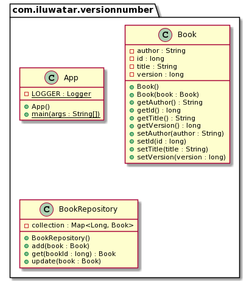

## 名字 / 分類

版本號

## 或稱

實體版本控制，樂觀鎖。

## 目的

解決多個客戶端嘗試同時更新同一實體時的併發衝突。

## 解釋

現實世界的例子

> 愛麗絲（Alice）和鮑勃（Bob）正在管理書，該書儲存在資料庫中。 我們的英雄們正在同時進行更改，我們需要某種機制來防止他們相互覆蓋。

通俗地說

> 版本號模式可防止對同一實體進行併發更新。

維基百科說

> 樂觀併發控制假設多個事務可以頻繁完成而不會互相干擾。 在執行時，事務使用資料資源而不獲取這些資源的鎖。 在提交之前，每個事務都將驗證沒有其他事務修改了已讀取的資料。如果檢查發現有衝突的修改，則提交的事務將回滾並可以重新啟動。

**程式示例**

我們有`Book` 已版本化的實體，它有一個複製建構函式。

```java
public class Book {
  private long id;
  private String title = "";
  private String author = "";

  private long version = 0; // version number

  public Book(Book book) {
    this.id = book.id;
    this.title = book.title;
    this.author = book.author;
    this.version = book.version;
  }

  // getters and setters are omitted here
}
```

我們還有一個 `BookRepository`, 它實現了併發控制。

```java
public class BookRepository {
  private final Map<Long, Book> collection = new HashMap<>();

  public void update(Book book) throws BookNotFoundException, VersionMismatchException {
    if (!collection.containsKey(book.getId())) {
      throw new BookNotFoundException("Not found book with id: " + book.getId());
    }

    var latestBook = collection.get(book.getId());
    if (book.getVersion() != latestBook.getVersion()) {
      throw new VersionMismatchException(
        "Tried to update stale version " + book.getVersion()
          + " while actual version is " + latestBook.getVersion()
      );
    }

    // update version, including client representation - modify by reference here
    book.setVersion(book.getVersion() + 1);

    // save book copy to repository
    collection.put(book.getId(), new Book(book));
  }

  public Book get(long bookId) throws BookNotFoundException {
    if (!collection.containsKey(bookId)) {
      throw new BookNotFoundException("Not found book with id: " + bookId);
    }

    // return copy of the book
    return new Book(collection.get(bookId));
  }
}
```

這是實踐中的併發控制：

```java
var bookId = 1;
// Alice and Bob took the book concurrently
final var aliceBook = bookRepository.get(bookId);
final var bobBook = bookRepository.get(bookId);

aliceBook.setTitle("Kama Sutra"); // Alice has updated book title
bookRepository.update(aliceBook); // and successfully saved book in database
LOGGER.info("Alice updates the book with new version {}", aliceBook.getVersion());

// now Bob has the stale version of the book with empty title and version = 0
// while actual book in database has filled title and version = 1
bobBook.setAuthor("Vatsyayana Mallanaga"); // Bob updates the author
try {
  LOGGER.info("Bob tries to update the book with his version {}", bobBook.getVersion());
  bookRepository.update(bobBook); // Bob tries to save his book to database
} catch (VersionMismatchException e) {
  // Bob update fails, and book in repository remained untouchable
  LOGGER.info("Exception: {}", e.getMessage());
  // Now Bob should reread actual book from repository, do his changes again and save again
}
```

程式輸出：

```java
Alice updates the book with new version 1
Bob tries to update the book with his version 0
Exception: Tried to update stale version 0 while actual version is 1
```

## 類圖



## 適用性

將版本號用於：

* 解決對資料的併發寫訪問
* 強的資料一致性

## 教程
* [Version Number Pattern Tutorial](http://www.java2s.com/Tutorial/Java/0355__JPA/VersioningEntity.htm)

## 已知用途
 * [Hibernate](https://vladmihalcea.com/jpa-entity-version-property-hibernate/)
 * [Elasticsearch](https://www.elastic.co/guide/en/elasticsearch/reference/current/docs-index_.html#index-versioning)
 * [Apache Solr](https://lucene.apache.org/solr/guide/6_6/updating-parts-of-documents.html)

## 意義
版本號模式允許實現併發控制，通常透過樂觀離線鎖模式來完成。

## 相關模式
* [Optimistic Offline Lock](https://martinfowler.com/eaaCatalog/optimisticOfflineLock.html)

## 鳴謝
* [Optimistic Locking in JPA](https://www.baeldung.com/jpa-optimistic-locking)
* [JPA entity versioning](https://www.byteslounge.com/tutorials/jpa-entity-versioning-version-and-optimistic-locking)
* [J2EE Design Patterns](http://ommolketab.ir/aaf-lib/axkwht7wxrhvgs2aqkxse8hihyu9zv.pdf)
