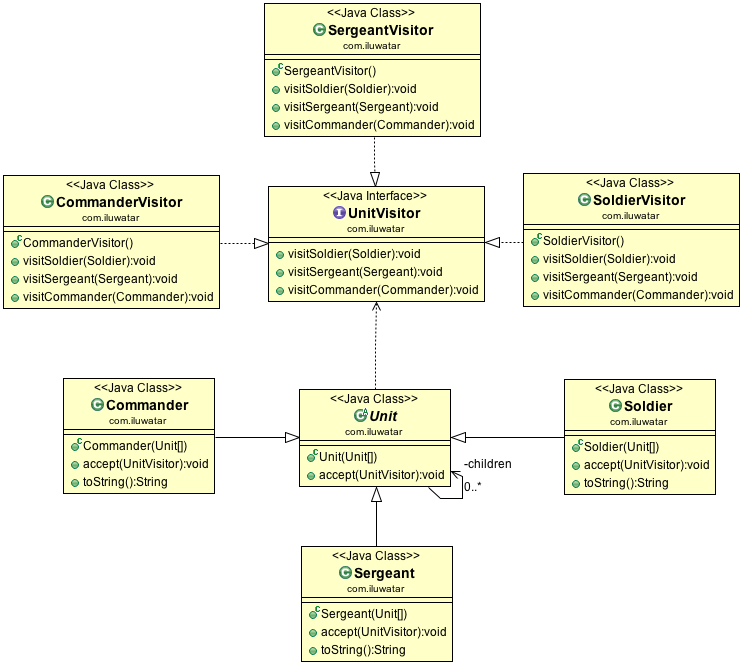

## 目的

表示要在物件結構的元素上執行的操作。訪問者可讓你定義新操作，而無需更改其所操作元素的類。

## 解釋

真實世界例子

> 考慮有一個帶有軍隊單位的樹形結構。指揮官下有兩名中士，每名中士下有三名士兵。基於這個層級結構實現訪問者模式，我們可以輕鬆建立與指揮官，中士，士兵或所有人員互動的新物件

通俗的說

> 訪問者模式定義可以在資料結構的節點上執行的操作。

維基百科說

> 在物件導向的程式設計和軟體工程中，訪問者設計模式是一種將演算法與操作物件的結構分離的方法。這種分離的實際結果是能夠在不修改結構的情況下向現有物件結構新增新操作。

**程式示例**

使用上面的軍隊單元的例子，我們首先由單位和單位訪問器型別。

```java
public abstract class Unit {

  private final Unit[] children;

  public Unit(Unit... children) {
    this.children = children;
  }

  public void accept(UnitVisitor visitor) {
    Arrays.stream(children).forEach(child -> child.accept(visitor));
  }
}

public interface UnitVisitor {

  void visitSoldier(Soldier soldier);

  void visitSergeant(Sergeant sergeant);

  void visitCommander(Commander commander);
}
```

然後我們有具體的單元。

```java
public class Commander extends Unit {

  public Commander(Unit... children) {
    super(children);
  }

  @Override
  public void accept(UnitVisitor visitor) {
    visitor.visitCommander(this);
    super.accept(visitor);
  }

  @Override
  public String toString() {
    return "commander";
  }
}

public class Sergeant extends Unit {

  public Sergeant(Unit... children) {
    super(children);
  }

  @Override
  public void accept(UnitVisitor visitor) {
    visitor.visitSergeant(this);
    super.accept(visitor);
  }

  @Override
  public String toString() {
    return "sergeant";
  }
}

public class Soldier extends Unit {

  public Soldier(Unit... children) {
    super(children);
  }

  @Override
  public void accept(UnitVisitor visitor) {
    visitor.visitSoldier(this);
    super.accept(visitor);
  }

  @Override
  public String toString() {
    return "soldier";
  }
}
```

然後有一些具體的訪問者。

```java
public class CommanderVisitor implements UnitVisitor {

  private static final Logger LOGGER = LoggerFactory.getLogger(CommanderVisitor.class);

  @Override
  public void visitSoldier(Soldier soldier) {
    // Do nothing
  }

  @Override
  public void visitSergeant(Sergeant sergeant) {
    // Do nothing
  }

  @Override
  public void visitCommander(Commander commander) {
    LOGGER.info("Good to see you {}", commander);
  }
}

public class SergeantVisitor implements UnitVisitor {

  private static final Logger LOGGER = LoggerFactory.getLogger(SergeantVisitor.class);

  @Override
  public void visitSoldier(Soldier soldier) {
    // Do nothing
  }

  @Override
  public void visitSergeant(Sergeant sergeant) {
    LOGGER.info("Hello {}", sergeant);
  }

  @Override
  public void visitCommander(Commander commander) {
    // Do nothing
  }
}

public class SoldierVisitor implements UnitVisitor {

  private static final Logger LOGGER = LoggerFactory.getLogger(SoldierVisitor.class);

  @Override
  public void visitSoldier(Soldier soldier) {
    LOGGER.info("Greetings {}", soldier);
  }

  @Override
  public void visitSergeant(Sergeant sergeant) {
    // Do nothing
  }

  @Override
  public void visitCommander(Commander commander) {
    // Do nothing
  }
}
```

最後，來看看實踐中訪問者模式的力量。

```java
commander.accept(new SoldierVisitor());
commander.accept(new SergeantVisitor());
commander.accept(new CommanderVisitor());
```

程式輸出:

```
Greetings soldier
Greetings soldier
Greetings soldier
Greetings soldier
Greetings soldier
Greetings soldier
Hello sergeant
Hello sergeant
Good to see you commander
```

## Class diagram



## 適用性

使用訪問者模式當

* 物件結構包含許多具有不同介面的物件類，並且你希望根據這些物件的具體類對這些物件執行操作。
* 需要對物件結構中的物件執行許多不同且不相關的操作，並且你想避免使用這些操作“汙染”它們的類。 訪問者可以透過在一個類中定義相關操作來將它們保持在一起。當許多應用程式共享物件結構時，請使用訪問者模式將操作僅放在需要它們的那些應用程式中
* 定義物件結構的類很少變化，但是你經常想在結構上定義新的操作。更改物件結構類需要重新定義所有訪問者的介面，這可能會導致成本高昂。如果物件結構類經常更改，則最好在這些類中定義操作。

## 真例項子

* [Apache Wicket](https://github.com/apache/wicket) component tree, see [MarkupContainer](https://github.com/apache/wicket/blob/b60ec64d0b50a611a9549809c9ab216f0ffa3ae3/wicket-core/src/main/java/org/apache/wicket/MarkupContainer.java)
* [javax.lang.model.element.AnnotationValue](http://docs.oracle.com/javase/8/docs/api/javax/lang/model/element/AnnotationValue.html) and [AnnotationValueVisitor](http://docs.oracle.com/javase/8/docs/api/javax/lang/model/element/AnnotationValueVisitor.html)
* [javax.lang.model.element.Element](http://docs.oracle.com/javase/8/docs/api/javax/lang/model/element/Element.html) and [Element Visitor](http://docs.oracle.com/javase/8/docs/api/javax/lang/model/element/ElementVisitor.html)
* [java.nio.file.FileVisitor](http://docs.oracle.com/javase/8/docs/api/java/nio/file/FileVisitor.html)

## 鳴謝

* [Design Patterns: Elements of Reusable Object-Oriented Software](https://www.amazon.com/gp/product/0201633612/ref=as_li_tl?ie=UTF8&camp=1789&creative=9325&creativeASIN=0201633612&linkCode=as2&tag=javadesignpat-20&linkId=675d49790ce11db99d90bde47f1aeb59)
* [Head First Design Patterns: A Brain-Friendly Guide](https://www.amazon.com/gp/product/0596007124/ref=as_li_tl?ie=UTF8&camp=1789&creative=9325&creativeASIN=0596007124&linkCode=as2&tag=javadesignpat-20&linkId=6b8b6eea86021af6c8e3cd3fc382cb5b)
* [Refactoring to Patterns](https://www.amazon.com/gp/product/0321213351/ref=as_li_tl?ie=UTF8&camp=1789&creative=9325&creativeASIN=0321213351&linkCode=as2&tag=javadesignpat-20&linkId=2a76fcb387234bc71b1c61150b3cc3a7)
