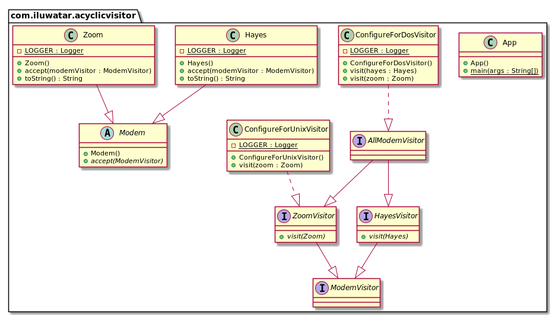

## 目的

允许将新功能添加到现有的类层次结构中，而不会影响这些层次结构，也不会有四人帮访客模式中那样循环依赖的问题。

## 解释

真实世界例子

> 我们有一个调制解调器类的层次结构。 需要使用基于过滤条件的外部算法（是Unix或DOS兼容的调制解调器）来访问此层次结构中的调制解调器。

通俗地说

> 非循环访问者允许将功能添加到现有的类层次结构中，而无需修改层次结构

[WikiWikiWeb](https://wiki.c2.com/?AcyclicVisitor) 上说

> 非循环访客模式允许将新功能添加到现有的类层次结构中，而不会影响这些层次结构，也不会创建四人帮访客模式中固有的循环依赖问题。

**程序示例**

这是调制解调器的层次结构。

```java
public abstract class Modem {
  public abstract void accept(ModemVisitor modemVisitor);
}

public class Zoom extends Modem {
  ...
  @Override
  public void accept(ModemVisitor modemVisitor) {
    if (modemVisitor instanceof ZoomVisitor) {
      ((ZoomVisitor) modemVisitor).visit(this);
    } else {
      LOGGER.info("Only ZoomVisitor is allowed to visit Zoom modem");
    }
  }
}

public class Hayes extends Modem {
  ...
  @Override
  public void accept(ModemVisitor modemVisitor) {
    if (modemVisitor instanceof HayesVisitor) {
      ((HayesVisitor) modemVisitor).visit(this);
    } else {
      LOGGER.info("Only HayesVisitor is allowed to visit Hayes modem");
    }
  }
}
```

下面我们介绍`调制解调器访问者`类结构。

```java
public interface ModemVisitor {
}

public interface HayesVisitor extends ModemVisitor {
  void visit(Hayes hayes);
}

public interface ZoomVisitor extends ModemVisitor {
  void visit(Zoom zoom);
}

public interface AllModemVisitor extends ZoomVisitor, HayesVisitor {
}

public class ConfigureForDosVisitor implements AllModemVisitor {
  ...
  @Override
  public void visit(Hayes hayes) {
    LOGGER.info(hayes + " used with Dos configurator.");
  }
  @Override
  public void visit(Zoom zoom) {
    LOGGER.info(zoom + " used with Dos configurator.");
  }
}

public class ConfigureForUnixVisitor implements ZoomVisitor {
  ...
  @Override
  public void visit(Zoom zoom) {
    LOGGER.info(zoom + " used with Unix configurator.");
  }
}
```

最后，这里是访问者的实践。

```java
    var conUnix = new ConfigureForUnixVisitor();
    var conDos = new ConfigureForDosVisitor();
    var zoom = new Zoom();
    var hayes = new Hayes();
    hayes.accept(conDos);
    zoom.accept(conDos);
    hayes.accept(conUnix);
    zoom.accept(conUnix);   
```

程序输出:

```
    // Hayes modem used with Dos configurator.
    // Zoom modem used with Dos configurator.
    // Only HayesVisitor is allowed to visit Hayes modem
    // Zoom modem used with Unix configurator.
```

## 类图



## 适用性

以下情况可以使用此模式：

* 需要在现有层次结构中添加新功能而无需更改或影响该层次结构时。
* 当某些功能在层次结构上运行，但不属于层次结构本身时。 例如 ConfigureForDOS / ConfigureForUnix / ConfigureForX问题。
* 当您需要根据对象的类型对对象执行非常不同的操作时。
* 当访问的类层次结构将经常使用元素类的新派生进行扩展时。
* 当重新编译，重新链接，重新测试或重新分发派生元素非常昂贵时。

## 结果

好处:

* 类层次结构之间没有依赖关系循环。
* 如果添加了新访客，则无需重新编译所有访客。
* 如果类层次结构具有新成员，则不会导致现有访问者中的编译失败。

坏处:

* 通过证明它可以接受所有访客，但实际上仅对特定访客感兴趣，从而违反了[Liskov的替代原则](https://java-design-patterns.com/principles/#liskov-substitution-principle)
* 必须为可访问的类层次结构中的所有成员创建访问者的并行层次结构。

## 相关的模式

* [Visitor Pattern](https://java-design-patterns.com/patterns/visitor/)

## 鸣谢

* [Acyclic Visitor by Robert C. Martin](http://condor.depaul.edu/dmumaugh/OOT/Design-Principles/acv.pdf)
* [Acyclic Visitor in WikiWikiWeb](https://wiki.c2.com/?AcyclicVisitor)
