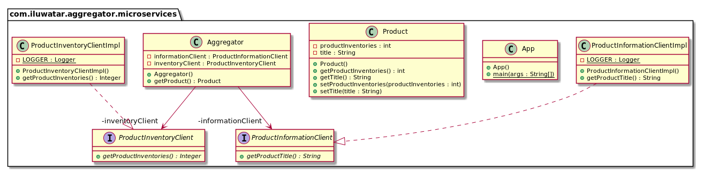

## 意图

用户对聚合器服务进行一次调用，然后聚合器将调用每个相关的微服务。

## 解释

真实世界例子

> 我们的网络市场需要有关产品及其当前库存的信息。 它调用聚合服务，聚合服务依次调用产品信息微服务和产品库存微服务，返回组合信息。

通俗地说

> 聚合器微服务从各种微服务中收集数据，并返回一个聚合数据以进行处理。

Stack Overflow上说

> 聚合器微服务调用多个服务以实现应用程序所需的功能。

**程序示例**

让我们从数据模型开始。 这是我们的`产品`。

```java
public class Product {
  private String title;
  private int productInventories;
  // getters and setters ->
  ...
}
```

接下来，我们将介绍我们的聚合器微服务。 它包含用于调用相应微服务的客户端`ProductInformationClient`和` ProductInventoryClient`。

```java
@RestController
public class Aggregator {

  @Resource
  private ProductInformationClient informationClient;

  @Resource
  private ProductInventoryClient inventoryClient;

  @RequestMapping(path = "/product", method = RequestMethod.GET)
  public Product getProduct() {

    var product = new Product();
    var productTitle = informationClient.getProductTitle();
    var productInventory = inventoryClient.getProductInventories();

    //Fallback to error message
    product.setTitle(requireNonNullElse(productTitle, "Error: Fetching Product Title Failed"));

    //Fallback to default error inventory
    product.setProductInventories(requireNonNullElse(productInventory, -1));

    return product;
  }
}
```

这是产品信息微服务的精华实现。 库存微服务类似，它只返回库存计数。

```java
@RestController
public class InformationController {
  @RequestMapping(value = "/information", method = RequestMethod.GET)
  public String getProductTitle() {
    return "The Product Title.";
  }
}
```

Now calling our `Aggregator` REST API returns the product information.

现在调用我们的聚合器 REST API会返回产品信息。

```bash
curl http://localhost:50004/product
{"title":"The Product Title.","productInventories":5}
```

## 类图



## 适用性

当需要各种微服务的统一API时，无论客户端设备如何，都可以使用Aggregator微服务模式。

## 鸣谢

* [Microservice Design Patterns](http://web.archive.org/web/20190705163602/http://blog.arungupta.me/microservice-design-patterns/)
* [Microservices Patterns: With examples in Java](https://www.amazon.com/gp/product/1617294543/ref=as_li_qf_asin_il_tl?ie=UTF8&tag=javadesignpat-20&creative=9325&linkCode=as2&creativeASIN=1617294543&linkId=8b4e570267bc5fb8b8189917b461dc60)
* [Architectural Patterns: Uncover essential patterns in the most indispensable realm of enterprise architecture](https://www.amazon.com/gp/product/B077T7V8RC/ref=as_li_qf_asin_il_tl?ie=UTF8&tag=javadesignpat-20&creative=9325&linkCode=as2&creativeASIN=B077T7V8RC&linkId=c34d204bfe1b277914b420189f09c1a4)
